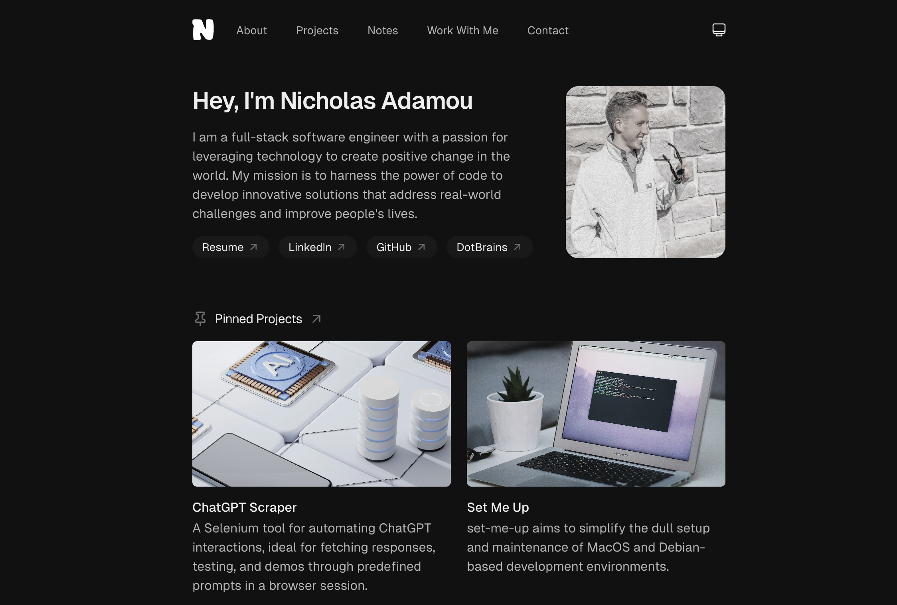

# nicholasadamou.com - v4




Previous iterations: [v1](https://github.com/nicholasadamou/v1), [v2](https://github.com/nicholasadamou/v2), and [v3](https://github.com/nicholasadamou/v3).

A simplistic and clean personal portfolio website showcasing my work and blog posts. This website features MDX articles with view counts, a dark mode toggle, an about page, and more.

## Table of Contents

-  [Features](#features)
-  [Prerequisites](#prerequisites)
-  [Installation](#installation)
-  [Database Setup](#database-setup)
-  [Deployment](#deployment)
-  [License](#license)

## Features

-  Built with Next.js and TypeScript for a robust backend.
-  Utilizes MDX and Contentlayer for dynamic article management.
-  Supports Vercel Postgres for database management.
-  Styled with Tailwind CSS for a modern look and feel.
-  Incorporates Radix Primitives for accessible UI components.
-  Includes Framer Motion for smooth animations.
-  Dark mode toggle for a better user experience.

## Prerequisites

Before you begin, ensure you have met the following requirements:

-  Node.js v18.17.0 or higher installed on your machine.

## Installation

**Clone the Repository**

```sh
git clone https://github.com/nicholasadamou/nicholasadamou.com.git
cd nicholasadamou.com
```

**Install Dependencies**

```sh
npm install
```

**Environment Variables**

Copy the example environment file:

```sh
cp .env.example .env.local
```

Modify the `.env.local` file with your own configurations as needed.

## Database Setup

Follow the Vercel Postgres [quickstart guide](https://vercel.com/docs/storage/vercel-postgres/quickstart) to set up your database.

**Handle Note Views**

Run the following SQL commands to create the necessary tables for tracking notes views:

```sql
CREATE TABLE IF NOT EXISTS notes_views (
    slug VARCHAR(255) PRIMARY KEY,
    count INT DEFAULT 0
);

CREATE TABLE user_views
(
    user_id     VARCHAR(255) NOT NULL,
    slug        VARCHAR(255) NOT NULL,
    last_viewed TIMESTAMP    NOT NULL,
    PRIMARY KEY (user_id, slug)
);
```

## Deployment

This project can be [quickly deployed to Vercel](https://vercel.com/new/clone?repository-url=https%3A%2F%2Fgithub.com%nicholasadamou%2Fnicholasadamou.com). Connect your Vercel account to your GitHub repository, and Vercel will automatically build and deploy your application with each new push to the main branch.

Add the project environment variables to your Vercel project settings.

## License

This project is licensed under the MIT License - see the [LICENSE](/LICENSE) file for details.
