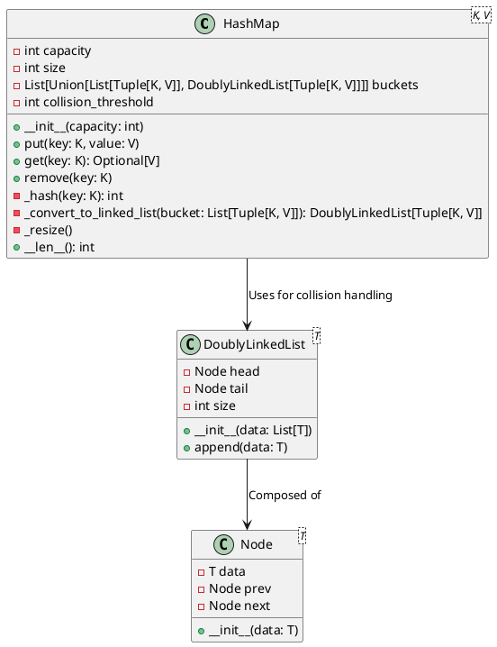
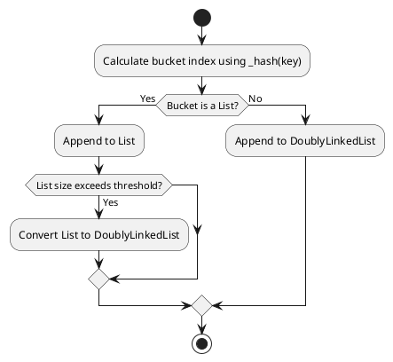
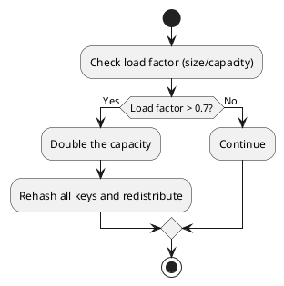

The "Two Sum" problem is a classic entry point for many aspiring software engineers tackling algorithmic challenges. At first glance, the problem appears simple, but it offers a wealth of learning opportunities when explored deeply. An interview might ask such a question from this topic to probe your understanding of Hash Maps, binary search, and even memory management. Let's unravel it step by step, starting with the naive approach and progressing toward a highly optimized solution.

## Table of Contents

## Problem Statement

> Given an array of integers `nums` and an integer `target`, return the indices of the two numbers such that they add up to `target`.

You may assume that each input would have **exactly one solution**, and you may not use the same element twice.

Example:

```plaintext
Input: nums = [2, 7, 11, 15], target = 9
Output: [0, 1]
Explanation: Because nums[0] + nums[1] = 2 + 7 = 9, we return [0, 1].
```

## Step 1: The Naive Solution

The simplest way to solve this problem is by using a brute force approach: iterate through all pairs of elements in the array and check if their sum equals the target.

### Implementation

```python
def two_sum_naive(nums, target):
    for i in range(len(nums)):
        for j in range(i + 1, len(nums)):
            if nums[i] + nums[j] == target:
                return [i, j]

    raise ValueError("No solution found")
```

### Time Complexity

- **Outer Loop:** Runs $n$ times.
- **Inner Loop:** Runs approximately $n/2$ times for each iteration.
- **Overall:** $O(n^2)$

### Space Complexity

- $O(1)$: No additional space is used beyond a few variables.

While the naive solution is simple and easy to implement, it quickly becomes inefficient for large arrays.

## Step 2: Optimizing with Binary Search

If the array is sorted, we can use binary search to optimize the search for the complement of each element.

### Strategy

1. **Sort the Array:** First, sort the array while keeping track of the original indices.
2. **Iterate and Search:** For each element, use binary search to find its complement.

### Implementation

```python
def two_sum_binary_search(nums, target):
    nums_with_indices = [(num, i) for i, num in enumerate(nums)]
    nums_with_indices.sort()  # Sort by the values, retaining indices
		n = len(nums_with_indices)

    for i, (num, original_index) in enumerate(nums_with_indices):
        complement = target - num
        left = i + 1
				right = n - 1

        while left <= right:
            mid = (left + right) // 2

            if nums_with_indices[mid][0] == complement:
                return [original_index, nums_with_indices[mid][1]]

            if nums_with_indices[mid][0] < complement:
                left = mid + 1
            else:
                right = mid - 1

    raise ValueError("No solution found")
```

### Time Complexity

- **Sorting:** $O(n \log n)$
- **Binary Search for Each Element:** $O(n \log n)$
- **Overall:** $O(n \log n)$

### Space Complexity

- $O(n)$: Additional space for storing the original indices.

While this approach is faster than the naive solution, it introduces the overhead of sorting the array. Let’s explore a more efficient method.

## Step 3: Trading Time for Space

Instead of relying on sorting + binary search, we can _use more space to reduce our time complexity_ by storing elements we’ve seen so far in a data structure that allows fast lookups.

The idea is straightforward:

1. As you iterate through the array, calculate the complement of the current element.
2. Check if the complement is already stored.
3. If it’s found, return the indices. Otherwise, store the current element and its index.

This leads directly to the hash map approach.

## Step 4: Optimizing with Hash Maps

A Hash Map allows us to store elements for fast lookup. The idea is to store each element of the array as we iterate through it, checking if the complement ($\text{target} - \text{current\_element}$) already exists in the map.

### Implementation

```python
def two_sum_optimized(nums, target):
    num_map = {}

    for i, num in enumerate(nums):
        complement = target - num

        if complement in num_map:
            return [num_map[complement], i]

        num_map[num] = i

    raise ValueError("No solution found")
```

### Time Complexity

- **Single Loop:** $O(n)$, since we iterate through the array once.
- **Hash Map Operations:** $O(1)$ on average per operation.

### Space Complexity

- $O(n)$, since we store each element in the hash map.

## Step 5: Exploring Memory Management

With this optimal solution under our belts, we march forward towards deeper waters, and we arrive at: _memory management in the context of Hash Maps_. Let's explore how Hash Maps interact with the system memory and dive deeper into the nuances of two-sum and how it relates to memory management.

### Hash Maps and Memory

- **Heap Allocation:** Hash Maps require dynamic memory allocation, as the size can grow during runtime.
- **Buckets:** Hash Maps use buckets to store keys and values. Each bucket is an array or linked list.
- **Resizing:** When the load factor (number of elements divided by the number of buckets) exceeds a threshold, the Hash Map resizes, doubling the bucket count and rehashing all keys.

### Performance Implications

1. **Collisions:** As the number of collisions increases, performance degrades from $O(1)$ to $O(n)$.
2. **Resizing Costs:** Resizing can be expensive due to rehashing.
3. **Memory Overhead:** The underlying array often reserves more space than needed to minimize collisions.

### Heaps in System Memory

The heap is a region of memory used for dynamic allocations. Hash Maps rely on heap memory for:

- **Storing Buckets:** Each bucket array resides in the heap.
- **Linked Nodes:** In chaining implementations, nodes for collisions are allocated on the heap.

Efficient memory management is critical to prevent fragmentation and minimize overhead.

## Step 6: HashMap Design and Optimization

Lets dive deeper still and deepen our understanding of how hash maps work. Let’s explore a practical `HashMap` implementation that uses a **hybrid approach** for optimal performance. This design combines Python lists and doubly linked lists to handle collisions efficiently.

### Before We Begin

_Before we dive deeper_, I invite you to implement a Hash Map from scratch. The process of _building something yourself_ is the best way to deeply understand how it works. For this reason, I implemented a Hash Map in Python, which you can find [here](https://github.com/nicholasadamou/databricks/blob/master/HashMap/HashMap.py). It's implemented using a hybrid approach in order to more effectively handle collisions (of which I discuss in more detail below). When a collision occurs, the bucket is converted from a list to a Doubly Linked List. This allows for $O(1)$ insertion and deletion in the average case.

This Hash Map implementation is part of a larger project called [_databricks_](https://github.com/nicholasadamou/databricks) which is a 🐍 pythonic data structures library that features stacks, queues, hash maps, linked lists and more. I created this library because I wanted to deepen my understanding of data structures and algorithms. I also wanted to create a library that would be useful to other Python developers because some data structures are not included in the Python standard library, such as Linked Lists (Singly and Doubly), Graphs (Directed Undirected, Trie's, Tree's, etc.).

### Hybrid HashMap Design

This _hybrid_ implementation:
- Starts with lists for buckets to minimize memory overhead.
- Converts buckets to doubly linked lists when collisions exceed a predefined threshold.
- Dynamically resizes the buckets array when the load factor exceeds 0.7, ensuring consistent performance.

### Key Components

1. **Buckets:**
- Stored as an array of `capacity` size.
- Each bucket can either be:
- A simple Python list (default).
- A `DoublyLinkedList` when collisions exceed a predefined threshold.

2. **Hash Function:**
- Uses Python's built-in `hash` function modulo `capacity` to compute the bucket index.
- Ensures even distribution of keys to minimize collisions.

3. **Dynamic Resizing:**
- When the load factor (number of elements/capacity) exceeds 0.7, the buckets array is resized to double its current capacity.
- All existing key-value pairs are rehashed and redistributed into the new buckets.

4. **Collision Handling:**
- Starts with a simple list for handling collisions.
- Converts to a `DoublyLinkedList` when the number of elements in a bucket exceeds `collision_threshold`.

5. **Hybrid Structure Advantages:**
- Lists provide fast appends for low-collision scenarios.
- `DoublyLinkedList` ensures efficient insertion and deletion for high-collision scenarios.

### High-Level UML Diagram

Below is the high-level UML diagram for the `HashMap`:



### Collision Handling Flow

The diagram below explains the process of handling collisions in a hash-based data structure, such as a hash map or hash table. Collisions occur when multiple keys are hashed to the same bucket index. Here's the step-by-step explanation:

1. **Calculate Bucket Index**:
The bucket index is computed using the `_hash(key)` function, which determines the position of the key-value pair in the data structure.

2. **Check if the Bucket Contains a List**:
If the bucket already holds a list (indicating previous collisions), proceed to append the new key-value pair to the list.

3. **Check List Size Threshold**:
If the size of the list exceeds a pre-defined threshold (e.g., a maximum list size), convert the list into a `DoublyLinkedList`. This conversion improves the efficiency of collision handling by reducing the search time for keys.

4. **If Not a List**:
If the bucket does not already contain a list, initialize a `DoublyLinkedList` and append the key-value pair.

This process ensures efficient management of collisions while keeping operations like insertion and retrieval optimized.



### Resizing Workflow

The diagram below outlines the workflow for resizing a hash-based data structure when the load factor exceeds a certain threshold. The load factor is the ratio of the number of elements (size) to the total capacity (buckets) of the data structure. Here's the explanation:

1. **Check Load Factor**:
Calculate the load factor using the formula `size / capacity`. If the load factor exceeds a pre-defined threshold (commonly 0.7), resizing is triggered.

2. **Double the Capacity**:
The capacity of the data structure is doubled to reduce the load factor, ensuring efficient operations.

3. **Rehash and Redistribute Keys**:
All keys in the data structure are rehashed to recalculate their bucket indices based on the new capacity. This step redistributes the key-value pairs to the appropriate buckets, preventing clustering and improving lookup times.

4. **If Load Factor Is Within Limits**:
If the load factor is below or equal to the threshold, no resizing is required, and the data structure continues to operate normally.

This workflow ensures that the hash-based data structure remains efficient even as the number of elements grows.



### How the Hybrid Approach Achieves Optimal Performance

This hybrid design highlights the importance of adapting to workload patterns in real-world scenarios. The use of a hybrid approach allows the `HashMap` to optimize both time complexity and memory management, making it a robust implementation for dynamic datasets.

#### 1. **Efficient Collision Handling**
   - **Low Collision Scenario:** Buckets remain as simple Python lists.
- Fast appends (`O(1)` average) for low-collision cases.
 - **High Collision Scenario:** Buckets convert to `DoublyLinkedList`.
- Insertions and deletions are efficient (`O(1)` average), even for large bucket sizes.
 - This hybrid approach balances simplicity and efficiency depending on the level of collisions.

#### 2. **Dynamic Resizing**
   - The resizing mechanism ensures the load factor remains below the threshold (0.7).
   - Prevents buckets from growing too large, maintaining average-case `O(1)` performance for `put`, `get`, and `remove`.

#### 3. **Memory Utilization**
   - Lists are memory-efficient for sparse buckets.
   - `DoublyLinkedList` avoids the overhead of resizing lists during high collision scenarios, reducing overall memory fragmentation.

#### 4. **Improved Search and Maintenance**
   - Lists provide simple and fast linear searches when the bucket size is small.
   - `DoublyLinkedList` allows efficient deletion and restructuring of data when bucket size grows due to collisions.

#### 5. **Flexibility in Key Management**
   - Switching between list and `DoublyLinkedList` dynamically adapts to varying workloads, ensuring consistent performance.

## Conclusion

The "Two Sum" problem is more than an exercise in coding—it’s a gateway to understanding fundamental concepts in computer science. By exploring naive, binary search, and hash map solutions, we’ve demonstrated how trading space for time can lead to efficient algorithms.

The hybrid `HashMap` design exemplifies the principles of dynamic optimization and efficient memory management, making it a powerful tool for handling real-world data efficiently.

Next time you encounter a similar problem, think deeply about the trade-offs between time complexity, space complexity, and memory management—hallmarks of a senior software engineer’s approach to problem-solving.
