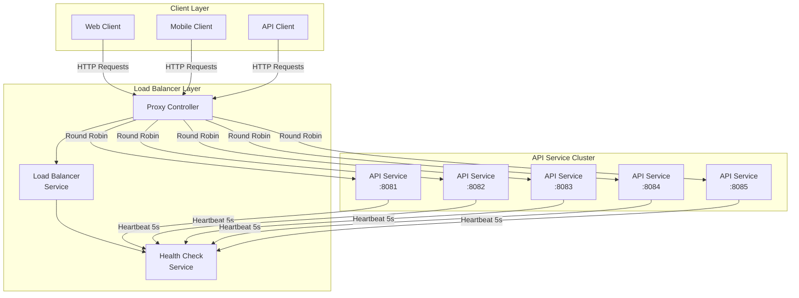

In today’s world of microservices, managing and balancing traffic across multiple instances of a service is essential for scalability and reliability. This post will guide you through building a basic load balancer using Spring Boot, featuring health checks and round-robin distribution.

## Project Overview

This load balancer project is built on Spring Boot 3.2.0 and Java 21, leveraging modern Java features and enterprise patterns. The setup consists of three main parts:

- **Load Balancer Service**: Manages request distribution.
- **API Service**: The demo service that handles distributed requests.
- **Common Module**: Shared DTOs and utility classes.

### Architecture

Here's a high-level view of the system flow:



- **Clients** send requests to the load balancer (port 8080).
- The load balancer maintains a list of healthy services and uses round-robin to distribute requests.
- **API services** register themselves with heartbeat messages every 5 seconds.
- A **Health Check Service** continuously monitors service status, removing unresponsive instances.
- Each API service operates on a unique port (8081–8085) and handles requests forwarded by the load balancer.

## Implementation Details

Let's dive into the code and logic behind each component.

### 1. Common DTOs

These shared data structures facilitate communication between services:

```java
// HeartbeatRequest.java
public record HeartbeatRequest(
    String serviceId,
    String host,
    int port,
    String status,
    long timestamp
) {}

// HeartbeatResponse.java
public record HeartbeatResponse(
    boolean acknowledged,
    String message,
    long timestamp
) {}
```

### 2. Service Node Model

The `ServiceNode` record helps the load balancer keep track of each service instance:

```java
public record ServiceNode(
    String serviceId,
    String host,
    int port,
    boolean healthy,
    Instant lastHeartbeat
) {}
```

### 3. Load Balancer Service

The main logic for load balancing is implemented in `LoadBalancerService`:

```java
@Service
public class LoadBalancerService {
    private final ConcurrentHashMap<String, ServiceNode> serviceNodes = new ConcurrentHashMap<>();
    private final AtomicInteger currentNodeIndex = new AtomicInteger(0);

    public void registerNode(ServiceNode node) {
        serviceNodes.put(node.serviceId(), node);
    }

    public void removeNode(String serviceId) {
        serviceNodes.remove(serviceId);
    }

    public ServiceNode getNextAvailableNode() {
        List<ServiceNode> healthyNodes = serviceNodes.values().stream()
            .filter(ServiceNode::healthy)
            .toList();
        if (healthyNodes.isEmpty()) {
            throw new IllegalStateException("No healthy nodes available");
        }
        int index = currentNodeIndex.getAndIncrement() % healthyNodes.size();
        return healthyNodes.get(index);
    }
}
```

### 4. Health Check Service

The `HealthCheckService` manages service health by checking heartbeats and removing inactive nodes:

```java
@Service
@Slf4j
@RequiredArgsConstructor
public class HealthCheckService {
    private final LoadBalancerService loadBalancerService;
    private static final long HEALTH_CHECK_TIMEOUT_SECONDS = 30;

    public HeartbeatResponse processHeartbeat(HeartbeatRequest request) {
        ServiceNode node = new ServiceNode(
            request.serviceId(),
            request.host(),
            request.port(),
            true,
            Instant.now()
        );
        loadBalancerService.registerNode(node);
        return new HeartbeatResponse(true, "Heartbeat acknowledged", Instant.now().toEpochMilli());
    }

    @Scheduled(fixedRate = 10000)
    public void checkNodeHealth() {
        Instant threshold = Instant.now().minus(HEALTH_CHECK_TIMEOUT_SECONDS, ChronoUnit.SECONDS);
        loadBalancerService.getAllNodes().stream()
            .filter(node -> node.lastHeartbeat().isBefore(threshold))
            .forEach(node -> loadBalancerService.removeNode(node.serviceId()));
    }
}
```

### 5. Proxy Controller

The `ProxyController` forwards incoming requests to available services:

```java
@Slf4j
@RestController
public class ProxyController {
    private final LoadBalancerService loadBalancerService;
    private final HealthCheckService healthCheckService;
    private final RestTemplate restTemplate;

    @PostMapping("/heartbeat")
    public HeartbeatResponse handleHeartbeat(@RequestBody HeartbeatRequest request) {
        return healthCheckService.processHeartbeat(request);
    }

    @RequestMapping(value = "/**")
    public ResponseEntity<?> proxyRequest(HttpServletRequest request) throws URISyntaxException, IOException {
        var node = loadBalancerService.getNextAvailableNode();
        String targetUrl = String.format("http://%s:%d%s", node.host(), node.port(), request.getRequestURI());

        // Copy headers and forward the request
        HttpHeaders headers = new HttpHeaders();
        Enumeration<String> headerNames = request.getHeaderNames();
        while (headerNames.hasMoreElements()) {
            String headerName = headerNames.nextElement();
            headers.addAll(headerName, Collections.list(request.getHeaders(headerName)));
        }

        ResponseEntity<String> response = restTemplate.exchange(
            new URI(targetUrl),
            HttpMethod.valueOf(request.getMethod()),
            new HttpEntity<>(StreamUtils.copyToByteArray(request.getInputStream()), headers),
            String.class
        );
        return new ResponseEntity<>(response.getBody(), response.getHeaders(), response.getStatusCode());
    }
}
```

### 6. API Service Implementation

Each API service sends a heartbeat message every 5 seconds to register with the load balancer:

```java
@Slf4j
@Component
public class HeartbeatConfig {
    private final RestTemplate restTemplate;
    private final String serviceId = UUID.randomUUID().toString();

    @Value("${server.port}")
    private int serverPort;

    @Scheduled(fixedRate = 5000)
    public void sendHeartbeat() {
        try {
            var request = new HeartbeatRequest(
                serviceId,
                InetAddress.getLocalHost().getHostName(),
                serverPort,
                "UP",
                Instant.now().toEpochMilli()
            );
            restTemplate.postForObject("http://load-balancer:8080/heartbeat", request, void.class);
            log.info("Heartbeat sent successfully");
        } catch (Exception e) {
            log.error("Failed to send heartbeat: {}", e.getMessage());
        }
    }
}
```

## Docker Deployment

For deployment, we use Docker Compose to spin up the load balancer and API services. Here’s an example `docker-compose.yml`:

```yaml
services:
  load-balancer:
    build: load-balancer
    ports:
      - "8080:8080"
    networks:
      - app-network

  api-service-1:
    build: api-service
    environment:
      - SERVER_PORT=8081
    networks:
      - app-network

  api-service-2:
    build: api-service
    environment:
      - SERVER_PORT=8082
    networks:
      - app-network
networks:
  app-network:
    driver: bridge
```

## Key Features

This load balancer implementation provides:
- **Round-Robin Load Balancing**: Fair distribution of traffic.
- **Health Checks**: Monitors service availability.
- **Docker Support**: Quick deployment with Docker Compose.

## Conclusion

This project offers a basic but functional load balancer built on Spring Boot. While production environments often rely on more advanced solutions like Nginx or HAProxy, understanding the core concepts and building your own load balancer provides valuable insight into distributed systems.

For reference, the entire code implementation can also be found on [GitHub](https://github.com/nicholasadamou/spring-boot-load-balancer-demo).
