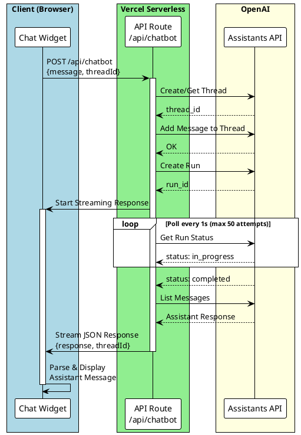
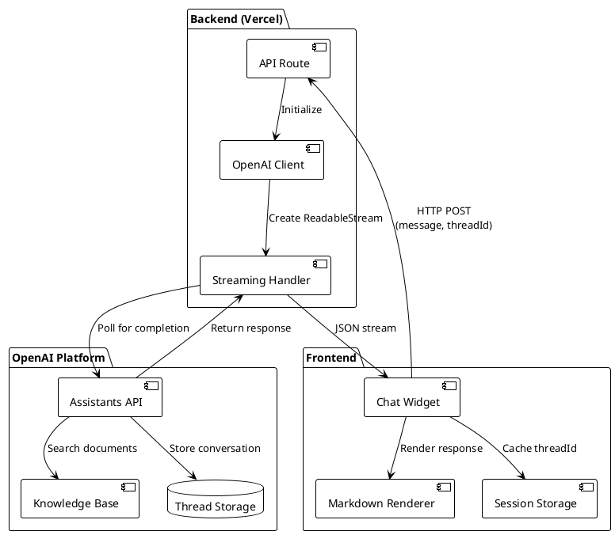
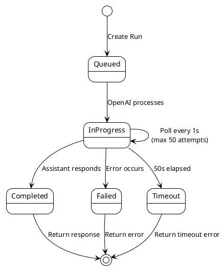

Building a chat assistant that's knowledgeable about you and your work can significantly enhance visitor engagement on your portfolio site. This guide walks through how I implemented an AI-powered chat assistant using OpenAI's Assistants API, complete with streaming support to handle serverless function timeouts.

## Why I Added a Chat Assistant

As a software engineer with a portfolio showcasing numerous projects, blog posts, and technical notes, I recognized that visitors often have specific questions:

- "What technologies does Nicholas work with?"
- "Has he built anything with React and Node.js?"
- "What's his experience with cloud platforms?"
- "Can you summarize this project for me?"

While all this information is available across my site, requiring visitors to navigate through multiple pages creates friction. A chat assistant solves this by:

1. **Providing Instant Answers**: Visitors can ask natural questions and get immediate responses
2. **Showcasing Technical Skills**: The implementation itself demonstrates full-stack development, API integration, and solving real production challenges
3. **Improving Engagement**: Interactive experiences keep visitors on the site longer
4. **Accessibility**: Offers an alternative way to explore content for users who prefer conversational interfaces
5. **Standing Out**: A personalized AI assistant differentiates my portfolio from standard static sites

The assistant is trained on my resume, project descriptions, and technical writing, making it a knowledgeable representative that can answer questions about my background and work—essentially acting as a 24/7 interactive resume.

## The Challenge

The initial implementation faced a critical issue in production: **504 Gateway Timeouts**. OpenAI's Assistant API can take 20-30 seconds to generate responses, but Vercel's serverless functions have strict timeout limits:

- **Hobby Plan**: 10 seconds maximum
- **Pro Plan**: 60 seconds maximum

When using the standard `createAndPoll` method, the function would timeout before the assistant finished responding, resulting in failed requests and a poor user experience.

## The Solution: Streaming with Manual Polling

Instead of waiting for the entire response, I implemented a streaming solution that:

1. Creates a `ReadableStream` to maintain the connection
2. Manually polls the OpenAI API for run status
3. Sends the response as soon as it's available
4. Provides better timeout control and error handling

### Architecture Overview



The streaming approach allows the connection to stay open while polling OpenAI, preventing serverless timeouts.

## System Architecture

Before diving into implementation, here's how the components work together:



## Step 1: Create an OpenAI Assistant

First, create an assistant on the OpenAI platform with knowledge about yourself:

### 1. Prepare Your Knowledge Base

Gather content about yourself:

- Resume/CV
- Project descriptions
- Blog posts or articles
- Technical skills and experience
- Personal interests and background

### 2. Create the Assistant

Go to the [OpenAI Platform](https://platform.openai.com/assistants) and:

1. Click "Create Assistant"
2. Give it a name (e.g., "Portfolio Assistant")
3. Add instructions:

```text path=null start=null
You are a helpful AI assistant trained on the content from Nicholas Adamou's portfolio website (nicholasadamou.com). Your role is to help visitors learn about Nicholas, his projects, blog posts, skills, and experience.

Key guidelines:
- Answer questions about Nicholas's projects, blog posts, skills, and professional background
- Provide accurate information based on the training data
- Be friendly, professional, and concise
- If you don't know something, admit it rather than making up information
- Encourage users to visit specific pages or contact Nicholas directly when appropriate
- When discussing projects, mention relevant technologies and provide context
- For technical questions about blog posts, reference the specific post if available

Always maintain a helpful and engaging tone while representing Nicholas's professional brand.
```

4. Upload your knowledge base files (PDF, TXT, DOCX)
5. Enable **File Search** capability
6. Copy the **Assistant ID** (starts with `asst_`)

### 3. Set Environment Variables

Add to your `.env.local`:

```bash path=null start=null
OPENAI_API_KEY=sk-proj-...
OPENAI_ASSISTANT_ID=asst_...
```

## Step 2: Implement the API Route

Create the backend API route with streaming support:

```typescript path=/src/app/api/chatbot/route.ts start=1
import { NextRequest } from "next/server";
import OpenAI from "openai";

// Lazy-initialize to avoid build-time errors
function getOpenAIClient() {
  return new OpenAI({
    apiKey: process.env.OPENAI_API_KEY,
  });
}

// Set max duration (60s for Pro, 10s for Hobby)
export const maxDuration = 60;

export async function POST(req: NextRequest) {
  const encoder = new TextEncoder();

  try {
    const body = await req.json();
    const message = body.message as string;
    const clientThreadId = body.threadId as string | undefined;

    if (!message) {
      return new Response(JSON.stringify({ error: "Message is required" }), {
        status: 400,
        headers: { "Content-Type": "application/json" },
      });
    }

    const assistantId = process.env.OPENAI_ASSISTANT_ID;
    const openai = getOpenAIClient();

    // Get or create thread
    let threadId: string;
    if (clientThreadId) {
      threadId = clientThreadId;
    } else {
      const thread = await openai.beta.threads.create();
      threadId = thread.id;
    }

    // Add message to thread
    await openai.beta.threads.messages.create(threadId, {
      role: "user",
      content: message,
    });

    // Create streaming response
    const stream = new ReadableStream({
      async start(controller) {
        try {
          // Start the assistant run
          const run = await openai.beta.threads.runs.create(threadId, {
            assistant_id: assistantId,
          });

          // Poll for completion (50 attempts × 1s = 50s max)
          let attempts = 0;
          const maxAttempts = 50;
          let runStatus = await openai.beta.threads.runs.retrieve(run.id, {
            thread_id: threadId,
          });

          while (
            runStatus.status === "queued" ||
            runStatus.status === "in_progress"
          ) {
            if (attempts >= maxAttempts) {
              controller.enqueue(
                encoder.encode(
                  JSON.stringify({
                    error: "Request timeout - please try again",
                  }) + "\n"
                )
              );
              controller.close();
              return;
            }

            await new Promise((resolve) => setTimeout(resolve, 1000));
            runStatus = await openai.beta.threads.runs.retrieve(run.id, {
              thread_id: threadId,
            });
            attempts++;
          }

          if (runStatus.status !== "completed") {
            throw new Error("Assistant failed to respond");
          }

          // Get the assistant's response
          const messagesResponse =
            await openai.beta.threads.messages.list(threadId);
          const assistantMessage = messagesResponse.data.find(
            (msg) => msg.role === "assistant"
          );

          if (!assistantMessage) {
            throw new Error("No response from assistant");
          }

          // Extract text content
          const textContent = assistantMessage.content.find(
            (content) => content.type === "text"
          );

          let responseText = "I couldn't generate a response.";
          if (textContent && textContent.type === "text") {
            responseText = textContent.text.value;

            // Remove OpenAI annotations
            if (textContent.text.annotations) {
              textContent.text.annotations.forEach((annotation) => {
                responseText = responseText.replace(annotation.text, "");
              });
            }
          }

          // Send complete response
          controller.enqueue(
            encoder.encode(
              JSON.stringify({ response: responseText, threadId }) + "\n"
            )
          );
          controller.close();
        } catch (error) {
          console.error("Stream error:", error);
          controller.enqueue(
            encoder.encode(
              JSON.stringify({ error: "Internal server error" }) + "\n"
            )
          );
          controller.close();
        }
      },
    });

    return new Response(stream, {
      headers: {
        "Content-Type": "application/json",
        "Transfer-Encoding": "chunked",
      },
    });
  } catch (error) {
    console.error("Chatbot API error:", error);
    return new Response(JSON.stringify({ error: "Internal server error" }), {
      status: 500,
      headers: { "Content-Type": "application/json" },
    });
  }
}
```

### Key Implementation Details

**1. Lazy OpenAI Client Initialization**

```typescript path=null start=null
function getOpenAIClient() {
  return new OpenAI({
    apiKey: process.env.OPENAI_API_KEY,
  });
}
```

This prevents build-time errors when environment variables aren't available during static generation.

**2. Manual Polling Instead of `createAndPoll`**

```typescript path=null start=null
// ❌ Don't use - causes timeouts
const run = await openai.beta.threads.runs.createAndPoll(threadId, {
  assistant_id: assistantId,
});

// ✅ Use manual polling with timeout control
const run = await openai.beta.threads.runs.create(threadId, {
  assistant_id: assistantId,
});

while (status === "in_progress") {
  await sleep(1000);
  status = await checkStatus();
}
```

**3. Streaming Response Format**

Responses are sent as newline-delimited JSON:

```json path=null start=null
{ "response": "Hello! I'm here to help...", "threadId": "thread_abc123" }
```

### Polling State Machine

The assistant run goes through several states:



## Step 3: Build the Client Component

Create a React component to handle the streaming response:

```typescript path=/src/components/common/Chatbot/ChatbotWidget.tsx start=108
const sendMessage = async (content: string) => {
  setIsLoading(true);

  try {
    const response = await fetch("/api/chatbot", {
      method: "POST",
      headers: { "Content-Type": "application/json" },
      body: JSON.stringify({ message: content.trim(), threadId }),
    });

    if (!response.ok || !response.body) {
      throw new Error("Failed to get response");
    }

    // Read streaming response
    const reader = response.body.getReader();
    const decoder = new TextDecoder();
    let buffer = "";
    let hasError = false;
    let errorMessage = "";

    while (true) {
      const { done, value } = await reader.read();
      if (done) break;

      buffer += decoder.decode(value, { stream: true });

      // Parse complete JSON objects
      const lines = buffer.split("\n");
      buffer = lines.pop() || "";

      for (const line of lines) {
        if (line.trim()) {
          try {
            const data = JSON.parse(line);

            if (data.error) {
              hasError = true;
              errorMessage = data.error;
              break;
            }

            if (data.threadId) {
              setThreadId(data.threadId);
            }

            if (data.response) {
              const assistantMessage = {
                id: Date.now().toString(),
                role: "assistant",
                content: data.response,
                timestamp: new Date(),
              };
              setMessages((prev) => [...prev, assistantMessage]);
            }
          } catch (parseError) {
            console.error("Failed to parse:", line, parseError);
          }
        }
      }

      if (hasError) break;
    }

    if (hasError) {
      throw new Error(errorMessage);
    }
  } catch (error) {
    console.error("Chat error:", error);
    // Show error message to user
  } finally {
    setIsLoading(false);
  }
};
```

### Key Client Features

1. **Streaming Parser**: Handles newline-delimited JSON
2. **Error Handling**: Properly catches and displays errors
3. **Thread Persistence**: Maintains conversation context via `threadId`
4. **Loading States**: Shows "Thinking..." while waiting for response

## Step 4: Add Markdown Support

Install dependencies for rich text rendering:

```bash path=null start=null
npm install react-markdown remark-gfm
```

Render assistant messages with markdown:

```typescript path=null start=null
import ReactMarkdown from "react-markdown";
import remarkGfm from "remark-gfm";

<ReactMarkdown
  remarkPlugins={[remarkGfm]}
  className="prose prose-sm dark:prose-invert"
>
  {message.content}
</ReactMarkdown>
```

## Step 5: Deploy to Vercel

### Set Environment Variables

In your Vercel project settings, add:

```bash path=null start=null
OPENAI_API_KEY=sk-proj-...
OPENAI_ASSISTANT_ID=asst_...
```

### Verify Plan Limits

- **Hobby Plan**: 10s timeout (may not be sufficient)
- **Pro Plan**: 60s timeout (recommended)

If you're on the Hobby plan and experiencing timeouts, consider:

- Upgrading to Pro
- Reducing assistant response complexity
- Implementing a queue system with webhooks

## Common Issues and Solutions

### Issue 1: "Path parameters result in path with invalid segments"

**Problem**: Incorrect parameter order for `runs.retrieve()`

**Solution**: Use the correct syntax:

```typescript path=null start=null
// ✅ Correct
await openai.beta.threads.runs.retrieve(runId, { thread_id: threadId });

// ❌ Incorrect
await openai.beta.threads.runs.retrieve(threadId, runId);
```

### Issue 2: Build fails with "Missing credentials"

**Problem**: OpenAI client initialized at module level

**Solution**: Use lazy initialization:

```typescript path=null start=null
// ❌ Don't do this
const openai = new OpenAI({
  apiKey: process.env.OPENAI_API_KEY,
});

// ✅ Do this
function getOpenAIClient() {
  return new OpenAI({
    apiKey: process.env.OPENAI_API_KEY,
  });
}
```

### Issue 3: 504 Gateway Timeout in production

**Problem**: Response takes longer than serverless timeout

**Solution**: Implement streaming as shown above, or upgrade to Vercel Pro.

## Best Practices

1. **Cache Thread IDs**: Store in session storage to maintain context
2. **Clear Chat History**: Provide a way for users to start fresh
3. **Keyboard Shortcuts**: Add Cmd/Ctrl+J to toggle chat
4. **Mobile Considerations**: Ensure responsive design
5. **Error Messages**: Use friendly, actionable error text
6. **Loading States**: Show clear feedback during processing

## Conclusion

Building an AI-powered chat assistant adds significant value to a portfolio site, allowing visitors to learn about you conversationally. By implementing streaming responses with manual polling, you can work within serverless timeout constraints while providing a smooth user experience.

The key takeaways:

- Use OpenAI's Assistants API with file search for knowledge base
- Implement streaming to handle long response times
- Properly handle errors with clear user feedback
- Test thoroughly in production-like environments

With these patterns, you can build a robust, personalized chat assistant that engages visitors and showcases your technical capabilities.
