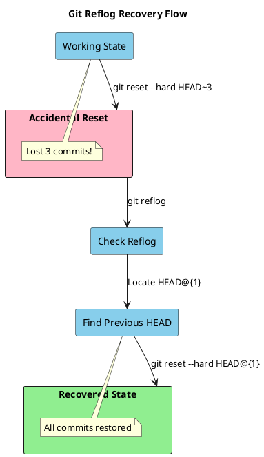
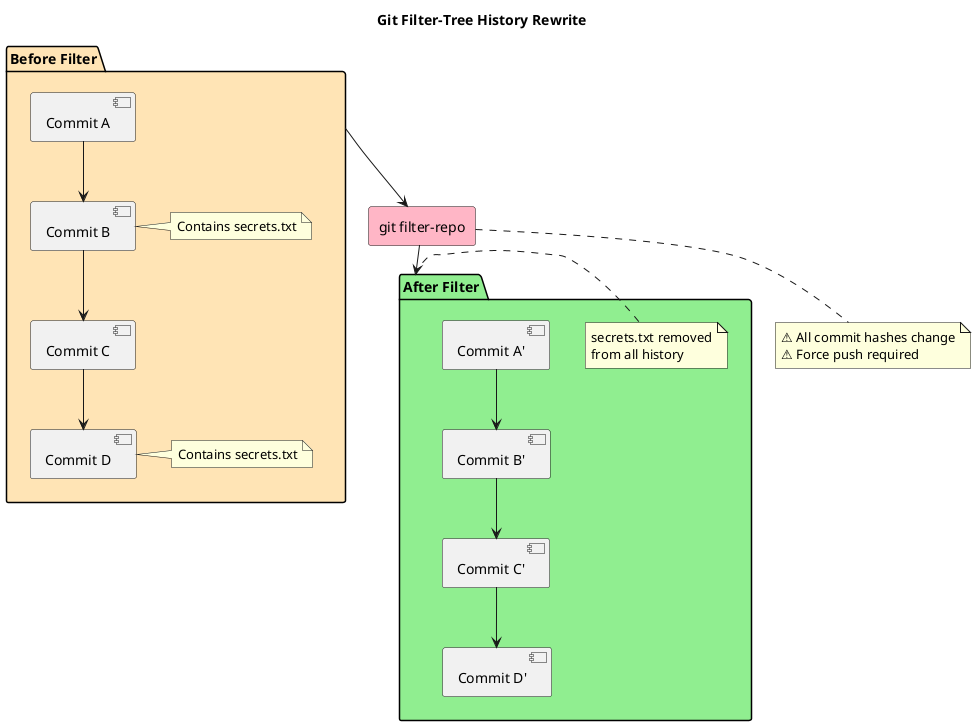
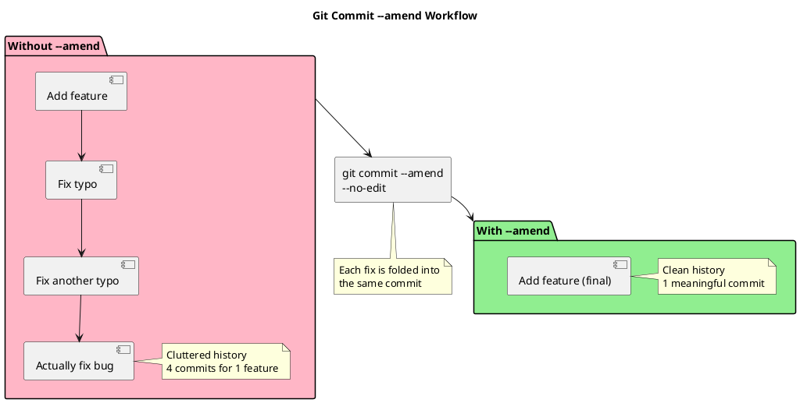
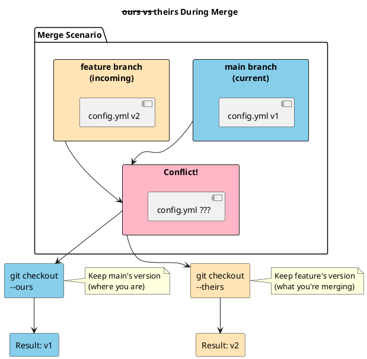

Over the years, I've learned that mastering Git is so much more than just running add, commit, and push. In this note, I want to share with you the advanced Git commands and techniques that have truly saved my skin and boosted my workflow. From recovering from spectacular mistakes (yes, I've undone some terrifying rebases!) to hunting down seemingly lost commits or carefully rewriting a project's history, these are the tools that have helped me keep projects on track and maintain a clean, understandable history. My hope is that by sharing my own experience with these commands, you'll feel much more confident taking on any Git challenge that comes your way.

## Git Reflog: Your Time Machine

`git reflog` is Git's safety net—it records every change to HEAD, even commits that seem "lost" after a reset or rebase.

### What It Does

- Records all HEAD movements (commits, checkouts, resets, rebases)
- Keeps history for ~90 days by default
- Works locally (not pushed to remote)

### Common Use Cases

Git reflog shines brightest in moments of panic: when you've lost commits after a mistaken reset, need to recover work erased by an accidental rebase, or want to undo a problematic merge. Here are some of the most useful scenarios where reflog can help you recover quickly and safely:



**Recover from accidental reset:**

```bash
git reset --hard HEAD~3  # Oops, deleted 3 commits
git reflog               # Find the commit hash before reset
git reset --hard HEAD@{1}  # Restore to previous state
```

**Find lost commits after rebase:**

```bash
git reflog
# Look for your commit before the problematic rebase
git checkout <commit-hash>
git checkout -b recovery-branch
```

**Undo a bad merge:**

```bash
git reflog
git reset --hard HEAD@{n}  # Where n is before the merge
```

### Pro Tips

- `git reflog show --all` shows reflog for all branches
- Each entry has a timestamp—useful for "I had it working yesterday"
- Combine with `git cherry-pick` to selectively recover changes

## Git Filter-Tree: Surgical History Rewrites

`git filter-tree` (or the older `git filter-branch`) allows you to rewrite Git history at scale—removing files, changing authors, or cleaning sensitive data.

### Why Use It

- Remove accidentally committed secrets or large files
- Change author information across history
- Clean up repo before open-sourcing
- Split a subdirectory into its own repository

### Common Operations

Before diving into specific commands, it's helpful to understand the types of large-scale changes `git filter-tree` enables. Below are some of the most common workflows, with sample commands to illustrate how you can surgically alter your repository's history—whether you're removing sensitive files, cleaning up bloat, or modifying author information across all commits.



**Remove a file from all history:**

```bash
git filter-branch --tree-filter 'rm -f passwords.txt' HEAD
# Or with the newer filter-repo tool:
git filter-repo --path passwords.txt --invert-paths
```

**Remove large files to reduce repo size:**

```bash
git filter-branch --tree-filter 'rm -rf node_modules/' HEAD
```

**Change author email across all commits:**

```bash
git filter-branch --env-filter '
if [ "$GIT_AUTHOR_EMAIL" = "old@email.com" ]; then
    export GIT_AUTHOR_EMAIL="new@email.com"
    export GIT_AUTHOR_NAME="New Name"
fi
' HEAD
```

### Important Warnings

- ⚠️ Rewrites commit hashes—requires force push
- ⚠️ Team members must re-clone or rebase
- ⚠️ Use `git-filter-repo` for better performance (install via brew/pip)
- ⚠️ Always backup before running: `git clone --mirror original backup`

### Modern Alternative

```bash
# git-filter-repo is faster and safer
brew install git-filter-repo

# Remove a file
git filter-repo --path secrets.env --invert-paths

# Keep only a subdirectory
git filter-repo --path src/component/
```

## Git Commit --amend: Quick Fixes

`git commit --amend` lets you modify the most recent commit without creating a new one—perfect for fixing typos, adding forgotten files, or improving commit messages.

### Basic Usage

Before we look at specific amend commands, let's review what this feature accomplishes. Amending a commit is a handy way to adjust your most recent commit, either by editing its message, adding or removing files, or correcting author details. It's an essential tool to keep your commit history clean and meaningful without introducing extra commits for small fixes.

**Fix commit message:**

```bash
git commit --amend -m "Correct commit message"
```

**Add forgotten files:**

```bash
git add forgotten-file.js
git commit --amend --no-edit  # Keep existing message
```

**Change author info:**

```bash
git commit --amend --author="Name <email@example.com>"
```

### Workflow Speed-Ups

Before diving into more advanced workflow techniques, it's helpful to master commit amendments. This section explores how `git commit --amend` empowers you to polish and perfect your last commit without cluttering your history—a crucial tool for any disciplined, efficient Git workflow.



**Iterative development:**

```bash
# Make changes
git add .
git commit -m "WIP: Feature X"

# Realize you need more changes
git add more-changes.js
git commit --amend --no-edit  # Fold into same commit
```

**Clean commit history before pushing:**

```bash
# Instead of:
# - "Add feature"
# - "Fix typo"
# - "Fix another typo"
# - "Actually fix the bug"

# Use amend to keep ONE clean commit
git commit --amend --no-edit  # Each time you fix something
```

### Pro Tips

- Only amend commits that haven't been pushed (or use `git push --force-with-lease`)
- Use `--no-edit` to skip message editor
- Combine with `git add -p` for surgical staging
- `git commit --amend --reset-author` updates timestamp to now

## Git Checkout --ours/--theirs: Merge Conflict Resolution

When resolving merge conflicts, `--ours` and `--theirs` let you quickly accept one side entirely—no manual editing needed.

### Understanding the Flags

Before diving into practical examples, it's important to understand what happens behind the scenes when resolving merge conflicts. The `--ours` and `--theirs` flags, used with `git checkout`, provide powerful shortcuts for quickly settling conflicts in favor of one branch or the other. This section unpacks what these terms mean and how to use them confidently during your day-to-day workflow.



**During a merge:**

- `--ours` = current branch (where you are)
- `--theirs` = incoming branch (what you're merging in)

**During a rebase:**

- `--ours` = incoming branch (what you're rebasing onto) ⚠️
- `--theirs` = current branch (your commits) ⚠️
- Yes, it's reversed during rebase!

### Common Workflows

When you encounter merge conflicts, it's easy to get bogged down manually editing files. Instead, Git offers powerful shortcuts with the `--ours` and `--theirs` flags to resolve conflicts quickly and intentionally. The following examples demonstrate how to efficiently use these flags during day-to-day development, turning a potentially tedious process into a streamlined part of your workflow.

**Accept all their changes for specific files:**

```bash
git merge feature-branch
# Conflicts in package-lock.json
git checkout --theirs package-lock.json
git add package-lock.json
```

**Accept all your changes:**

```bash
git checkout --ours database/schema.sql
git add database/schema.sql
```

**Bulk resolution:**

```bash
# Accept theirs for all conflicts
git checkout --theirs .
git add .

# Accept ours for all conflicts
git checkout --ours .
git add .
```

### Real-World Use Cases

Real-world scenarios often demand swift and decisive conflict resolution to keep development moving. Below are some practical examples that illustrate how `--ours` and `--theirs` can streamline merges in different situations, helping teams adopt clear strategies for resolving the most common kinds of merge conflicts.

**Lock file conflicts (always regenerate):**

```bash
git checkout --theirs package-lock.json
npm install  # Regenerate anyway
git add package-lock.json
```

**Keep main's version during feature merge:**

```bash
git checkout main
git merge feature-branch
git checkout --ours config/production.yml
git add config/production.yml
git commit
```

**Database migration conflicts (prefer incoming):**

```bash
git checkout --theirs db/migrations/
git add db/migrations/
```

### Pro Tips

- Combine with glob patterns: `git checkout --theirs "*.lock"`
- After choosing, always review with `git diff --staged`
- For partial conflicts, manually resolve then `git add`
- Use `git merge -X ours` or `-X theirs` to prefer one side automatically

## Combining Powers: Advanced Workflows

Before diving into nuanced techniques, it's important to see how advanced Git operations can be combined for even greater effect. In this section, we'll explore workflows that leverage multiple tools—from conflict resolution flags to history editing—to solve real-world problems with clarity and control.

### Recover + Cherry-pick

```bash
git reflog
git cherry-pick <lost-commit-hash>
git commit --amend --no-edit  # Fold into current work
```

### Clean History Before PR

```bash
# Made messy commits
git rebase -i HEAD~5
# Squash/fixup commits
# If something breaks:
git reflog
git reset --hard HEAD@{1}
```

### Conflict-Heavy Merge Strategy

```bash
git merge feature
# Many conflicts in generated files
git checkout --theirs "dist/*"
git checkout --ours "config/*"
# Manually resolve only the important files
git add .
git commit
```

## Key Takeaways

Understanding and mastering advanced Git workflows allows you to resolve complex merge conflicts, recover lost changes, and maintain a clean, understandable history. Techniques like using reflog for recovery, cherry-picking, interactive rebasing, and strategic use of `--ours` or `--theirs` during merges give you precision and confidence in collaborative environments. Always prioritize communication and double-check your commands to ensure you preserve both your work and your team's progress.

1. **Reflog** is your undo button for "oh no" moments
2. **Filter-tree** rewrites history—powerful but dangerous
3. **Amend** keeps commits clean without polluting history
4. **--ours/--theirs** saves time on bulk conflict resolution

Remember: With great power comes great responsibility. Always have backups, and communicate with your team before rewriting shared history.
