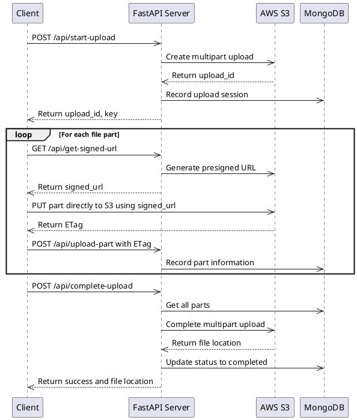
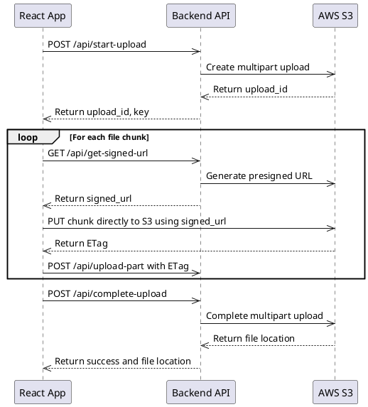

If you’ve ever tried uploading massive files (20GB–30GB) through your backend server, you’ve probably realized quickly that it’s not scalable. Memory spikes, timeouts, and server crashes are just the beginning. That’s why using **Amazon S3 Multipart Upload with Signed URLs** is the industry-standard solution.

In this detailed guide, I’ll walk you through how to implement a **direct-to-S3 large file uploader** using:

* **Python** for the backend
* **AWS SDK for Python** for S3 Mutlipart Upload API with Signed URLs
* **Fast API** for the server
* **React + Vite** for the frontend
* **MongoDB** for tracking uploads

## 🧠 Why This Approach?

Instead of uploading files directly to your backend server, we’ll use **S3 Multipart Upload**. This method breaks the file into smaller chunks, uploads them in parallel, and then combines them on the server. This approach is much more efficient and scalable.

_How does this work?_

1. **Client**: The client (browser) initiates the upload process.
2. **Backend**: The backend generates a **signed URL** for each chunk.
3. **Client**: The client uploads each chunk directly to S3 using the signed URL.
4. **Backend**: The backend combines the chunks on S3.

This makes the system:

* **Scalable**: Can handle large files without overloading the server.
* **Secure**: Uses signed URLs to ensure only authorized users can upload files.
* **Efficient**: Uploads chunks in parallel, reducing the overall upload time.

## 🛠️ Tech Stack

* Backend
  * **Python**: For the backend server.
  * **AWS SDK for Python**: For interacting with S3.
  * **Fast API**: For building the server.
* Frontend
  * **React + Vite**: For building the frontend.
* Database
  * **MongoDB**: For tracking uploads.

## 🔁 Flow Overview

1. User selects file in frontend.
2. Frontend sends filename to backend → backend creates multipart upload (S3) and stores metadata (MongoDB).
3. Frontend splits file into chunks.
4. For each chunk:
	- Ask backend for signed URL.
	- Upload chunk to S3 using that URL.
	- Notify backend with ETag + part number.
5. After all chunks are uploaded:
	- Frontend tells backend to finalize upload.
	- Backend completes the multipart upload using S3 API.

_Flow Diagram from the Backend Perspective_

_Flow Diagram from the Frontend Perspective_

## ✅ Final Thoughts

Handling large file uploads efficiently is crucial for modern web applications. By using S3 Multipart Upload with Signed URLs, you can ensure that your system remains scalable, secure, and efficient. This approach is widely used in industries ranging from media to e-commerce, making it a reliable choice for handling large file uploads.

For those who like bullet points to succinctly summarize the key takeaways:

* Use **signed** URLs to offload heavy uploads from your backend.
* Track everything in MongoDB for status, retries, resumability.
* Only finalize uploads once all parts are done.

This is the exact approach I've used in production for multi-GB file uploads. It’s stable, efficient, and easy to extend.

_The code in this article is focused on demonstrating the overall flow and concept. It’s not fully production-structured, but feel free to explore the full implementation and adapt it to your needs — [GitHub repo](https://github.com/nicholasadamou/s3-large-file-uploader)._
