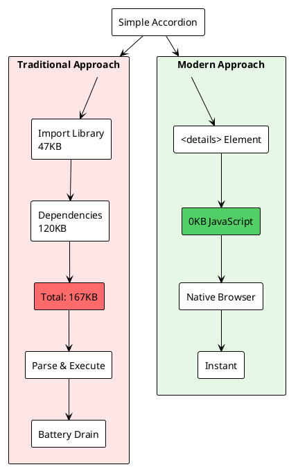
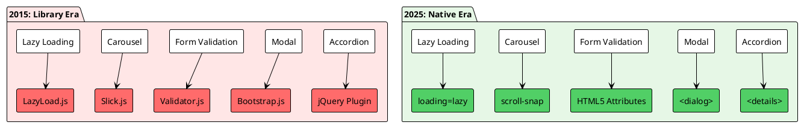
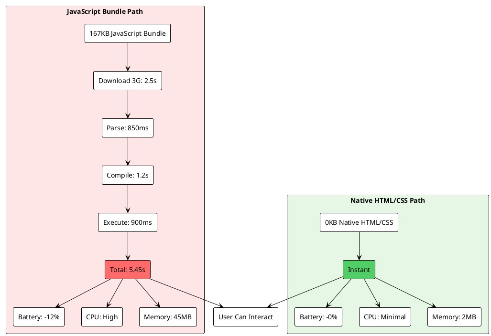
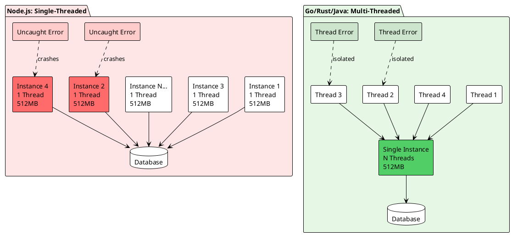

80% of the JavaScript on modern websites solves problems that don't exist anymore. We've reached a point where the browser has evolved to handle tasks natively that once required heavy libraries, yet we continue importing entire frameworks for trivial features.

## The Browser Already Solved It

Consider these common patterns and their modern, zero-JavaScript alternatives:

### The Dependency Bloat Problem

As web developers, it's easy to reach for third-party packages to solve UI and UX challenges, but many "problems" these libraries address are already natively solved by today's browsers. Every new dependency bloats your application, increases the maintenance burden, and expands the surface area for bugs and vulnerabilities. Let's look at how dependency bloat sneaks in, and why reconsidering our default to "npm install" is so important.



### Accordions

**Before:**

```javascript path=null start=null
// Import a 47 KB accordion library
import Accordion from "accordion-library";

const accordion = new Accordion({
  selector: ".accordion",
  multipleOpen: false,
  animationSpeed: 300,
});
```

**After:**

```html path=null start=null
<details>
  <summary>Click to expand</summary>
  <p>Content goes here. Zero JavaScript required.</p>
</details>
```

The `<details>` and `<summary>` elements have been part of HTML since 2014. No JavaScript, no library, no build pipeline.

### Modals

**Before:**

```javascript path=null start=null
// Complex modal library with overlay management
import Modal from "modal-library";

const modal = new Modal({
  backdrop: true,
  keyboard: true,
  focus: true,
});
```

**After:**

```html path=null start=null
<dialog id="modal">
  <p>Modal content</p>
  <button onclick="this.closest('dialog').close()">Close</button>
</dialog>

<script>
  document.querySelector("#modal").showModal();
</script>
```

The native `<dialog>` element handles backdrop, focus trapping, and accessibility automatically.

### Responsive Navigation

**Before:**

```javascript path=null start=null
// jQuery for a simple toggle
$(".menu-toggle").on("click", function () {
  $(".nav-menu").toggleClass("open");
});
```

**After:**

```html path=null start=null
<input type="checkbox" id="nav-toggle" hidden />
<label for="nav-toggle">Menu</label>
<nav>
  <!-- menu items -->
</nav>
```

```css path=null start=null
nav {
  display: none;
}

#nav-toggle:checked + label + nav {
  display: block;
}
```

Zero JavaScript. CSS `:has()` and checkbox state handle everything.

## What the Browser Can Do Today

Modern HTML and CSS provide native solutions for problems that once required JavaScript:



### Layout & Responsive Design

- **CSS Grid + Subgrid + Grid Areas**: Reorder elements visually without touching the DOM
- **Container Queries**: Responsive components based on parent size, not viewport
- **CSS `aspect-ratio`**: Maintain proportions without JavaScript calculations

### Interactive Elements

- **`<details>` / `<summary>`**: Native accordions and collapsible sections
- **`<dialog>`**: Modals with built-in accessibility
- **Form Validation**: Native HTML5 validation attributes (`required`, `pattern`, `min`, `max`)

### Performance Optimizations

- **`loading="lazy"`**: Native lazy loading for images and iframes
- **`scroll-behavior: smooth`**: Smooth scrolling without libraries
- **`scroll-snap`**: Carousels and sliders with CSS only

### Dynamic Styling

- **`:has()` selector**: Parent selection and conditional styling
- **CSS Custom Properties**: Theme switching without JavaScript
- **`toggleAttribute()`**: One-line state management for UI toggles

## The Real Cost of Over-Engineering

Instead of leveraging these native features, we import:

→ React for a contact form
→ jQuery for a carousel
→ A 47 KB accordion library for 3 collapsible sections
→ 90% of the library's code unused, but bundled anyway

### The Price We Pay

When we reach for third-party libraries to solve every UI or performance challenge, we often overlook the hidden impact—on both the user experience and the planet. Every unnecessary dependency inflates our bundles, slows interactions, drains batteries, and wastes precious device resources. Beyond the direct cost to your users, this bloat ripples outward, scaling inefficiency across millions of page loads. Let’s break down the tangible consequences of over-engineering with JavaScript compared to using the browser’s native capabilities.



**Battery Drain**: Every kilobyte of JavaScript must be parsed, compiled, and executed—taxing mobile devices unnecessarily.

**Slower Page Loads**: Large bundles delay Time to Interactive (TTI), frustrating users who just want to read content.

**Dependency Chains**: Each package brings its own dependencies, creating chains you'll never audit for security or compatibility.

**Build Complexity**: Webpack, Babel, and bundlers for problems HTML solved a decade ago.

## The Irony of "Modern" Development

Some developers call CSS state management "hacky" while writing `addEventListener` spaghetti to shuffle DOM nodes on every click. The irony is stark.

**The browser is not a JavaScript runtime that happens to render HTML.** It's a rendering engine with JavaScript as an escape hatch.

We've inverted the relationship. JavaScript should be the last resort, not the first instinct.

## State Management Without Libraries

**Before:**

```javascript path=null start=null
// Redux for a simple toggle
const toggleReducer = (state = { open: false }, action) => {
  switch (action.type) {
    case "TOGGLE":
      return { open: !state.open };
    default:
      return state;
  }
};
```

**After:**

```javascript path=null start=null
element.toggleAttribute("data-open");
```

CSS handles the rest:

```css path=null start=null
[data-open] {
  /* open state styles */
}
```

One line. No library. No boilerplate.

## Layout Shifts and Grid

Layout thrashing and content shifts are among the most common (and irritating) user experience issues attributed to JavaScript-driven layouts and dynamic DOM manipulation. However, many of these problems are now elegantly solved with native browser features like CSS Grid and Flexbox. By relying on these tools, we can achieve responsive, reorderable layouts without a single line of JavaScript—sidestepping performance pitfalls and complexity altogether.

**Before:**

```javascript path=null start=null
// JavaScript to reorder elements on resize
window.addEventListener("resize", () => {
  const items = Array.from(container.children);
  // Complex DOM manipulation
  items.sort(compareFunction);
  items.forEach((item) => container.appendChild(item));
});
```

**After:**

```css path=null start=null
.container {
  display: grid;
  grid-template-areas:
    "header header"
    "sidebar content"
    "footer footer";
}

@media (max-width: 768px) {
  .container {
    grid-template-areas:
      "header"
      "content"
      "sidebar"
      "footer";
  }
}
```

Visual reordering without touching the DOM. No JavaScript. No layout thrashing.

## The Node.js Problem

This mindset didn't stay in the browser. Node.js exported the npm dependency culture to servers. Your backend now inherits the same dependency debt—with production databases attached.

Then there's the architecture: Node.js's single-threaded event loop forces you to spawn countless service instances just to handle concurrency. Each instance multiplies your error vectors exponentially. One uncaught exception crashes an entire process.



Compare that to multi-threaded languages like Go, Rust, or Java, where threads share memory efficiently and a single crash doesn't take down the whole server.

## Before You `npm install`

Before reaching for a package, ask yourself:

1. **Does the browser already solve this?** Check MDN or Can I Use.
2. **Can I write 10 lines of code instead?** Often, the native solution is simpler than configuring a library.
3. **What's the total cost?** Count the dependencies, the bundle size, and the maintenance burden.

## The Greenest Code

**The greenest code is the code you didn't ship.**

Every line of JavaScript you don't write is:

- Faster to load
- Easier to maintain
- Less likely to break
- Better for the environment

## Conclusion

Modern web development has an over-reliance on JavaScript for problems the browser solved years ago. Before importing a library, check if HTML or CSS can do it natively. Your users, your bundle size, and your future self will thank you.

The browser isn't a limitation—it's a superpower. Use it.

## External Resources

_Specifications & Documentation_

- [HTML Living Standard](https://html.spec.whatwg.org/): The official specification for modern HTML
- [MDN Web Docs](https://developer.mozilla.org/): Comprehensive documentation for web technologies
- [Can I Use](https://caniuse.com/): Browser support tables for modern web features

_Articles & Tools_

- [The Cost of JavaScript](https://v8.dev/blog/cost-of-javascript-2019): V8 team's analysis of JavaScript performance costs
- [Web Almanac](https://almanac.httparchive.org/): Annual state of the web report
- [Bundlephobia](https://bundlephobia.com/): Find the cost of adding npm packages to your bundle
