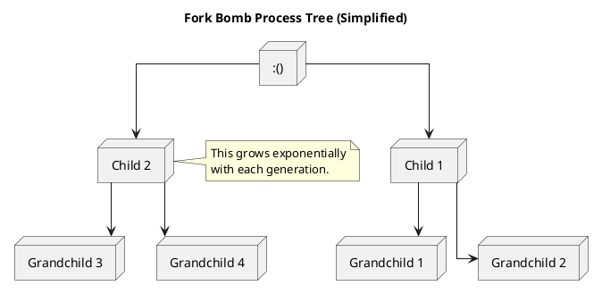
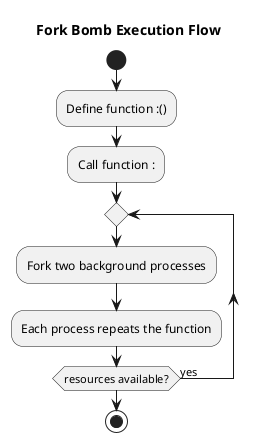

A **fork bomb** is a denial-of-service (DoS) attack against a Unix-like system. It works by rapidly creating new processes to exhaust system resources, eventually making the system unresponsive.

The classic form of a fork bomb looks like this:

```bash
:(){ :|:& };:
```

Let’s break it down step by step.

## 🧬 Dissecting the Code

### `:()`

This defines a function named `:` (yes, just a colon). While unconventional, this is valid in Bash.

### `{ :|:& };`

The function body is:

```bash
:|:&
```

- `:` calls itself.
- `|` pipes its output into another call to itself.
- `&` sends both calls to the background, allowing the parent to continue and spawn more.

This means **each function call spawns two new ones**, exponentially increasing the number of processes.

Finally, `;:` **calls the function once**, kicking off the chain reaction.

## 🌱 Process Tree Growth



The process tree grows exponentially with each generation. The number of processes doubles with each level. Ultimately, this leads to a rapid depletion of system resources.

## ⚙️ Fork Bomb Execution Flow



The fork bomb repeatedly forks two background processes, each of which repeats the function. This continues as long as system resources are available.

## 🖥️ What Happens When You Run It?

Running this code will:

1. **Define the function**.
2. **Call the function once**, which forks twice.
3. Each of those forks **forks two more**, and so on.

This exponential growth rapidly overwhelms the process table, starving the system of resources and effectively freezing it.

## 🛡️ How to Protect Against It

1. **Limit user processes** with `ulimit`:

```bash
ulimit -u 100
```

2. **Use cgroups (control groups)** for fine-grained resource control on Linux systems.

3. **Audit shell scripts** and educate users about the risks of executing unknown code.

## ⚠️ Warning

Never run the fork bomb on a production system. It will almost certainly require a hard reboot. Always test destructive code in a **controlled environment** like a virtual machine.

## 🔚 Final Thoughts

The fork bomb is a powerful demonstration of how minimal code can wreak havoc. While it's often used as a teaching example or prank, it’s a serious tool that underscores the importance of resource management and shell security.

Stay safe — and stay curious.
