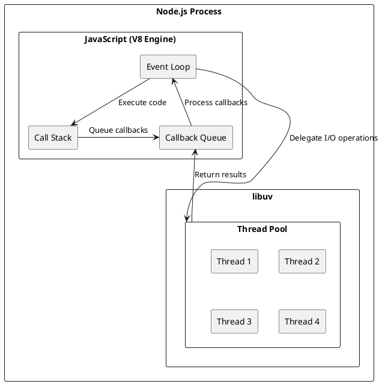
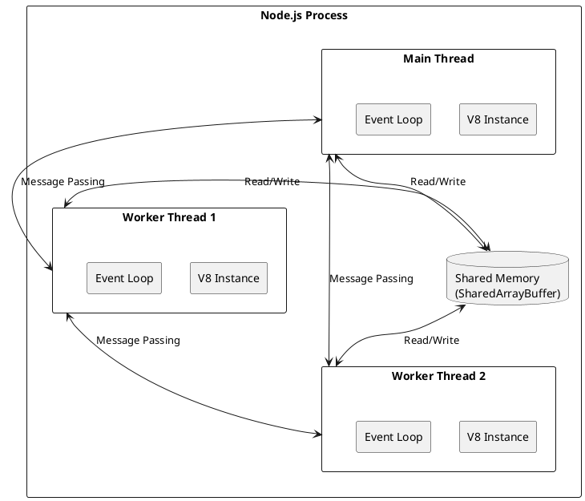
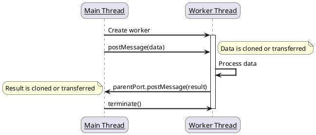
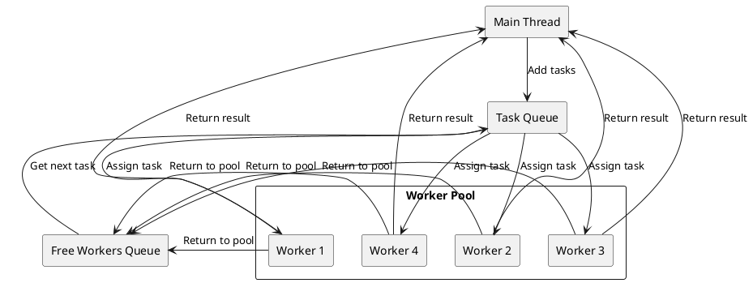
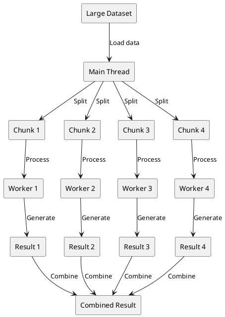

# Worker Threads in Node.js: A Comprehensive Guide

JavaScript has traditionally been known as a single-threaded language, which means it can only execute one piece of code at a time. This characteristic has shaped how we build applications in Node.js, focusing on asynchronous I/O operations to maintain performance. However, for CPU-intensive tasks, this single-threaded nature becomes a limitation.

Enter worker threads - a powerful feature in Node.js that enables true parallel execution for CPU-bound tasks. In this comprehensive guide, we'll explore everything you need to know about worker threads, from basic concepts to advanced implementation patterns.

## Understanding JavaScript's Single-Threaded Nature

Before diving into worker threads, it's important to understand why JavaScript has traditionally been single-threaded and how Node.js works around this limitation.



The diagram above illustrates Node.js's architecture with its single-threaded JavaScript execution environment and the underlying libuv thread pool that handles I/O operations.

### The History of Single-Threaded JavaScript

JavaScript was originally designed for the browser, where it primarily handled simple interactions and form validations. In this context, a single-threaded model made sense - it simplified the language and avoided complex concurrency issues like race conditions and deadlocks.

When Ryan Dahl created Node.js, he leveraged this single-threaded nature but combined it with an event-driven, non-blocking I/O model. This approach allowed Node.js to handle many concurrent connections efficiently without the complexity of traditional threading.

### Is Node.js Truly Single-Threaded?

While JavaScript code in Node.js runs in a single thread (often called the "main thread" or "event loop"), Node.js itself isn't entirely single-threaded. Under the hood, Node.js uses:

1. **The V8 JavaScript engine** - Executes JavaScript code in a single thread
2. **libuv** - A C library that provides the event loop and a thread pool for handling asynchronous I/O operations

When you perform I/O operations like reading files or making network requests, these tasks are delegated to libuv's thread pool, allowing your JavaScript code to continue executing without waiting for the I/O to complete.

## The Problem: CPU-Intensive Tasks

The single-threaded model works well for I/O-bound applications, where most of the time is spent waiting for external resources. However, it becomes problematic for CPU-intensive tasks like:

- Complex calculations
- Image or video processing
- Data encryption/decryption
- Machine learning algorithms
- Parsing large files

When your application performs these kinds of operations, the main thread becomes blocked, preventing it from handling other tasks until the CPU-intensive work is complete. This can lead to poor performance and unresponsive applications.

Consider this example:

```javascript
// This CPU-intensive task will block the event loop
function doHeavyCalculation() {
  let result = 0;
  for (let i = 0; i < 10000000000; i++) {
    result += i;
  }
  return result;
}

// This will be delayed until the calculation completes
console.log("Starting calculation...");
const result = doHeavyCalculation();
console.log("Calculation complete:", result);
console.log("This message is delayed");
```

## Naive Solutions Before Worker Threads

Before worker threads were introduced, developers used several approaches to handle CPU-intensive tasks:

### 1. Splitting Synchronous Code with setImmediate()

One approach was to break up CPU-intensive tasks into smaller chunks and use `setImmediate()` to yield to the event loop between chunks:

```javascript
const arr = new Array(1000000).fill(1);
let sum = 0;
let index = 0;

function processChunk() {
  // Process 10,000 items at a time
  const end = Math.min(index + 10000, arr.length);

  for (let i = index; i < end; i++) {
    sum += arr[i];
  }

  index = end;

  if (index < arr.length) {
    // Schedule the next chunk
    setImmediate(processChunk);
  } else {
    console.log("Sum:", sum);
  }
}

processChunk();
console.log("Processing started");
```

This approach works but makes the code more complex and increases the overall execution time.

### 2. Child Processes

Another approach was to use the `child_process` module to spawn separate Node.js processes:

```javascript
const { fork } = require('child_process');

function runHeavyTask(data) {
  return new Promise((resolve, reject) => {
    const child = fork('./heavy-task.js');

    child.on('message', resolve);
    child.on('error', reject);

    child.send(data);
  });
}

// Usage
runHeavyTask({ input: 42 })
  .then(result => console.log(result))
  .catch(err => console.error(err));
```

While this works, it has significant drawbacks:
- High memory overhead (each process has its own V8 instance)
- Slow startup time
- Limited communication (data must be serialized/deserialized)

## Introducing Worker Threads

The `worker_threads` module was introduced in Node.js v10.5.0 and became stable in Node.js v12. It provides a way to create true parallel execution threads that can share memory with the main thread.



The diagram above shows how worker threads operate within a Node.js process. Each worker thread has its own V8 instance and event loop, allowing true parallel execution. Communication happens through message passing, and memory can be shared using SharedArrayBuffer.

### Key Features of Worker Threads

1. **True parallelism** - Worker threads run in parallel with the main thread
2. **Shared memory** - Can share memory using `SharedArrayBuffer`
3. **Efficient communication** - Fast data transfer between threads
4. **Isolated JavaScript environments** - Each worker has its own V8 instance
5. **Lower overhead than child processes** - Workers are lighter than separate processes

### Basic Usage

Here's a simple example of using worker threads:

```javascript
// main.js
const { Worker } = require('worker_threads');

function runWorker(workerData) {
  return new Promise((resolve, reject) => {
    const worker = new Worker('./worker.js', { workerData });

    worker.on('message', resolve);
    worker.on('error', reject);
    worker.on('exit', (code) => {
      if (code !== 0)
        reject(new Error(`Worker stopped with exit code ${code}`));
    });
  });
}

async function main() {
  try {
    const result = await runWorker('Hello from main thread');
    console.log(result);
  } catch (err) {
    console.error(err);
  }
}

main();
```

```javascript
// worker.js
const { parentPort, workerData } = require('worker_threads');

// Perform CPU-intensive task
function performHeavyTask(data) {
  // Simulate CPU-intensive work
  let result = 0;
  for (let i = 0; i < 1000000000; i++) {
    result += i;
  }
  return { result, data };
}

const result = performHeavyTask(workerData);

// Send result back to parent
parentPort.postMessage(result);
```

### Using a Single File for Both Main Thread and Worker

You can also use a single file for both the main thread and worker code:

```javascript
const { Worker, isMainThread, parentPort, workerData } = require('worker_threads');

if (isMainThread) {
  // This code runs in the main thread

  const worker = new Worker(__filename, {
    workerData: 'Hello from main thread'
  });

  worker.on('message', (result) => {
    console.log('Worker result:', result);
  });

  worker.on('error', (err) => {
    console.error(err);
  });

  worker.on('exit', (code) => {
    if (code !== 0)
      console.error(`Worker stopped with exit code ${code}`);
  });

  console.log('Main thread continues execution...');

} else {
  // This code runs in the worker thread

  // Simulate CPU-intensive task
  function performHeavyTask(data) {
    let result = 0;
    for (let i = 0; i < 1000000000; i++) {
      result += i;
    }
    return { result, data };
  }

  const result = performHeavyTask(workerData);

  // Send result back to main thread
  parentPort.postMessage(result);
}
```

## Communication Between Threads

Worker threads communicate with the main thread through message passing, similar to how web workers function in browsers.



The sequence diagram above illustrates the typical communication flow between the main thread and a worker thread. Data is passed between threads using the postMessage API, and the data is either cloned (copied) or transferred (moved) between threads.

### Basic Message Passing

The main thread communicates with workers using `worker.postMessage()` and `worker.on('message')`:

```javascript
// In main thread
const worker = new Worker('./worker.js');

worker.postMessage('Hello worker');
worker.on('message', (message) => {
  console.log('Worker says:', message);
});
```

In the worker, you use `parentPort.postMessage()` and `parentPort.on('message')`:

```javascript
// In worker thread
const { parentPort } = require('worker_threads');

parentPort.on('message', (message) => {
  console.log('Main thread says:', message);
  parentPort.postMessage('Hello main thread');
});
```

### Transferring Data

When sending data between threads, the data is cloned by default (similar to JSON serialization/deserialization). For large data, this can be inefficient. You can use transferable objects to move data between threads without copying:

```javascript
// In main thread
const buffer = new ArrayBuffer(1024);
worker.postMessage({ buffer }, [buffer]);
// After transfer, 'buffer' is no longer usable in the main thread
```

### Sharing Memory with SharedArrayBuffer

For even more efficient data sharing, you can use `SharedArrayBuffer` to share memory between threads:

```javascript
// In main thread
const shared = new SharedArrayBuffer(1024);
const uint8 = new Uint8Array(shared);
uint8[0] = 123;

worker.postMessage({ shared });

// Later
console.log(uint8[0]); // This might have been changed by the worker
```

```javascript
// In worker thread
parentPort.on('message', ({ shared }) => {
  const uint8 = new Uint8Array(shared);
  console.log(uint8[0]); // 123

  // Modify the shared memory
  uint8[0] = 42;
});
```

## Worker Pools for Efficient Resource Usage

Creating a new worker for each task can be inefficient, especially if you have many short-lived tasks. A better approach is to create a pool of workers that can be reused:



The diagram above illustrates the worker pool pattern. Instead of creating and destroying workers for each task, a fixed number of workers are created and managed in a pool. Tasks are queued and assigned to available workers, and workers are returned to the pool after completing their tasks.

```javascript
// worker-pool.js
const { Worker } = require('worker_threads');
const os = require('os');

class WorkerPool {
  constructor(workerScript, numWorkers = os.cpus().length) {
    this.workerScript = workerScript;
    this.numWorkers = numWorkers;
    this.workers = [];
    this.freeWorkers = [];
    this.taskQueue = [];

    for (let i = 0; i < numWorkers; i++) {
      this.addNewWorker();
    }
  }

  addNewWorker() {
    const worker = new Worker(this.workerScript);

    worker.on('message', (result) => {
      // Add worker back to free pool
      this.freeWorkers.push(worker);

      // Resolve the promise with the result
      worker.currentResolve(result);

      // Process next task if any
      if (this.taskQueue.length > 0) {
        const { task, resolve } = this.taskQueue.shift();
        this.runTask(task, resolve);
      }
    });

    worker.on('error', (err) => {
      // Handle worker error
      if (worker.currentReject) {
        worker.currentReject(err);
      }

      // Remove this worker and create a new one
      this.workers = this.workers.filter(w => w !== worker);
      this.addNewWorker();
    });

    this.workers.push(worker);
    this.freeWorkers.push(worker);
  }

  runTask(task, resolve, reject) {
    if (this.freeWorkers.length === 0) {
      // No free workers, queue the task
      this.taskQueue.push({ task, resolve, reject });
      return;
    }

    const worker = this.freeWorkers.pop();
    worker.currentResolve = resolve;
    worker.currentReject = reject;
    worker.postMessage(task);
  }

  exec(task) {
    return new Promise((resolve, reject) => {
      this.runTask(task, resolve, reject);
    });
  }

  close() {
    for (const worker of this.workers) {
      worker.terminate();
    }
  }
}

module.exports = WorkerPool;
```

Usage:

```javascript
const WorkerPool = require('./worker-pool');
const pool = new WorkerPool('./worker.js', 4); // Create 4 workers

async function main() {
  const results = await Promise.all([
    pool.exec({ type: 'fibonacci', n: 42 }),
    pool.exec({ type: 'prime', max: 10000000 }),
    pool.exec({ type: 'hash', data: 'large-data' }),
    // More tasks...
  ]);

  console.log(results);
  pool.close();
}

main().catch(console.error);
```

## Real-World Use Cases

Worker threads are particularly useful for:



The diagram above illustrates a common pattern for parallel data processing with worker threads. A large dataset is split into chunks, each chunk is processed by a separate worker thread, and the results are combined to produce the final output.

### 1. Image Processing

```javascript
// main.js
const { Worker } = require('worker_threads');
const fs = require('fs');
const path = require('path');

async function resizeImage(imagePath, width, height) {
  return new Promise((resolve, reject) => {
    const worker = new Worker('./image-worker.js', {
      workerData: { imagePath, width, height }
    });

    worker.on('message', resolve);
    worker.on('error', reject);
    worker.on('exit', (code) => {
      if (code !== 0)
        reject(new Error(`Worker stopped with exit code ${code}`));
    });
  });
}

async function processImages() {
  const imageDir = './images';
  const files = fs.readdirSync(imageDir);

  const tasks = files
    .filter(file => /\.(jpg|jpeg|png)$/i.test(file))
    .map(file => {
      const imagePath = path.join(imageDir, file);
      return resizeImage(imagePath, 800, 600);
    });

  const results = await Promise.all(tasks);
  console.log(`Processed ${results.length} images`);
}

processImages().catch(console.error);
```

```javascript
// image-worker.js
const { parentPort, workerData } = require('worker_threads');
const sharp = require('sharp');
const path = require('path');

async function resizeImage() {
  const { imagePath, width, height } = workerData;
  const outputPath = path.join(
    path.dirname(imagePath),
    `resized-${path.basename(imagePath)}`
  );

  await sharp(imagePath)
    .resize(width, height)
    .toFile(outputPath);

  return { original: imagePath, resized: outputPath };
}

resizeImage()
  .then(result => parentPort.postMessage(result))
  .catch(err => {
    console.error(err);
    process.exit(1);
  });
```

### 2. Data Processing and Analysis

```javascript
// main.js
const { Worker } = require('worker_threads');
const os = require('os');

function analyzeDataChunk(chunk) {
  return new Promise((resolve, reject) => {
    const worker = new Worker('./analysis-worker.js', {
      workerData: chunk
    });

    worker.on('message', resolve);
    worker.on('error', reject);
    worker.on('exit', (code) => {
      if (code !== 0)
        reject(new Error(`Worker stopped with exit code ${code}`));
    });
  });
}

async function analyzeData(data) {
  // Split data into chunks based on CPU count
  const numCPUs = os.cpus().length;
  const chunkSize = Math.ceil(data.length / numCPUs);
  const chunks = [];

  for (let i = 0; i < data.length; i += chunkSize) {
    chunks.push(data.slice(i, i + chunkSize));
  }

  // Process each chunk in parallel
  const results = await Promise.all(
    chunks.map(chunk => analyzeDataChunk(chunk))
  );

  // Combine results
  return results.reduce((acc, result) => {
    // Merge results logic here
    return { ...acc, ...result };
  }, {});
}

// Example usage
const largeDataset = Array(1000000).fill().map((_, i) => ({
  id: i,
  value: Math.random() * 1000
}));

analyzeData(largeDataset)
  .then(result => console.log('Analysis complete:', result))
  .catch(err => console.error('Analysis failed:', err));
```

```javascript
// analysis-worker.js
const { parentPort, workerData } = require('worker_threads');

function analyzeData(data) {
  // Perform CPU-intensive analysis
  const sum = data.reduce((acc, item) => acc + item.value, 0);
  const avg = sum / data.length;
  const max = Math.max(...data.map(item => item.value));
  const min = Math.min(...data.map(item => item.value));

  return { sum, avg, max, min, count: data.length };
}

const result = analyzeData(workerData);
parentPort.postMessage(result);
```

### 3. Cryptography

```javascript
// main.js
const { Worker } = require('worker_threads');
const crypto = require('crypto');

function hashPassword(password, iterations = 100000) {
  return new Promise((resolve, reject) => {
    const worker = new Worker('./crypto-worker.js', {
      workerData: { password, iterations }
    });

    worker.on('message', resolve);
    worker.on('error', reject);
    worker.on('exit', (code) => {
      if (code !== 0)
        reject(new Error(`Worker stopped with exit code ${code}`));
    });
  });
}

async function hashPasswords(passwords) {
  const promises = passwords.map(password => hashPassword(password));
  return Promise.all(promises);
}

// Example usage
const passwords = [
  'password123',
  'securePassword!',
  'anotherPassword',
  // ... more passwords
];

hashPasswords(passwords)
  .then(hashes => console.log('Passwords hashed:', hashes))
  .catch(err => console.error('Hashing failed:', err));
```

```javascript
// crypto-worker.js
const { parentPort, workerData } = require('worker_threads');
const crypto = require('crypto');

function hashPassword(password, iterations) {
  const salt = crypto.randomBytes(16);
  const hash = crypto.pbkdf2Sync(
    password,
    salt,
    iterations,
    64,
    'sha512'
  );

  return {
    salt: salt.toString('hex'),
    hash: hash.toString('hex'),
    iterations
  };
}

const { password, iterations } = workerData;
const result = hashPassword(password, iterations);
parentPort.postMessage(result);
```

## Best Practices for Using Worker Threads

To get the most out of worker threads, follow these best practices:

### 1. Use Worker Pools

Instead of creating a new worker for each task, use a worker pool to reuse workers and limit resource consumption.

### 2. Choose the Right Tasks

Use worker threads only for CPU-intensive tasks. For I/O-bound tasks, Node.js's built-in asynchronous I/O is more efficient.

### 3. Minimize Data Transfer

Large data transfers between threads can be expensive. Consider using `SharedArrayBuffer` for large datasets or structuring your code to minimize data transfer.

### 4. Handle Errors Properly

Always handle worker errors and termination events to prevent memory leaks and ensure your application remains stable.

### 5. Monitor Worker Performance

Monitor your workers' CPU and memory usage to ensure they're performing as expected and not causing resource issues.

### 6. Match Worker Count to CPU Cores

For optimal performance, match the number of workers to the number of available CPU cores:

```javascript
const os = require('os');
const numWorkers = os.cpus().length;
```

### 7. Consider Worker Startup Time

Creating workers has overhead. For very short tasks, the cost of creating a worker might outweigh the benefits of parallelization.

## Limitations and Considerations

While worker threads are powerful, they have some limitations to be aware of:

### 1. Memory Overhead

Each worker has its own V8 instance, which consumes memory. This is still more efficient than child processes but more expensive than a single thread.

### 2. Complexity

Multithreaded code is inherently more complex and harder to debug than single-threaded code.

### 3. Shared Memory Challenges

When using `SharedArrayBuffer`, you need to be careful about race conditions and may need to use synchronization primitives like `Atomics`.

### 4. Not for I/O-Bound Tasks

For I/O-bound tasks, worker threads provide little benefit over Node.js's built-in asynchronous I/O.

## Alternatives to Worker Threads

Depending on your use case, you might consider these alternatives:

### 1. Cluster Module

For scaling a Node.js server across multiple cores, the `cluster` module is often a better choice:

```javascript
const cluster = require('cluster');
const http = require('http');
const numCPUs = require('os').cpus().length;

if (cluster.isMaster) {
  console.log(`Master ${process.pid} is running`);

  // Fork workers
  for (let i = 0; i < numCPUs; i++) {
    cluster.fork();
  }

  cluster.on('exit', (worker, code, signal) => {
    console.log(`worker ${worker.process.pid} died`);
  });
} else {
  // Workers can share any TCP connection
  // In this case it is an HTTP server
  http.createServer((req, res) => {
    res.writeHead(200);
    res.end('Hello World\n');
  }).listen(8000);

  console.log(`Worker ${process.pid} started`);
}
```

### 2. Child Processes

For running separate Node.js instances or external programs:

```javascript
const { spawn } = require('child_process');
const ls = spawn('ls', ['-la']);

ls.stdout.on('data', (data) => {
  console.log(`stdout: ${data}`);
});

ls.stderr.on('data', (data) => {
  console.error(`stderr: ${data}`);
});

ls.on('close', (code) => {
  console.log(`child process exited with code ${code}`);
});
```

### 3. External Services

For very intensive tasks, consider offloading to specialized services or languages better suited for the task.

## Conclusion

Worker threads provide a powerful way to perform CPU-intensive tasks in Node.js without blocking the main thread. By understanding when and how to use them effectively, you can significantly improve the performance and responsiveness of your Node.js applications.

Remember that multithreading isn't a silver bullet - it adds complexity and should only be used when necessary. For many applications, Node.js's single-threaded, event-driven model is still the right approach for most tasks.

By following the best practices and patterns outlined in this guide, you can harness the power of worker threads while minimizing their complexity and overhead.

## Resources

- [Node.js Worker Threads Documentation](https://nodejs.org/api/worker_threads.html)
- [Node.js Cluster Documentation](https://nodejs.org/api/cluster.html)
- [MDN Web Workers API](https://developer.mozilla.org/en-US/docs/Web/API/Web_Workers_API) (similar concept for browsers)
