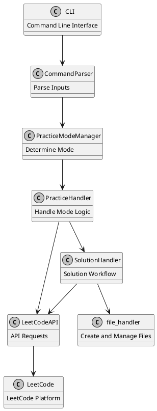
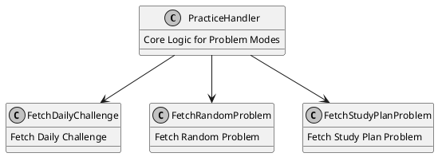
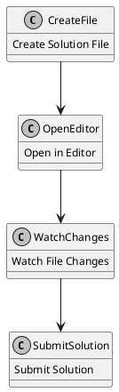

SquidLeet is a command-line tool designed to enhance the experience of practicing LeetCode problems. This article explores its low-level design, highlighting the modular architecture, key components, and how they interact to create a seamless user experience.

## Table of Contents

## Overview of the Architecture

SquidLeet's architecture is modular, with distinct layers for API interactions, input handling, practice management, and utility functions. Here's a high-level overview of its architecture:

## Key Components and Their Roles

### 1. **CommandParser**

The `CommandParser` component processes CLI arguments and validates inputs. It determines the user's desired practice mode, problem difficulty, and other configuration options.

- **Input Arguments:**
- `--practice-mode`: Specifies the mode (e.g., daily, random, custom, study-plan).
- `--difficulties`: Filters problems by difficulty (easy, medium, hard).
- `--problems`: Accepts specific problem slugs for custom mode.
- `--plan-name`: Selects a study plan for study-plan mode.

### 2. **PracticeModeManager**

This module determines the appropriate practice mode based on the parsed inputs and delegates the request to the corresponding handler.

### 3. **PracticeHandler**

`PracticeHandler` serves as the core logic for managing different practice modes. It interfaces with `LeetCodeAPI` to fetch problems and passes problem details to the `SolutionHandler` for further action.

### 4. **LeetCodeAPI**

The `LeetCodeAPI` module encapsulates all interactions with the LeetCode platform using GraphQL. It supports fetching problems, study plans, and submitting solutions.

- **Core Methods:**
- `fetch_problems`: Retrieves a list of problems based on difficulty and filters.
- `fetch_daily_challenge`: Fetches the daily coding challenge.
- `fetch_problem`: Retrieves detailed information about a specific problem.
- `submit_solution`: Submits user solutions and handles responses.

### 5. **SolutionHandler**

`SolutionHandler` manages the solution workflow, including creating template files, opening them in the user's preferred editor, and setting up file watchers for automatic submission.

### 6. **Utilities**

SquidLeet includes several utility modules for logging, file handling, and timer management:

- **Logger:** Customizable logging levels (DEBUG, INFO, WARN, ERROR).
- **File Handler:** Manages file creation for solutions.
- **Timer:** Tracks time limits for solving problems.
- **Editor Resolver:** Determines the appropriate command to open files in the user's preferred editor.

## Interaction Flow

Here is a step-by-step breakdown of how SquidLeet processes a `--mode daily` command:

1. **User Input:** The user enters `python3 main.py --mode daily`.
2. **Command Parsing:** `CommandParser` parses inputs and validates them.
3. **Session Initialization:** `SessionManager` initializes the LeetCode session.
4. **Mode Handling:** `PracticeModeManager` delegates the request to `DailyChallengeMode`.
5. **Problem Fetching:** `LeetCodeAPI` fetches the daily challenge.
6. **Solution Workflow:**
- `SolutionHandler` creates a solution file.
- Opens the file in the editor.
- Sets up a file watcher to monitor changes.
- Submits the solution upon file save.

## Design Considerations

### 1. **Modular Design**
Each component is designed to perform a specific task, making the codebase maintainable and extensible. For instance, adding a new practice mode requires implementing a new subclass of `PracticeHandler`.

### 2. **Asynchronous API Calls**
The use of `ThreadPoolExecutor` in `LeetCodeAPI` allows fetching problems in parallel, improving performance for multi-difficulty queries.

### 3. **Extensibility**
New features like additional practice modes or support for more languages can be added without disrupting existing functionality.

### 4. **Error Handling**
Graceful error handling ensures that the user is informed of any issues, such as missing session tokens or invalid problem slugs.

## Challenges and Future Enhancements

### Challenges
- Managing authentication securely.
- Handling API rate limits and network failures.

### Future Enhancements
- **Detailed Analytics:** Track user performance and provide insights.
- **Enhanced Logging:** Support structured logging for better debugging.

## Conclusion

SquidLeet demonstrates the power of modular design and efficient API integration. By providing a command-line interface for practicing LeetCode problems, it eliminates distractions and optimizes the coding experience. With its extensible design, SquidLeet is well-positioned to evolve into an even more powerful tool for developers.
