In the world of Kubernetes and GitOps, Helm charts are the cornerstone of application deployment and management. However, the official Argo project charts often need extensive customization for production environments, leading to maintenance overhead and configuration drift across teams.

**Argo Helm Charts** solves this challenge by providing a comprehensive collection of wrapper charts that enhance the official Argo charts with production-ready configurations, intelligent CI/CD workflows, and enterprise-grade features.

## Why I Built Argo Helm Charts

Having worked extensively with ArgoCD and Argo Workflows in production environments, I consistently encountered the same challenges across different organizations:

- **Configuration Sprawl**: Teams maintaining their own custom values files with inconsistent patterns
- **Manual Processes**: No automated way to keep chart configurations current with upstream changes
- **Documentation Drift**: Chart documentation becoming outdated as configurations evolved
- **Testing Gaps**: Lack of comprehensive testing for chart configurations before deployment
- **Security Concerns**: Missing production security hardening in default configurations

I wanted to create a solution that would:

- **Standardize Configurations**: Provide battle-tested, production-ready defaults
- **Automate Maintenance**: Keep charts current with upstream releases automatically
- **Ensure Quality**: Comprehensive testing and validation for every change
- **Improve Developer Experience**: Make GitOps deployments more reliable and predictable
- **Demonstrate Best Practices**: Showcase modern DevOps patterns and CI/CD workflows

This project also serves as a demonstration of sophisticated automation patterns, including intelligent change detection, automated documentation generation, and comprehensive CI/CD workflows that can be applied to other DevOps projects.

## Connection to ArgoCD Selective Sync Research

This wrapper chart project builds directly on my research and experimentation with ArgoCD selective syncing patterns. The journey began with a [comprehensive demo implementation](https://github.com/nicholasadamou/argocd-selective-sync-demo/tree/feature/helm-and-argo-workflows) that explored per-application selective syncing using the App-of-Apps pattern with Helm charts and Argo Workflows validation.

### From Demo to Production

The selective sync demo proved the concept but revealed the complexity of managing multiple Helm charts across environments. Key challenges included:

- **Chart Management Overhead**: Each environment required individual chart maintenance
- **Configuration Drift**: No standardization across similar deployments
- **Manual Processes**: Chart updates and validation required manual intervention
- **Documentation Gaps**: Each chart needed its own documentation maintenance

These insights led to the creation of this wrapper chart project, which provides:

- **Standardized Configurations**: Production-ready defaults eliminate per-environment customization
- **Automated Maintenance**: CI/CD workflows keep all charts current automatically
- **Comprehensive Validation**: Built-in testing ensures reliability across all deployments
- **Living Documentation**: Auto-generated docs that stay current with configuration changes

### Architecture Evolution


The demo repository specifically showcased how environment controllers could manage individual applications with dedicated Argo Workflows for validation - exactly the type of sophisticated GitOps pattern that benefits from standardized wrapper charts.

For a detailed analysis of the selective sync architecture patterns that informed this project, see my article on [ArgoCD Selective Sync: Per-App Architecture for Ultimate GitOps Precision](/notes/argocd-selective-sync-per-app-architecture).

## The Need for Wrapper Charts

While the official Argo charts are excellent starting points, production deployments often require:

### Common Production Requirements

- **🔧 Custom Configuration**: Environment-specific settings and resource limits
- **📊 Monitoring Integration**: Built-in Prometheus metrics and ServiceMonitors
- **🛡️ Security Hardening**: Enhanced RBAC and security configurations
- **🌐 Ingress Management**: Standardized ingress patterns across environments
- **📚 Documentation**: Automated documentation generation and maintenance
- **🔄 Dependency Management**: Proper handling of chart dependencies and versions

### The Traditional Approach Problems


## Wrapper Chart Architecture

This project implements a sophisticated wrapper chart architecture that provides a clean abstraction layer over the official Argo charts while maintaining full compatibility and upgradeability.

### System Architecture Overview


### Core Components Breakdown

**1. Common Chart Library**
A shared library providing reusable templates and utilities:

```yaml path=/Users/nicholas/Documents/GitHub/github.com/nicholasadamou/argo-helm-charts/charts/common/Chart.yaml start=1
apiVersion: v2
name: common
description: Common chart library with shared templates
type: library
version: 1.0.0
```

**2. ArgoCD Wrapper Chart**
Enterprise-ready ArgoCD deployment with production optimizations:

```yaml path=/Users/nicholas/Documents/GitHub/github.com/nicholasadamou/argo-helm-charts/charts/argocd/Chart.yaml start=1
apiVersion: v2
name: argocd
description: A wrapper chart for deploying ArgoCD Helm Chart
type: application
version: 1.0.0
appVersion: v2.12.3
dependencies:
  - name: argo-cd
    version: 7.9.1
    repository: https://argoproj.github.io/argo-helm
  - name: argocd-apps
    version: 2.0.2
    repository: https://argoproj.github.io/argo-helm
  - name: common
    version: ">= 0.0.0-0"
    repository: "file://../common"
```

**3. Argo Workflows Wrapper Chart**
Production-ready workflow engine configuration:

```yaml path=/Users/nicholas/Documents/GitHub/github.com/nicholasadamou/argo-helm-charts/charts/argo-workflows/Chart.yaml start=1
apiVersion: v2
name: argo-workflows
description: A wrapper chart for deploying Argo Workflows Helm Chart
type: application
version: 1.0.0
appVersion: v3.5.10
dependencies:
  - name: argo-workflows
    version: 0.45.23
    repository: https://argoproj.github.io/argo-helm
  - name: common
    version: ">= 0.0.0-0"
    repository: "file://../common"
```

## Intelligent CI/CD Pipeline

The project features a sophisticated CI/CD pipeline that provides intelligent change detection, automated testing, and seamless releases.

### CI/CD Workflow Architecture

```plantuml
@startuml
title Intelligent CI/CD Pipeline

start
:Code Push/PR;

partition "Change Detection" {
    :Analyze Changed Files;
    if (Chart Changed?) then (yes)
        :Identify Affected Charts;
        note right
            - ArgoCD changes detected
            - Argo Workflows changes detected
            - Common library changes detected
        end note
    else (no)
        :Skip Chart Processing;
        stop
    endif
}

partition "Validation Phase" {
    fork
        :Helm Lint;
    fork again
        :Chart Testing (ct);
    fork again
        :Schema Validation;
    end fork

    if (All Validations Pass?) then (yes)
        :Continue;
    else (no)
        :❌ Fail Pipeline;
        stop
    endif
}

partition "Testing Phase" {
    :Create Kind Cluster;
    :Install Charts with Test Values;
    :Run Integration Tests;

    if (Tests Pass?) then (yes)
        :Continue;
    else (no)
        :❌ Fail Pipeline;
        stop
    endif
}

partition "Documentation" {
    :Generate Chart READMEs;
    :Validate Documentation;

    if (Docs Up to Date?) then (yes)
        :Continue;
    else (no)
        :❌ Fail - Update Required;
        note right
            Run: bash scripts/helm-docs.sh
        end note
        stop
    endif
}

partition "Release Phase" {
    if (Master Branch?) then (yes)
        :Package Charts;
        :Create GitHub Releases;
        :Update Helm Repository;
        :Publish to GitHub Pages;
        note right
          Available at:
          https://nicholasadamou.github.io/argo-helm-charts/
        end note
        :Update Artifact Hub;
        note right
          Searchable at:
          https://artifacthub.io/packages/search?repo=argo-helm-charts
        end note
    else (no)
        :Skip Release;
    endif
}

:✅ Pipeline Complete;
stop

@enduml
```



### Change Detection Logic

The pipeline uses sophisticated path filtering to determine which charts need processing:

```yaml path=/Users/nicholas/Documents/GitHub/github.com/nicholasadamou/argo-helm-charts/.github/workflows/helm-charts.yml start=26
- uses: dorny/paths-filter@v2
  id: changes
  with:
    filters: |
      argocd:
        - 'charts/argocd/**'
        - 'charts/common/**'
      argo-workflows:
        - 'charts/argo-workflows/**'
        - 'charts/common/**'
      common:
        - 'charts/common/**'
```

This ensures that:

- **ArgoCD chart** rebuilds when ArgoCD or common files change
- **Argo Workflows chart** rebuilds when Argo Workflows or common files change
- **Common changes** trigger rebuilds of dependent charts
- **Unrelated changes** don't trigger unnecessary builds

## Production-Ready Configurations

The wrapper charts come with battle-tested configurations optimized for production environments.

### ArgoCD Production Configuration


The ArgoCD wrapper chart includes carefully tuned production configurations that have been tested across multiple enterprise environments.

**Resource Optimization:**

```yaml path=/Users/nicholas/Documents/GitHub/github.com/nicholasadamou/argo-helm-charts/charts/argocd/values.yaml start=22
controller:
  resources:
    limits:
      memory: 2Gi
    requests:
      cpu: 250m
      memory: 1Gi
```

**Monitoring Integration:**

```yaml path=/Users/nicholas/Documents/GitHub/github.com/nicholasadamou/argo-helm-charts/charts/argocd/values.yaml start=23
controller:
  metrics:
    enabled: true
    serviceMonitor:
      enabled: true
```

**Helm Integration Enhancement:**

```yaml path=/Users/nicholas/Documents/GitHub/github.com/nicholasadamou/argo-helm-charts/charts/argocd/values.yaml start=8
configs:
  cm:
    kustomize.buildOptions: --enabled-helm
```

### Argo Workflows Production Configuration


The Argo Workflows wrapper provides enterprise-grade features designed for production scalability and security.

**Instance Isolation:**

```yaml path=/Users/nicholas/Documents/GitHub/github.com/nicholasadamou/argo-helm-charts/charts/argo-workflows/values.yaml start=24
controller:
  instanceID:
    enabled: true
    useReleaseName: true
```

**Namespace Management:**

```yaml path=/Users/nicholas/Documents/GitHub/github.com/nicholasadamou/argo-helm-charts/charts/argo-workflows/values.yaml start=21
controller:
  workflowNamespaces:
    - default
```

**Security Configuration:**

```yaml path=/Users/nicholas/Documents/GitHub/github.com/nicholasadamou/argo-helm-charts/charts/argo-workflows/values.yaml start=54
workflow:
  serviceAccount:
    create: true
    name: "argo-workflow"
  rbac:
    create: true
```

## Advanced Development Workflow

The project includes comprehensive tooling for development, testing, and maintenance.

### Development Toolchain


### Local Development Commands

The project provides a comprehensive set of scripts that streamline the development and testing process for chart contributors.

**Comprehensive Validation:**

```bash path=null start=null
# Validate all charts
./scripts/test-local.sh validate

# Validate specific chart
./scripts/test-local.sh validate argocd

# Template and test charts
./scripts/test-local.sh test argo-workflows
```

**Documentation Management:**

```bash path=null start=null
# Generate all documentation
bash scripts/helm-docs.sh

# Validate documentation is current
./scripts/test-local.sh docs
```

**Package Management:**

```bash path=null start=null
# Package all charts
./scripts/test-local.sh package

# Package specific chart
./scripts/package.sh argocd
```

### Automated Documentation System

The project features an advanced documentation system that automatically generates comprehensive READMEs from templates:

**Documentation Flow:**

```plantuml
@startuml
title Documentation Generation Flow

start
:Modify Chart Configuration;

if (values.yaml changed?) then (yes)
    :Detect Value Changes;
else (no)
    if (README.md.gotmpl changed?) then (yes)
        :Detect Template Changes;
    else (no)
        :No Documentation Update Needed;
        stop
    endif
endif

:Run helm-docs Generator;
:Process Go Templates;
:Extract Value Documentation;
:Generate Table of Contents;
:Create Final README.md;

if (CI Environment?) then (yes)
    :Validate Documentation Currency;
    if (Documentation Current?) then (yes)
        :✅ Pass CI Check;
    else (no)
        :❌ Fail CI - Update Required;
        note right
            Run: bash scripts/helm-docs.sh
            Commit the changes
        end note
        stop
    endif
else (no)
    :Update Local Documentation;
endif

:✅ Documentation Updated;
stop

@enduml
```



## Real-World Usage Benefits

This wrapper chart architecture provides significant advantages in production environments.

### Deployment Comparison

The advantages of wrapper charts become clear when comparing them directly with traditional manual chart management approaches across key operational areas.

**Traditional Approach vs. Wrapper Charts:**

<Table
  columns={[
    { key: "aspect", header: "Aspect" },
    { key: "traditional", header: "Traditional Approach" },
    { key: "wrapperCharts", header: "Wrapper Charts" },
  ]}
  data={[
    {
      aspect: "Configuration Management",
      traditional: "❌ Manual value file maintenance",
      wrapperCharts: "✅ Standardized production configs",
    },
    {
      aspect: "Monitoring Integration",
      traditional: "⚠️ Manual Prometheus setup",
      wrapperCharts: "✅ Built-in ServiceMonitors",
    },
    {
      aspect: "Documentation",
      traditional: "❌ Manual documentation maintenance",
      wrapperCharts: "✅ Auto-generated documentation",
    },
    {
      aspect: "Dependency Management",
      traditional: "❌ Manual version tracking",
      wrapperCharts: "✅ Automated dependency updates",
    },
    {
      aspect: "Testing",
      traditional: "⚠️ Ad-hoc testing approaches",
      wrapperCharts: "✅ Comprehensive test suite",
    },
    {
      aspect: "Release Management",
      traditional: "❌ Manual package creation",
      wrapperCharts: "✅ Automated CI/CD releases",
    },
  ]}
/>

### Enterprise Adoption Benefits

Organizations adopting these wrapper charts experience significant operational improvements and cost savings across their GitOps infrastructure.

**Scalability and Maintenance:**

- **🔄 Automated Updates**: Renovate integration for upstream chart updates
- **📊 Consistent Monitoring**: Standardized metrics across all deployments
- **🛡️ Security Hardening**: Enterprise-grade security configurations
- **📚 Living Documentation**: Always up-to-date chart documentation
- **🧪 Comprehensive Testing**: Full validation pipeline for every change

**Developer Experience:**

- **⚡ Quick Setup**: Single command deployment with production defaults
- **🔧 Easy Customization**: Override any upstream configuration as needed
- **📖 Clear Documentation**: Auto-generated documentation with examples
- **🐛 Reliable Testing**: Local testing scripts match CI environment

## Installation and Usage

Getting started with the Argo Helm Charts is straightforward and follows Helm best practices.

### Repository Setup

Begin by adding the Argo Helm Charts repository to your local Helm configuration to access all available wrapper charts. You can also explore the charts visually on the [interactive GitHub Pages site](https://nicholasadamou.github.io/argo-helm-charts/) or browse them on [Artifact Hub](https://artifacthub.io/packages/search?repo=argo-helm-charts).

```bash path=null start=null
# Add the repository
helm repo add argo-helm-charts https://nicholasadamou.github.io/argo-helm-charts/
helm repo update

# List available charts
helm search repo argo-helm-charts
```

### ArgoCD Deployment

Deploy ArgoCD using the wrapper chart with production-ready defaults or customize it for your specific environment needs.

**Basic Installation:**

```bash path=null start=null
# Install with production defaults
helm install argocd argo-helm-charts/argocd

# Install with custom values
helm install argocd argo-helm-charts/argocd -f my-values.yaml
```

**Production Configuration Example:**

```yaml path=null start=null
# production-argocd-values.yaml
global:
  image:
    repository: quay.io/argoproj/argocd
  ingress:
    useIstioGateway: true

argo-cd:
  controller:
    resources:
      limits:
        memory: 4Gi
      requests:
        cpu: 500m
        memory: 2Gi

  server:
    ingress:
      enabled: true
      hosts:
        - argocd.example.com
      tls:
        - secretName: argocd-tls
          hosts:
            - argocd.example.com
```

### Argo Workflows Deployment

Install Argo Workflows with optimized configurations for container-native workflow processing in production environments.

**Basic Installation:**

```bash path=null start=null
# Install with production defaults
helm install argo-workflows argo-helm-charts/argo-workflows

# Install with custom configuration
helm install workflows argo-helm-charts/argo-workflows \
  --set argo-workflows.controller.workflowNamespaces={default,workflows} \
  --set argo-workflows.server.ingress.enabled=true
```

## Advanced Configuration Patterns

The wrapper charts support sophisticated configuration patterns for enterprise environments.

### Multi-Environment Configuration

The wrapper charts are designed to support different configuration strategies across development, staging, and production environments while maintaining consistency.


### GitOps Integration Pattern

The wrapper charts integrate seamlessly with GitOps workflows, supporting organized repository structures that separate environment configurations from application definitions.

**Repository Structure for GitOps:**

```bash path=null start=null
gitops-repo/
├── environments/
│   ├── dev/
│   │   ├── argocd-values.yaml
│   │   └── workflows-values.yaml
│   ├── staging/
│   │   ├── argocd-values.yaml
│   │   └── workflows-values.yaml
│   └── production/
│       ├── argocd-values.yaml
│       └── workflows-values.yaml
└── applications/
    ├── argocd-dev.yaml
    ├── argocd-staging.yaml
    ├── argocd-production.yaml
    ├── workflows-dev.yaml
    ├── workflows-staging.yaml
    └── workflows-production.yaml
```

## Monitoring and Observability

The charts include comprehensive monitoring integration out of the box.

### Monitoring Stack Integration

The wrapper charts provide comprehensive observability integration, connecting Argo components with your existing monitoring infrastructure for complete visibility.


The monitoring integration provides essential metrics for maintaining healthy Argo deployments at scale.

**Built-in Metrics:**

- **Application sync status and health**
- **Controller performance metrics**
- **API server request metrics**
- **Repository server performance**
- **Workflow execution statistics**
- **Resource utilization tracking**

## Security Considerations

The wrapper charts implement security best practices suitable for enterprise environments.

### Security Architecture

The wrapper charts implement a comprehensive security model that addresses network, container, and access control concerns across multiple layers.


### Security Best Practices Implemented

The charts incorporate industry-standard security practices to protect against common vulnerabilities and ensure compliance with enterprise security requirements.

**Container Security:**

- Non-root user execution
- Read-only root filesystems
- Security contexts for all pods
- Image vulnerability scanning

**Network Security:**

- TLS encryption for all communications
- Network policy isolation
- Service mesh integration ready
- Ingress security headers

**Access Control:**

- Fine-grained RBAC policies
- Service account isolation
- OIDC/SSO integration
- Multi-tenancy support

## Migration and Upgrade Strategies

The wrapper charts are designed to facilitate easy migration from existing deployments and seamless upgrades.

### Migration Path

The migration process is structured to minimize risk and ensure smooth transitions from existing Argo deployments to the wrapper chart architecture.

```plantuml
@startuml
title Migration Strategy Flow

start

:Existing Argo Deployment;

partition "Assessment Phase" {
    :Audit Current Configuration;
    :Identify Custom Settings;
    :Document Dependencies;
    :Plan Migration Strategy;
}

partition "Preparation Phase" {
    :Create Value Overrides;
    :Test in Development;
    :Validate Functionality;
    :Prepare Rollback Plan;
}

partition "Migration Phase" {
    if (Blue-Green Migration?) then (yes)
        :Deploy New Stack;
        :Switch Traffic;
        :Validate Operation;
        :Decommission Old;
    else (no)
        :In-Place Upgrade;
        :Validate Components;
        :Monitor Health;
    endif
}

partition "Validation Phase" {
    :Functional Testing;
    :Performance Validation;
    :Security Verification;
    :Documentation Update;
}

:✅ Migration Complete;
stop

@enduml
```



### Upgrade Automation

Automated upgrade capabilities ensure that charts stay current with upstream releases while maintaining compatibility and stability.

The charts support automated upgrades through Renovate integration:

```json path=null start=null
{
  "extends": ["config:base"],
  "helm-values": {
    "fileMatch": ["charts/.+/values\\.ya?ml$"]
  },
  "regexManagers": [
    {
      "fileMatch": ["charts/.+/Chart\\.ya?ml$"],
      "matchStrings": [
        "# renovate: datasource=(?<datasource>.*?) depName=(?<depName>.*?) repository=(?<registryUrl>.*?)\\s+version: (?<currentValue>.*)"
      ]
    }
  ]
}
```

This automated approach provides several key benefits for maintaining chart currency and security:

- **Automated dependency updates**
- **Security patch automation**
- **Version compatibility checking**
- **Pull request creation for updates**

## Future Roadmap and Extensions

The Argo Helm Charts project continues to evolve with the Argo ecosystem and community needs.

### Planned Enhancements

The project roadmap focuses on expanding the wrapper chart ecosystem while enhancing existing capabilities to meet evolving enterprise needs.


### Community Contributions

The project thrives on community involvement and actively seeks contributions that enhance the wrapper chart ecosystem and improve the developer experience.

The project welcomes community contributions in several areas:

**High-Impact Contributions:**

- Additional chart wrappers (Rollouts, Events, Image Updater)
- Cloud provider-specific configurations
- Advanced security templates
- Multi-cluster deployment patterns

**Development Improvements:**

- Enhanced testing frameworks
- Additional automation scripts
- Documentation improvements
- Performance optimizations

## Conclusion

The Argo Helm Charts project represents a mature approach to managing Argo deployments in production environments. By providing well-crafted wrapper charts with enterprise-grade configurations, comprehensive CI/CD automation, and extensive documentation, it eliminates the common pain points associated with production Argo deployments.

### Key Value Propositions

The wrapper chart approach delivers tangible value across multiple dimensions of GitOps operations and enterprise software delivery.

**🏗️ Production-Ready Foundation**: Battle-tested configurations eliminate trial-and-error deployment cycles

**🔄 Automated Operations**: Intelligent CI/CD pipeline reduces manual overhead and human error

**📊 Comprehensive Monitoring**: Built-in observability features provide immediate visibility into system health

**🛡️ Security by Design**: Enterprise-grade security configurations protect against common vulnerabilities

**📚 Living Documentation**: Auto-generated documentation ensures configurations stay current and understandable

**🔧 Flexible Customization**: Wrapper architecture allows complete customization while maintaining upgradeability

This project demonstrates how thoughtful abstraction and automation can transform complex Kubernetes deployments into reliable, maintainable systems. Whether you're deploying your first Argo instance or managing hundreds of applications across multiple clusters, these wrapper charts provide the foundation for scalable, secure GitOps operations.

The combination of intelligent CI/CD, comprehensive testing, and production-ready defaults makes this an invaluable resource for any organization serious about GitOps excellence in their Kubernetes environments.
