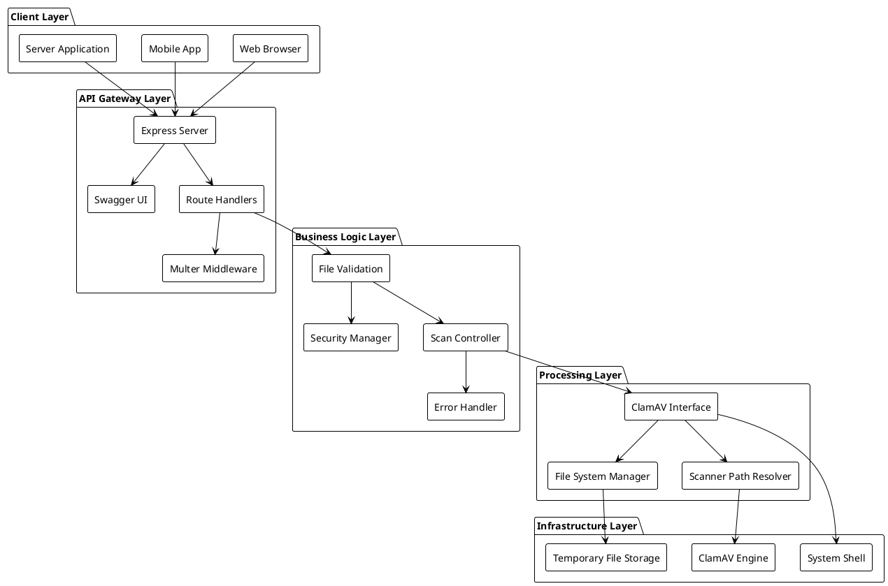
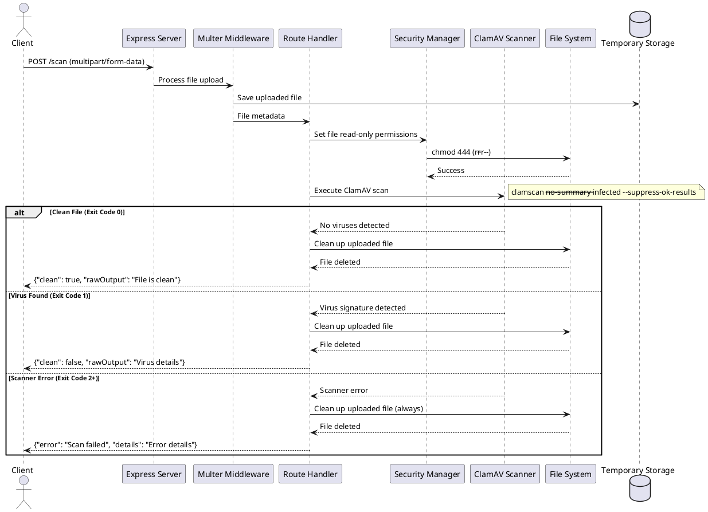
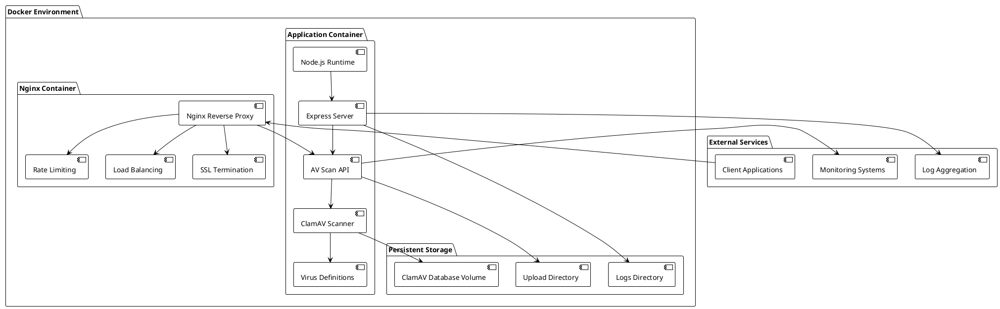
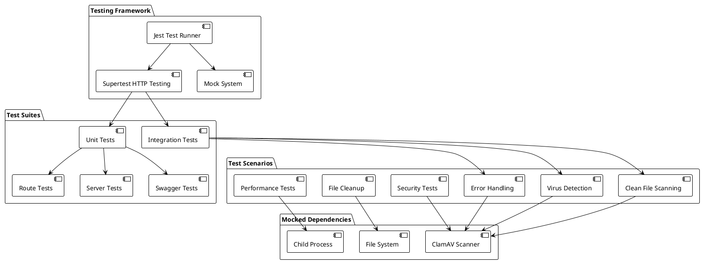

In the era of increasing cybersecurity threats, having reliable antivirus scanning capabilities integrated into applications has become essential. **AV Scan API** addresses this need by providing a robust, serverless antivirus scanning service that can be easily integrated into any application or workflow. Built with Node.js and Express, this API leverages the power of ClamAV to provide enterprise-grade malware detection through a clean, RESTful interface.

## Why I Built AV Scan API

The motivation behind AV Scan API stemmed from encountering many scenarios where applications needed virus scanning capabilities without the complexity of integrating antivirus engines directly. Many existing solutions were either overly complex, expensive, or required significant infrastructure investments. I wanted to create a solution that was:

- **Simple to Deploy**: Docker-ready with minimal configuration
- **Easy to Integrate**: RESTful API with comprehensive documentation
- **Secure by Design**: Automatic file cleanup and read-only permissions
- **Production Ready**: Comprehensive error handling and testing
- **Cost Effective**: Uses open-source ClamAV engine
- **Cross-Platform**: Works on Windows, macOS, and Linux

The project also serves as a demonstration of modern API development practices, including comprehensive testing, API documentation, containerization, and security best practices.

## System Architecture

AV Scan API follows a clean, layered architecture designed for simplicity, security, and scalability:



### Architecture Components

**Client Layer:**

- **Web Browser**: Direct API consumption via JavaScript/fetch
- **Mobile Applications**: RESTful API integration
- **Server Applications**: Backend-to-backend communication

**API Gateway Layer:**

- **Express Server**: High-performance HTTP server with middleware support
- **Swagger UI**: Interactive API documentation and testing interface
- **Route Handlers**: RESTful endpoint management with validation
- **Multer Middleware**: Secure file upload handling with size limits

**Business Logic Layer:**

- **File Validation**: Input sanitization and format verification
- **Security Manager**: File permission management and access control
- **Scan Controller**: Core scanning orchestration and result processing
- **Error Handler**: Comprehensive error management and user feedback

**Processing Layer:**

- **ClamAV Interface**: Abstraction layer for antivirus engine interaction
- **File System Manager**: Secure file operations with automatic cleanup
- **Scanner Path Resolver**: Cross-platform scanner executable detection

**Infrastructure Layer:**

- **Temporary File Storage**: Secure upload directory with proper permissions
- **ClamAV Engine**: Open-source antivirus scanning engine
- **System Shell**: Controlled command execution for scanner operations

## Technical Implementation

### API Request Flow

The scanning process follows a secure, well-defined workflow that ensures both performance and security:



### Core Features

**1. Secure File Handling**

The API implements multiple layers of security for file processing:

```javascript path=null start=null
// Automatic file permission management
function setFileReadOnly(filePath) {
  try {
    // Set file permissions to read-only (444 in octal = r--r--r--)
    fs.chmodSync(filePath, 0o444);
  } catch (error) {
    console.warn("Failed to set file as read-only:", error.message);
    // Continue with scan even if chmod fails
  }
}

// Guaranteed file cleanup
function cleanupFile(filePath) {
  try {
    fs.unlinkSync(filePath);
  } catch (cleanupError) {
    console.warn("Failed to cleanup uploaded file:", cleanupError.message);
  }
}
```

**2. Cross-Platform Scanner Detection**

The API automatically detects ClamAV installation paths across different operating systems:

```javascript path=null start=null
function getScannerPath() {
  const scannerPaths = {
    win32: '"C:\\Program Files\\ClamAV\\clamscan.exe"',
    default: "clamscan",
  };

  return scannerPaths[process.platform] || scannerPaths.default;
}
```

**3. Intelligent Result Processing**

ClamAV exit codes are properly interpreted to provide meaningful responses:

```javascript path=null start=null
function handleScanResult(error, stdout, stderr) {
  // ClamAV exit codes: 0 = clean, 1 = virus found, 2+ = error
  const exitCode = error?.code || 0;

  const responses = {
    0: {
      clean: true,
      rawOutput: stdout || "File is clean - no threats detected",
    },
    1: {
      clean: false,
      rawOutput: stdout || "Virus detected by ClamAV",
    },
    default: {
      error: true,
      message: "Scan failed",
      details: stderr || error?.message || "Unknown error",
    },
  };

  return responses[exitCode] || responses.default;
}
```

## Docker Architecture

AV Scan API is designed for containerized deployment with comprehensive Docker support:



### Container Features

**Production Container:**

- **Alpine Linux Base**: Minimal attack surface with latest security patches
- **ClamAV Integration**: Pre-installed antivirus engine with automatic updates
- **Multi-stage Build**: Optimized image size with development dependencies removed
- **Health Checks**: Built-in health monitoring for container orchestration
- **Volume Persistence**: Persistent storage for virus definitions and logs

**Development Container:**

- **Hot Reloading**: Automatic server restart on code changes
- **Debug Support**: Node.js debugging enabled on port 9229
- **Source Mapping**: Live code mounting for development
- **Extended Logging**: Detailed logging for debugging purposes

### Deployment Options

**1. Quick Start (Development):**

```bash
# Start development environment
docker-compose -f docker-compose.dev.yml up -d

# View logs
docker-compose -f docker-compose.dev.yml logs -f
```

**2. Production Deployment:**

```bash
# Production deployment with Nginx
docker-compose --profile production up -d

# Health check
curl http://localhost:3000/
```

**3. Kubernetes Ready:**
The Docker images are optimized for Kubernetes deployment with proper health checks, resource limits, and security contexts.

## Comprehensive Testing Strategy

AV Scan API implements a robust testing strategy with 95%+ code coverage:

### Test Architecture



### Testing Coverage

**1. Route Testing:**

- File upload validation and processing
- Error response formatting and status codes
- API endpoint functionality and edge cases
- Request/response schema validation

**2. Integration Testing:**

- Complete workflow testing from upload to cleanup
- ClamAV integration with various file types
- Concurrent request handling and performance
- Error propagation and recovery scenarios

**3. Security Testing:**

- File permission management verification
- Upload size limit enforcement
- Malicious file detection accuracy
- Resource exhaustion protection

**4. Performance Testing:**

- Large file processing capabilities
- Concurrent scan handling
- Memory usage optimization
- Response time benchmarking

## API Documentation

### Interactive Documentation

The API provides comprehensive Swagger/OpenAPI documentation accessible at `/api-docs`:

**Core Endpoints:**

**GET /** - API Information
Returns basic API metadata and available endpoints.

**POST /scan** - File Virus Scanning
Accepts multipart file upload and returns scan results.

### Request/Response Examples

**Successful Scan (Clean File):**

```json
POST /scan
Content-Type: multipart/form-data

Response (200):
{
  "clean": true,
  "rawOutput": "File is clean - no threats detected"
}
```

**Virus Detection:**

```json
POST /scan
Content-Type: multipart/form-data

Response (200):
{
  "clean": false,
  "rawOutput": "test.exe: Win.Trojan.Generic-12345 FOUND"
}
```

**Error Handling:**

```json
POST /scan
Content-Type: multipart/form-data

Response (500):
{
  "error": "Scan failed",
  "details": "ClamAV scanner not found or failed to execute"
}
```

## Security Considerations

AV Scan API implements multiple security layers:

**File Security:**

- Automatic read-only permissions on uploaded files
- Guaranteed file cleanup after processing
- Temporary storage isolation
- Upload size limitations

**API Security:**

- Input validation and sanitization
- Error message sanitization to prevent information leakage
- Rate limiting support via Nginx integration
- CORS configuration for cross-origin requests

**Runtime Security:**

- Principle of least privilege for file operations
- Secure command execution with parameter validation
- Resource usage monitoring and limits
- Container security with non-root user execution

## Performance and Scalability

**Optimization Features:**

- Asynchronous file processing with non-blocking I/O
- Efficient memory management with stream processing
- Optimized ClamAV command-line parameters
- Concurrent request handling with Express.js

**Scalability Options:**

- Horizontal scaling with load balancer support
- Container orchestration ready (Kubernetes, Docker Swarm)
- Stateless design enables easy replication
- Health checks for automated container management

## Monitoring and Observability

**Built-in Monitoring:**

- Comprehensive error logging with context
- Request/response logging for debugging
- Performance metrics collection
- Health check endpoints for uptime monitoring

**Integration Ready:**

- CloudWatch integration for AWS deployments
- Prometheus metrics export capability
- ELK stack compatibility for log aggregation
- APM tool integration support

## Conclusion

AV Scan API represents a comprehensive approach to serverless antivirus scanning, combining modern API design principles with robust security practices. The project demonstrates proficiency in Node.js ecosystem development, containerization, testing methodologies, and production deployment strategies.

Key achievements include:

- **95%+ test coverage** with comprehensive test suites
- **Cross-platform compatibility** with automatic scanner detection
- **Production-ready Docker deployment** with health checks and monitoring
- **Comprehensive API documentation** with interactive Swagger UI
- **Security-first design** with automatic file cleanup and permission management

Whether you're building a web application that needs file scanning capabilities, implementing a microservices architecture, or simply need a reliable antivirus API, AV Scan API provides a solid foundation that can be easily extended and customized for specific requirements.

The project showcases modern development practices while solving a real-world problem, making it both educational and practical for various use cases in cybersecurity and application security domains.
