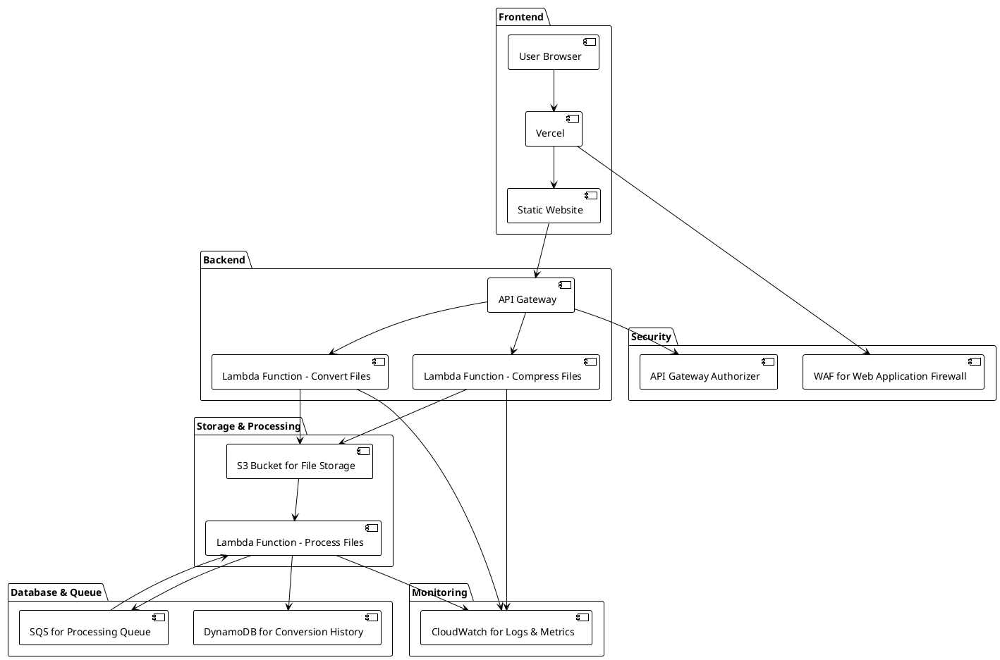

> **Note about the Demo**: While a [live demo](https://cloud-tools.vercel.app) is available, the backend AWS infrastructure is not currently deployed to keep costs minimal. The demo showcases the frontend interface and user experience, but file processing functionality won't work. However, you can experience the full functionality locally using [LocalStack](https://localstack.cloud/) by following the setup instructions in the [GitHub repository](https://github.com/nicholasadamou/cloud-tools).

In today's digital landscape, file processing and conversion are essential tasks that developers and users encounter regularly. However, building a scalable, secure, and cost-effective solution for these operations presents numerous challenges. That's why I created **Cloud Tools** - a serverless AWS-based platform that demonstrates how modern cloud-native architecture can solve real-world problems while showcasing best practices in distributed systems design.

## Why I Built Cloud Tools

I am eager to apply my Amazon AWS knowledge to a real-world project, as this endeavor will not only reinforce my understanding of AWS services but also provide a tangible showcase of my skills in designing and implementing cloud-based solutions. By building **Cloud Tools**, I aim to demonstrate my ability to architect scalable, efficient, and secure systems. This project highlights the practical application of the concepts I've learned, particularly in distributed systems and system design, which I have been studying extensively for both interviews and personal growth.

Through this initiative, I can effectively illustrate my capacity to translate theoretical knowledge into practical, impactful solutions, while building something genuinely useful for file processing needs.

## System Architecture

Cloud Tools leverages a comprehensive serverless architecture that demonstrates modern cloud-native design patterns:



### Architecture Components

**Frontend Layer:**

- **Next.js Application**: Modern React-based frontend with TypeScript and Tailwind CSS
- **Vercel Deployment**: Optimized hosting with global CDN and serverless functions
- **Responsive UI**: Mobile-first design with Framer Motion animations

**API Layer:**

- **API Gateway**: RESTful API endpoints with request validation and rate limiting
- **Lambda Integration**: Seamless integration with processing functions
- **CORS Configuration**: Secure cross-origin resource sharing

**Processing Layer:**

- **File Conversion Lambda**: Handles various file format conversions
- **File Compression Lambda**: Optimizes file sizes across different formats
- **Background Processing**: Asynchronous job processing with SQS integration

**Storage & Data:**

- **S3 Bucket**: Secure file storage with encryption at rest
- **DynamoDB**: Job tracking and metadata storage with auto-scaling
- **SQS Queues**: Reliable message queuing with dead letter queue support

**Monitoring & Security:**

- **CloudWatch**: Comprehensive logging and metrics collection
- **WAF**: Web Application Firewall protection
- **IAM Roles**: Principle of least privilege access control

## Technical Implementation

### Frontend Architecture

The frontend is built with modern web technologies, emphasizing performance and user experience:

```typescript
// Example component structure
interface FileProcessingProps {
  onUpload: (file: File, operation: "convert" | "compress") => Promise<void>;
  processing: boolean;
  result?: ProcessingResult;
}

const FileProcessor: React.FC<FileProcessingProps> = ({
  onUpload,
  processing,
  result,
}) => {
  // Component implementation with drag-and-drop support
  // Progress tracking and real-time status updates
  // Error handling and user feedback
};
```

**Key Frontend Features:**

- **Drag & Drop Interface**: Intuitive file upload with visual feedback
- **Real-time Processing Status**: Live updates on job progress using polling
- **Type Safety**: Comprehensive TypeScript integration throughout
- **Responsive Design**: Optimized for desktop, tablet, and mobile devices
- **Error Handling**: Graceful error states with actionable user feedback

### Backend Services

The serverless backend demonstrates advanced AWS service integration:

```typescript
// Lambda function structure
import { APIGatewayProxyHandler } from "aws-lambda";
import { S3Client, PutObjectCommand } from "@aws-sdk/client-s3";
import { DynamoDBClient, PutItemCommand } from "@aws-sdk/client-dynamodb";
import { SQSClient, SendMessageCommand } from "@aws-sdk/client-sqs";

export const processFileHandler: APIGatewayProxyHandler = async (event) => {
  // File processing logic with error handling
  // S3 operations for file storage
  // DynamoDB updates for job tracking
  // SQS message publishing for async processing
};
```

**Processing Pipeline:**

1. **File Upload**: Direct upload to S3 with pre-signed URLs
2. **Job Creation**: DynamoDB record creation with unique job ID
3. **Queue Processing**: SQS message triggers background Lambda
4. **File Processing**: Conversion/compression using specialized libraries
5. **Result Storage**: Processed files stored in S3 with metadata updates
6. **Notification**: Job completion status updates via API polling

### Infrastructure as Code with Terraform

One of the key aspects of Cloud Tools is its comprehensive use of Terraform for infrastructure management. I chose Terraform to demonstrate Infrastructure as Code (IaC) best practices and ensure reproducible, version-controlled infrastructure deployments.

**Why Terraform?**
Terraform provides several advantages for this project:

- **Declarative Configuration**: Define desired infrastructure state rather than imperative steps
- **Multi-Cloud Support**: Though focused on AWS, the patterns are transferable
- **State Management**: Track infrastructure changes and enable collaborative development
- **Module Reusability**: Create reusable components for consistent deployments

**Project Structure:**
The Terraform configuration is organized into a modular structure that promotes reusability and maintainability:

```bash
terraform/
├── environments/
│   ├── dev/
│   │   ├── main.tf
│   │   ├── variables.tf
│   │   └── terraform.tfvars
│   ├── staging/
│   └── prod/
├── modules/
│   ├── s3/
│   │   ├── main.tf
│   │   ├── variables.tf
│   │   └── outputs.tf
│   ├── dynamodb/
│   ├── lambda/
│   ├── api_gateway/
│   └── monitoring/
└── shared/
    ├── data.tf
    └── providers.tf
```

**Core Infrastructure Modules:**

```hcl
# Main environment configuration
module "s3_bucket" {
  source = "../../modules/s3"

  bucket_name         = "cloud-tools-${var.environment}-files"
  environment         = var.environment
  enable_versioning   = true
  enable_encryption   = true
  cors_configuration = {
    allowed_headers = ["*"]
    allowed_methods = ["GET", "POST", "PUT"]
    allowed_origins = [var.frontend_domain]
  }
}

module "dynamodb_table" {
  source = "../../modules/dynamodb"

  table_name     = "cloud-tools-${var.environment}-jobs"
  environment    = var.environment
  billing_mode   = "PAY_PER_REQUEST"

  attributes = [
    {
      name = "jobId"
      type = "S"
    },
    {
      name = "userId"
      type = "S"
    }
  ]

  global_secondary_indexes = [
    {
      name     = "UserIndex"
      hash_key = "userId"
    }
  ]
}

module "lambda_functions" {
  source = "../../modules/lambda"

  environment = var.environment
  s3_bucket   = module.s3_bucket.bucket_name
  dynamodb_table = module.dynamodb_table.table_name
  sqs_queue_url  = module.sqs.queue_url

  functions = {
    convert = {
      filename     = "convert-handler.zip"
      handler      = "index.handler"
      timeout      = 300
      memory_size  = 1024
      environment_vars = {
        BUCKET_NAME = module.s3_bucket.bucket_name
        TABLE_NAME  = module.dynamodb_table.table_name
      }
    }
    compress = {
      filename     = "compress-handler.zip"
      handler      = "index.handler"
      timeout      = 300
      memory_size  = 1024
    }
    process = {
      filename     = "process-handler.zip"
      handler      = "index.handler"
      timeout      = 900
      memory_size  = 2048
    }
  }
}

module "api_gateway" {
  source = "../../modules/api_gateway"

  environment     = var.environment
  lambda_functions = module.lambda_functions.function_arns

  cors_configuration = {
    allow_origins = [var.frontend_domain]
    allow_methods = ["GET", "POST", "OPTIONS"]
  }
}
```

**Environment-Specific Configurations:**
Each environment (dev, staging, prod) has its own Terraform workspace with specific configurations:

```hcl
# environments/dev/terraform.tfvars
environment = "dev"
aws_region = "us-east-1"
frontend_domain = "http://localhost:3000"

# Lambda configurations for development
lambda_configs = {
  convert = {
    memory_size = 512  # Smaller for dev to save costs
    timeout     = 180
  }
  compress = {
    memory_size = 512
    timeout     = 180
  }
}

# Enable detailed monitoring in dev for debugging
enable_detailed_monitoring = true
enable_x_ray_tracing = true
```

**State Management and Remote Backend:**
To ensure team collaboration and state consistency, I configured Terraform to use S3 as a remote backend:

```hcl
# Backend configuration
terraform {
  backend "s3" {
    bucket         = "cloud-tools-terraform-state"
    key            = "environments/dev/terraform.tfstate"
    region         = "us-east-1"
    encrypt        = true
    dynamodb_table = "terraform-state-locks"
  }
}
```

**Terraform Workflows:**
I integrated Terraform into the development workflow with automated validation and deployment:

```bash
# Development workflow commands
terraform fmt -recursive          # Format all .tf files
terraform validate               # Validate configuration
terraform plan -var-file="dev.tfvars"  # Preview changes
terraform apply -var-file="dev.tfvars" # Apply changes
```

**Infrastructure Highlights:**

- **Modular Architecture**: Reusable Terraform modules for different environments
- **Environment Separation**: Dedicated dev, staging, and production configurations
- **State Locking**: DynamoDB table prevents concurrent modifications
- **Security Hardening**: IAM policies following principle of least privilege
- **Cost Optimization**: Environment-specific resource sizing and intelligent tiering
- **Automated Validation**: Pre-commit hooks ensure code quality and security
- **Drift Detection**: Regular state refresh to identify configuration drift

### Local Development Environment with LocalStack

One of Cloud Tools' standout features is its comprehensive local development setup using LocalStack. This choice was crucial for creating a development experience that mirrors production while eliminating common cloud development challenges.

**What is LocalStack?**
LocalStack is a cloud service emulator that runs in a single container on your laptop or in your CI environment. It provides a testing and mocking framework for developing cloud applications by spinning up a testing environment on your local machine that provides the same functionality and APIs as the real AWS cloud environment.

**Why I Chose LocalStack:**
Developing cloud-native applications traditionally involves several pain points that LocalStack elegantly solves:

1. **Cost Management**: AWS services incur charges even during development. With multiple developers and frequent testing, costs can quickly spiral out of control.
2. **Network Latency**: API calls to real AWS services introduce network delays that slow down development cycles.
3. **Environment Isolation**: Shared development environments can lead to conflicts and inconsistent states.
4. **Offline Development**: Working without internet connectivity becomes impossible with cloud-dependent applications.
5. **CI/CD Complexity**: Running tests against real AWS services in CI pipelines requires complex setup and credential management.

**LocalStack Implementation in Cloud Tools:**

```bash
# One-command setup
pnpm run setup

# What it does:
# ✅ Check prerequisites (Docker, Node.js, AWS CLI)
# ✅ Start LocalStack with AWS service emulation
# ✅ Create local S3 buckets, DynamoDB tables, and SQS queues
# ✅ Configure AWS CLI profile for local development
# ✅ Set up environment variables and configuration
# ✅ Install dependencies and pre-commit hooks
```

**LocalStack Configuration:**
The project includes a comprehensive LocalStack setup that mirrors the production AWS environment:

```yaml
# docker-compose.localstack.yml
version: "3.8"
services:
  localstack:
    image: localstack/localstack:3.0
    ports:
      - "4566:4566" # LocalStack Gateway
    environment:
      - DEBUG=1
      - SERVICES=s3,dynamodb,sqs,lambda,apigateway,cloudwatch,iam
      - DATA_DIR=/tmp/localstack/data
      - HOST_TMP_FOLDER=/tmp/localstack
      - DOCKER_HOST=unix:///var/run/docker.sock
      - LAMBDA_EXECUTOR=docker-reuse
    volumes:
      - "/tmp/localstack:/tmp/localstack"
      - "/var/run/docker.sock:/var/run/docker.sock"
    networks:
      - cloud-tools-network
```

**Service-Specific LocalStack Setup:**
Each AWS service is configured to match production behavior:

```bash
# S3 Bucket Creation
aws --endpoint-url=http://localhost:4566 s3 mb s3://cloud-tools-dev-files
aws --endpoint-url=http://localhost:4566 s3api put-bucket-cors \
  --bucket cloud-tools-dev-files \
  --cors-configuration file://cors-config.json

# DynamoDB Table Creation
aws --endpoint-url=http://localhost:4566 dynamodb create-table \
  --table-name cloud-tools-dev-jobs \
  --attribute-definitions \
    AttributeName=jobId,AttributeType=S \
    AttributeName=userId,AttributeType=S \
  --key-schema \
    AttributeName=jobId,KeyType=HASH \
  --billing-mode PAY_PER_REQUEST \
  --global-secondary-indexes file://gsi-config.json

# SQS Queue Creation
aws --endpoint-url=http://localhost:4566 sqs create-queue \
  --queue-name cloud-tools-dev-processing-queue
```

**Development Workflow Benefits:**

```typescript
// Environment-aware configuration
const config = {
  aws: {
    region: process.env.AWS_REGION || "us-east-1",
    endpoint:
      process.env.NODE_ENV === "development"
        ? "http://localhost:4566"
        : undefined,
    s3: {
      bucket: process.env.S3_BUCKET || "cloud-tools-dev-files",
    },
    dynamodb: {
      table: process.env.DYNAMODB_TABLE || "cloud-tools-dev-jobs",
    },
  },
};

// Same code works in both local and cloud environments
const s3Client = new S3Client({
  region: config.aws.region,
  endpoint: config.aws.endpoint,
  forcePathStyle: !!config.aws.endpoint, // Required for LocalStack
});
```

**Integration Testing with LocalStack:**
LocalStack enables comprehensive integration testing without external dependencies:

```typescript
// Integration test example
import { beforeAll, afterAll, describe, it, expect } from "vitest";
import { startLocalStack, stopLocalStack } from "../utils/localstack";
import { uploadFile, processFile } from "../services/fileProcessing";

describe("File Processing Integration Tests", () => {
  beforeAll(async () => {
    await startLocalStack();
    // Setup test data and resources
  });

  afterAll(async () => {
    await stopLocalStack();
  });

  it("should process file upload and conversion end-to-end", async () => {
    // Test entire workflow without hitting real AWS
    const file = new File(["test content"], "test.txt");
    const uploadResult = await uploadFile(file);
    const processResult = await processFile(uploadResult.jobId);

    expect(processResult.status).toBe("completed");
    expect(processResult.outputUrl).toBeDefined();
  });
});
```

**LocalStack Integration Advantages:**

**For Development:**

- **Zero AWS Costs**: Eliminate development environment expenses
- **Instant Feedback**: No network latency for rapid iteration
- **Offline Capability**: Work without internet connectivity
- **Isolated Testing**: Each developer has their own environment
- **Consistent State**: Fresh environment for each development session

**For CI/CD:**

- **Parallel Testing**: Multiple test suites can run simultaneously
- **No Credential Management**: No need for AWS keys in CI environment
- **Deterministic Tests**: Consistent behavior across test runs
- **Fast Pipeline Execution**: Local services eliminate network overhead

**For Team Collaboration:**

- **Environment Standardization**: Everyone runs identical AWS service versions
- **Easy Onboarding**: New team members can start developing immediately
- **Debugging Simplification**: LocalStack logs are easily accessible
- **Feature Development**: Test new features without affecting shared resources

**LocalStack Limitations and Workarounds:**
While LocalStack provides excellent AWS emulation, some differences exist:

```typescript
// Handle LocalStack-specific behaviors
const s3Config = {
  // LocalStack requires path-style URLs
  forcePathStyle: process.env.NODE_ENV === "development",
  // Some S3 features may have different behavior
  useAccelerateEndpoint: process.env.NODE_ENV !== "development",
};

// Feature flags for LocalStack vs AWS differences
const features = {
  enableS3TransferAcceleration: process.env.NODE_ENV === "production",
  useAdvancedDynamoDBFeatures: !process.env.LOCALSTACK_ENDPOINT,
};
```

**Production Deployment Confidence:**
By developing against LocalStack, I ensured that the transition from local to cloud was seamless. The same Terraform configurations, Lambda functions, and application code work identically in both environments, providing confidence that local testing accurately represents production behavior.

## Advanced Features

### Comprehensive Monitoring

Cloud Tools implements enterprise-grade monitoring and observability:

```typescript
// CloudWatch metrics integration
import {
  CloudWatchClient,
  PutMetricDataCommand,
} from "@aws-sdk/client-cloudwatch";

const publishMetrics = async (
  metricName: string,
  value: number,
  unit: string
) => {
  const command = new PutMetricDataCommand({
    Namespace: "CloudTools",
    MetricData: [
      {
        MetricName: metricName,
        Value: value,
        Unit: unit,
        Timestamp: new Date(),
      },
    ],
  });

  await cloudWatchClient.send(command);
};
```

**Monitoring Features:**

- **Custom Metrics**: File processing times, success rates, error rates
- **Alerting**: SNS notifications for failures and performance degradation
- **Dashboard**: Real-time visualization of system health and performance
- **Log Aggregation**: Centralized logging with structured log formats

### Security Implementation

Security is implemented at every layer of the application:

```json
{
  "Version": "2012-10-17",
  "Statement": [
    {
      "Effect": "Allow",
      "Action": ["s3:GetObject", "s3:PutObject"],
      "Resource": "arn:aws:s3:::cloud-tools-bucket/*",
      "Condition": {
        "StringEquals": {
          "s3:x-amz-server-side-encryption": "AES256"
        }
      }
    }
  ]
}
```

**Security Measures:**

- **Encryption**: All data encrypted at rest and in transit
- **Access Control**: Fine-grained IAM policies and resource-based policies
- **Network Security**: VPC configuration with private subnets (production)
- **Input Validation**: Comprehensive request validation and sanitization
- **Rate Limiting**: API Gateway throttling and user-based limits

### CI/CD Pipeline

The project includes a comprehensive CI/CD setup with GitHub Actions:

```yaml
name: Continuous Integration
on: [push, pull_request]

jobs:
  test:
    runs-on: ubuntu-latest
    steps:
      - uses: actions/checkout@v4
      - name: Setup Node.js
        uses: actions/setup-node@v4
        with:
          node-version: "20"
      - name: Install dependencies
        run: pnpm install
      - name: Run tests
        run: pnpm test:coverage
      - name: Upload coverage
        uses: codecov/codecov-action@v3
```

**Pipeline Features:**

- **Multi-environment Testing**: Node.js matrix testing across versions
- **Code Quality**: ESLint, Prettier, and pre-commit hooks
- **Security Scanning**: Dependency vulnerability checks
- **Infrastructure Validation**: Terraform plan and validation
- **Deployment Automation**: Environment-specific deployment strategies

### Performance Optimization

Cloud Tools implements several performance optimization strategies:

**Frontend Optimizations:**

- Next.js App Router with server-side rendering
- Image optimization with Sharp
- Bundle analysis and code splitting
- Progressive Web App features

**Backend Optimizations:**

- Lambda cold start mitigation with provisioned concurrency
- DynamoDB query optimization with proper indexing
- S3 transfer acceleration for large files
- Connection pooling and SDK reuse

## Development Experience

### Developer-Friendly Setup

The project prioritizes developer experience with comprehensive tooling:

```bash
# Development commands
pnpm run dev              # Start development server
pnpm run test:watch       # Run tests in watch mode
pnpm run type-check       # TypeScript type checking
pnpm run lint             # Code linting and formatting
pnpm run build:all        # Build all packages
```

### Testing Strategy

Cloud Tools implements a multi-layered testing approach:

```typescript
// Integration test example
import { describe, it, expect } from "vitest";
import { testApiEndpoint } from "../utils/test-helpers";

describe("File Processing API", () => {
  it("should process file conversion successfully", async () => {
    const response = await testApiEndpoint("/api/process", {
      method: "POST",
      body: { operation: "convert", fileType: "pdf" },
    });

    expect(response.status).toBe(200);
    expect(response.data.jobId).toBeDefined();
  });
});
```

**Testing Pyramid:**

- **Unit Tests**: Component and function-level testing with Vitest
- **Integration Tests**: API endpoint testing with LocalStack
- **End-to-End Tests**: Full user workflow testing
- **Performance Tests**: Load testing and benchmarking

### Code Quality

The project maintains high code quality through automated tooling:

```yaml
# Pre-commit configuration
repos:
  - repo: https://github.com/pre-commit/pre-commit-hooks
    rev: v4.4.0
    hooks:
      - id: trailing-whitespace
      - id: end-of-file-fixer
      - id: check-yaml

  - repo: https://github.com/antonbabenko/pre-commit-terraform
    rev: v1.83.5
    hooks:
      - id: terraform_fmt
      - id: terraform_validate
```

## Cost Optimization

Cloud Tools demonstrates cost-effective cloud architecture:

**Cost Control Measures:**

- **Serverless Architecture**: Pay only for actual usage
- **S3 Intelligent Tiering**: Automatic cost optimization for storage
- **DynamoDB On-Demand**: Scaling based on actual traffic
- **Lambda Right-sizing**: Optimized memory allocation per function
- **Budget Alerts**: Automated cost monitoring and alerts

**Estimated Costs:**

- Development: ~$10/month with monitoring and alerting
- Production: Scales with usage, typically $50-200/month for moderate traffic

## Future Enhancements

The project roadmap includes several exciting features:

**Planned Features:**

1. **Additional File Formats**: Support for more conversion types
2. **Batch Processing**: Multiple file processing capabilities
3. **User Authentication**: AWS Cognito integration for user accounts
4. **Processing Templates**: Pre-configured processing workflows
5. **API Rate Limiting**: Enhanced quota management
6. **Real-time Notifications**: WebSocket support for live updates
7. **Analytics Dashboard**: Usage analytics and reporting

**Technical Improvements:**

- **Multi-region Deployment**: Global availability and disaster recovery
- **Advanced Caching**: Redis integration for improved performance
- **Machine Learning**: AI-powered file optimization suggestions
- **Microservices**: Breaking down monolithic Lambda functions

## Learning Outcomes

Building Cloud Tools provided valuable insights into:

**Cloud Architecture:**

- Serverless design patterns and best practices
- Event-driven architecture with SQS and Lambda
- Multi-service integration and error handling
- Cost optimization strategies for AWS services

**Development Practices:**

- Infrastructure as Code with Terraform
- Comprehensive testing strategies
- CI/CD pipeline implementation
- Local development environment setup

**System Design:**

- Scalable architecture patterns
- Security implementation at scale
- Monitoring and observability
- Performance optimization techniques

## Conclusion

Cloud Tools represents more than just a file processing platform - it's a comprehensive demonstration of modern cloud-native development practices. The project showcases how to build scalable, secure, and cost-effective solutions using AWS services while maintaining excellent developer experience and code quality.

From the sophisticated Terraform infrastructure modules to the intuitive Next.js frontend, every component is designed with production readiness in mind. The LocalStack integration ensures that developers can iterate quickly without incurring cloud costs, while the comprehensive CI/CD pipeline guarantees quality and reliability.

Whether you're learning cloud architecture, exploring serverless patterns, or building production applications, Cloud Tools provides a solid foundation and demonstrates best practices across the entire technology stack.

Visit the [GitHub repository](https://github.com/nicholasadamou/cloud-tools) to explore the code, try the local setup, or contribute to the project. The comprehensive documentation and one-command setup make it easy to get started and learn from a real-world cloud application.
