## Introduction

Let's be real—managing application configurations across multiple Mac systems is a pain. Setting up a new development machine? Tedious. Keeping settings consistent across your team? Error-prone. Worried about losing your carefully tweaked configurations? You should be.

**ConfigSync** fixes all of that. It's a command-line tool that centralizes, manages, and synchronizes your macOS application settings across multiple systems. Smart auto-discovery finds your configs automatically, safe deployment mechanisms ensure nothing breaks, and robust backup systems mean you can always roll back. Configuration management goes from being a chore to just... handled.

## Why ConfigSync?

ConfigSync tackles the real pain points of macOS configuration management:

### The Problem

Your development environment is a mess of config files scattered everywhere. VS Code settings here, iTerm2 preferences there, SSH configs somewhere else, Git settings in another spot. Dozens of apps, dozens of locations. Keeping all of that synchronized across multiple machines without proper tooling? Absolute nightmare.

### The Solution: Consistency

ConfigSync keeps your development environment consistent whether you're on your main machine, a fresh laptop, or helping a teammate get set up. It stores everything in one centralized location and uses symlinks, so any changes you make to application settings are immediately reflected everywhere.

### The Safety Net

This isn't just copying files around. ConfigSync provides comprehensive backup mechanisms, checksum validation, and rollback capabilities. Every operation gets logged, and the system runs integrity checks to make sure your configurations stay intact and recoverable.

## Core Architecture

ConfigSync's architecture is built around six key components:

**ConfigSync Core:**

- **Configuration Registry**: Tracks what's being managed
- **Central Storage**: Where all your configs actually live
- **Symlink Manager**: Creates and maintains symlinks to the central storage
- **Backup System**: Handles versioned backups with checksums
- **Deployment Engine**: Pushes configs to new systems
- **App Detector**: Automatically discovers installed applications

**System Integration:**
The Symlink Manager connects to all the major macOS config locations:

- `~/Library/Preferences/` - App preferences (plist files)
- `~/Library/Application Support/` - App data and settings
- `~/.config/` - Unix-style configuration files
- `~/Library/Containers/` - Sandboxed app data
- `~/Library/Group Containers/` - Shared app configurations

**Supported Applications:**
Out of the box, ConfigSync knows how to handle Visual Studio Code, Google Chrome, iTerm2, 1Password, Git & SSH, and 20+ more applications.

**CLI Interface:**
Everything happens through simple commands: `init`, `discover`, `sync`, `backup`, `export`, and `deploy`.

### Directory Structure

ConfigSync organizes everything in `~/.configsync/` with a clean, logical structure:

**`config.yaml`** - The main configuration registry tracking all managed applications

**`store/`** - Central storage mirroring your system directory structure:

- `Library/Preferences/` - App preference files (VS Code, Chrome, iTerm2 plists)
- `Library/Application Support/` - App data directories (Code/, Google/Chrome/, Alfred/)
- `Containers/` - Sandboxed app data (1Password, etc.)
- `.config/` - Unix-style configs (git/, ssh/)

**`backups/`** - Versioned snapshots with checksums for safe rollback
**`logs/`** - Operation logs for debugging and audit trails
**`temp/`** - Staging area for export/import operations

## Dynamic Application Discovery & Configuration Management

ConfigSync's most innovative feature is its intelligent, multi-layered discovery system that automatically identifies installed applications and dynamically locates their configuration files across macOS's complex directory structure. Unlike static configuration tools that rely on hardcoded paths, ConfigSync adapts to each system's unique setup and application versions.

### Multi-Method Discovery Engine

ConfigSync employs a sophisticated discovery engine that combines multiple detection methods to ensure comprehensive application coverage:

#### 1. System Profiler Integration

ConfigSync leverages macOS's built-in `system_profiler` command to enumerate all installed applications with comprehensive metadata:

```bash path=null start=null
# ConfigSync internally executes commands like:
system_profiler SPApplicationsDataType -json
```

This provides:

- Application bundle identifiers (e.g., `com.microsoft.VSCode`)
- Installation paths and versions
- Application signatures and metadata
- Launch services registration data

#### 2. Spotlight Search Integration

Using `mdfind` (Spotlight's command-line interface), ConfigSync performs intelligent searches across the entire filesystem:

```bash path=null start=null
# Search for application bundles
mdfind "kMDItemContentType == 'com.apple.application-bundle'"

# Find specific app configurations
mdfind "kMDItemDisplayName == 'Visual Studio Code'"
```

#### 3. Intelligent Directory Scanning

ConfigSync systematically scans known application installation directories with recursive pattern matching:

- `/Applications` - Standard app installations
- `~/Applications` - User-specific applications
- `/System/Applications` - System applications
- `/System/Library/CoreServices` - Core system utilities
- `/usr/local/bin` - Command-line tools and utilities

### Dynamic Configuration Pattern Detection

Once applications are discovered, ConfigSync employs advanced pattern recognition to locate their configuration files across macOS's diverse storage locations:


### Smart Configuration Storage Strategy

ConfigSync doesn't just copy configuration files—it intelligently categorizes and stores them based on their type and importance:

#### Configuration File Classification

1. **Core Preferences (.plist files)**

   ```bash path=null start=null
   # Example: Visual Studio Code preferences
   ~/Library/Preferences/com.microsoft.VSCode.plist → ~/.configsync/store/Library/Preferences/
   ```

2. **Application Support Data**

   ```bash path=null start=null
   # Example: VS Code extensions and settings
   ~/Library/Application Support/Code/ → ~/.configsync/store/Library/Application Support/Code/
   ```

3. **Sandboxed App Containers**

   ```bash path=null start=null
   # Example: 1Password app data
   ~/Library/Containers/com.1password.1password/ → ~/.configsync/store/Containers/com.1password.1password/
   ```

4. **XDG Configuration Directories**
   ```bash path=null start=null
   # Example: Git and SSH configurations
   ~/.config/git/ → ~/.configsync/store/.config/git/
   ~/.ssh/ → ~/.configsync/store/.config/ssh/
   ```

### Advanced Discovery Process


### Intelligent Storage & Symlink Management

ConfigSync's storage system goes beyond simple file copying by implementing intelligent symlink management that maintains live connections between applications and their centralized configurations:

#### Symlink Strategy by Configuration Type


#### Dynamic Configuration Rules Engine

ConfigSync uses a sophisticated rules engine to determine how different types of applications should be handled:

```yaml path=null start=null
# Example from ConfigSync's internal rules
applications:
  "Visual Studio Code":
    bundle_id: "com.microsoft.VSCode"
    config_paths:
      - path: "~/Library/Preferences/com.microsoft.VSCode.plist"
        type: "preferences"
        critical: true
      - path: "~/Library/Application Support/Code/User/settings.json"
        type: "user_settings"
        critical: true
      - path: "~/Library/Application Support/Code/User/keybindings.json"
        type: "keybindings"
        critical: false
    backup_strategy: "full"
    symlink_mode: "file_level"
```

#### Adaptive Configuration Detection

ConfigSync adapts to different application architectures and storage patterns:

1. **Legacy Applications** (Pre-sandboxing)
   - Direct preference files in `~/Library/Preferences/`
   - Application support in `~/Library/Application Support/`
   - Simple bundle ID-based detection

2. **Sandboxed Applications** (Modern macOS apps)
   - Isolated containers in `~/Library/Containers/`
   - Group containers for shared data
   - Complex permission handling

3. **Cross-Platform Applications**
   - XDG-compliant configurations in `~/.config/`
   - Dotfiles in home directory
   - Multi-platform compatibility considerations

4. **Command-Line Tools**
   - Configuration files in `~/.config/toolname/`
   - Dotfiles like `.gitconfig`, `.zshrc`
   - Tool-specific discovery patterns

### Supported Applications with Dynamic Discovery

ConfigSync's built-in application database includes detailed configuration patterns for popular applications, but it can also dynamically adapt to unknown applications:

**Development Tools:**

- **Visual Studio Code** (settings.json, keybindings.json, extensions, snippets)
- **Sublime Text** (user packages, settings, key bindings)
- **iTerm2** (terminal preferences, profiles, color schemes)
- **Git** (global configuration, SSH keys, Git hooks)
- **Xcode** (preferences, templates, code snippets)

**Browsers:**

- **Google Chrome** (preferences, bookmarks, extensions data)
- **Firefox** (profiles, preferences, user.js customizations)
- **Safari** (preferences, reading list, extensions)

**Productivity Apps:**

- **1Password** (both v7 and v8, including browser integration)
- **Alfred** (workflows, preferences, clipboard history)
- **Rectangle/Magnet** (window management rules and shortcuts)
- **Slack/Discord** (workspace settings, notification preferences)
- **Notion** (workspace data and preferences)

**System Utilities:**

- **Finder** (view preferences, sidebar settings)
- **Dock** (position, size, hidden apps)
- **Bartender** (menu bar organization)
- **CleanMyMac X** (scan preferences and settings)

### Real-Time Configuration Tracking

ConfigSync doesn't just manage static configurations—it provides real-time tracking and monitoring of configuration changes across all managed applications:

#### Configuration Registry Deep Dive

The `~/.configsync/config.yaml` file serves as the central registry, containing detailed metadata about each managed application:

```yaml path=null start=null
# ConfigSync Configuration Registry Example
version: "1.0"
last_updated: "2024-09-19T14:30:45Z"
system_info:
  hostname: "MacBook-Pro"
  os_version: "14.6.1"
  configsync_version: "1.2.0"

applications:
  vscode:
    display_name: "Visual Studio Code"
    bundle_id: "com.microsoft.VSCode"
    version: "1.84.2"
    install_path: "/Applications/Visual Studio Code.app"
    status: "active"
    last_synced: "2024-09-19T14:25:30Z"
    configurations:
      - path: "~/Library/Preferences/com.microsoft.VSCode.plist"
        type: "preferences"
        size_bytes: 2048
        checksum_sha256: "a1b2c3d4e5f6..."
        symlink_status: "active"
        backup_count: 5
      - path: "~/Library/Application Support/Code/User/settings.json"
        type: "user_settings"
        size_bytes: 15672
        checksum_sha256: "f6e5d4c3b2a1..."
        symlink_status: "active"
        last_modified: "2024-09-19T12:45:15Z"

  git:
    display_name: "Git"
    type: "cli_tool"
    version: "2.42.0"
    status: "active"
    configurations:
      - path: "~/.gitconfig"
        type: "global_config"
        symlink_status: "active"
        contains_secrets: false
      - path: "~/.ssh/config"
        type: "ssh_config"
        symlink_status: "active"
        contains_secrets: true
        backup_encryption: true
```

#### Intelligent Change Detection

ConfigSync monitors configuration changes through multiple mechanisms:


## Configuration Sync Process

The synchronization process is the heart of ConfigSync, ensuring that all managed applications maintain consistent configurations through safe symlink management:

```plantuml
@startuml Sync Process Flow
!theme plain

start

:User runs **configsync sync**;

if (Config file exists?) then (no)
  :❌ Error: Run 'configsync init' first;
  stop
else (yes)
  :📋 Load configuration registry;
endif

:🔍 Get enabled apps from config;

while (More apps to process?) is (yes)
  :📂 Check application paths;

  if (Required path missing?) then (yes)
    :⚠️ Warn: Required path missing;
  else (no)
    if (Backup enabled?) then (yes)
      :📦 Create timestamped backup;
      if (Backup successful?) then (no)
        :❌ Log backup failure;
      else (yes)
        :🔒 Generate checksums;
        :🔗 Create/update symlink;
        if (Symlink successful?) then (yes)
          :📝 Update config status;
          :📊 Log success metrics;
        else (no)
          :❌ Log symlink failure;
        endif
      endif
    else (no)
      :🔗 Create/update symlink;
      :📝 Update config status;
    endif
  endif
endwhile (no)

:📈 Generate sync summary;
:🗂️ Update operation logs;

stop

@enduml
```



## Deployment Workflow

ConfigSync's deployment system enables seamless configuration migration between Mac systems through secure bundle creation and validation:

```plantuml
@startuml Deployment Sequence
!theme plain

participant "Source Mac" as SRC
participant "Config Bundle" as BUNDLE
participant "Target Mac" as TGT
participant "Applications" as APPS

== Export Phase ==
SRC -> SRC: **configsync export**
activate SRC

SRC -> SRC: 🔍 Validate configurations
SRC -> SRC: 📊 Calculate checksums
SRC -> SRC: 📦 Package store/ directory
SRC -> SRC: 📝 Include metadata
SRC -> SRC: 🗜️ Create export staging

SRC -> BUNDLE: Create .tar.gz bundle
deactivate SRC

note over BUNDLE
  Secure bundle with:
  • Configuration files
  • Checksum validation
  • Metadata for integrity
end note

== Transfer ==
BUNDLE --> TGT: 🔐 Secure file transfer

== Import & Deploy Phase ==
TGT -> TGT: **configsync init**
activate TGT

TGT -> TGT: 🏗️ Create directory structure
TGT -> TGT: 📁 Initialize logs/ temp/ backups/

TGT -> TGT: **configsync import bundle.tar.gz**
TGT -> BUNDLE: 📥 Extract to staging area
TGT -> TGT: ✅ Validate bundle integrity
TGT -> TGT: 🔍 Check for conflicts

alt Conflicts Detected
  TGT -> TGT: ⚠️ Report conflicts
  note right: User can resolve or use --force
else No Conflicts
  TGT -> TGT: 📂 Copy to central store
  TGT -> TGT: 📋 Update config registry
end

TGT -> TGT: **configsync deploy**
TGT -> TGT: 🔍 Verify app installations
TGT -> TGT: 💾 Create safety backups
TGT -> TGT: 🔐 Generate backup checksums
TGT -> APPS: 🔗 Create validated symlinks
TGT -> TGT: 📝 Update sync status
TGT -> TGT: 🧹 Clean staging area

deactivate TGT

note over TGT
  Safe deployment with:
  • Automatic backups
  • Symlink validation
  • Rollback capability
  • Complete logging
end note

@enduml
```



## Command Architecture

ConfigSync provides a comprehensive CLI interface organized into logical command groups:


## Quality Assurance & Testing

ConfigSync maintains enterprise-grade reliability through comprehensive testing and quality assurance measures:

### Test Coverage Metrics

- **75%+ Overall Coverage**: Extensive test suites across all core modules
- **Integration Tests**: Full workflow testing including CLI commands
- **Unit Tests**: Individual component testing with mocked dependencies
- **Benchmark Tests**: Performance testing for critical operations
- **Cross-platform Testing**: Verified on Intel and Apple Silicon Macs

### Quality Assurance Features


## Installation & Getting Started

ConfigSync offers multiple installation methods to suit different preferences and workflows:

### Homebrew Installation (Recommended)

```bash path=null start=null
# Add the DotBrains tap and install
brew install dotbrains/tap/configsync

# Verify installation
configsync --version
```

### Quick Start Workflow

```bash path=null start=null
# Initialize ConfigSync
configsync init

# Auto-discover and add applications
configsync discover --auto-add

# Check what's being managed
configsync status

# Sync all configurations
configsync sync

# Create a backup
configsync backup

# Export for deployment to another Mac
configsync export --output my-configs.tar.gz
```

## Advanced Features

### Shell Completion

ConfigSync provides intelligent shell completion for all major shells:

```bash path=null start=null
# Bash completion
configsync completion bash > /usr/local/etc/bash_completion.d/configsync

# Zsh completion (oh-my-zsh)
mkdir -p ~/.oh-my-zsh/completions
configsync completion zsh > ~/.oh-my-zsh/completions/_configsync

# Fish completion
configsync completion fish > ~/.config/fish/completions/configsync.fish
```

### Selective Operations

ConfigSync supports fine-grained control over which applications and configurations are managed:

```bash path=null start=null
# Export only specific applications
configsync export --apps "vscode,git,iterm2"

# Backup with validation and cleanup
configsync backup --validate --keep-days 30

# Sync with dry-run preview
configsync sync --dry-run

# Force deployment overriding conflicts
configsync deploy --force
```

## Use Cases

ConfigSync excels in several key scenarios:

### Development Team Standardization

Ensure consistent development environments across team members by sharing configuration bundles that include standardized editor settings, Git configurations, and development tool preferences.

### Machine Migration

Seamlessly transfer your entire configuration setup when upgrading to a new Mac or setting up additional development machines.

### Backup & Recovery

Maintain versioned backups of all your application configurations with checksum validation, providing confidence that your settings are always recoverable.

### Environment Experimentation

Safely experiment with new application configurations knowing that you can always roll back to previous working states through the comprehensive backup and restore system.

## Conclusion

ConfigSync transforms macOS configuration management from a manual, error-prone process into an automated, reliable system. By combining intelligent discovery, safe symlink management, comprehensive backup systems, and seamless deployment workflows, it provides everything needed to maintain consistent development environments across multiple Mac systems.

Whether you're managing configurations for yourself, your development team, or deploying to new systems, ConfigSync offers the reliability, safety, and automation needed to focus on what matters most: your work, not your configuration management.

Ready to simplify your macOS configuration management? Get started with ConfigSync today by visiting the [GitHub repository](https://github.com/dotbrains/configsync) and following the installation guide.
