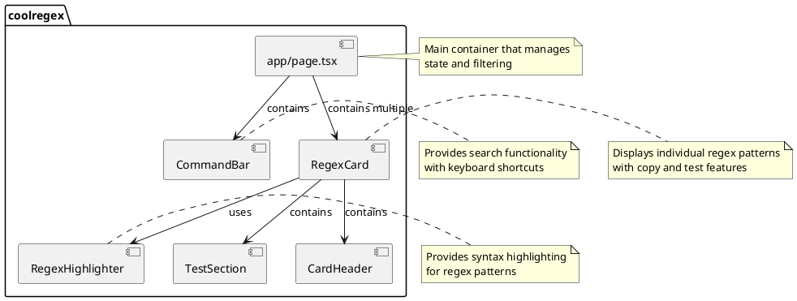
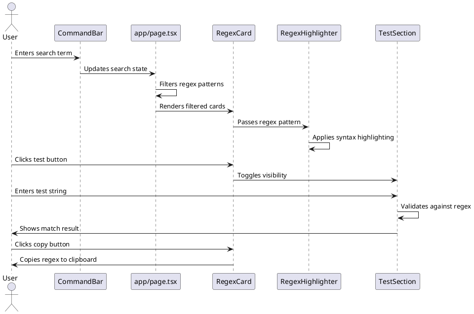
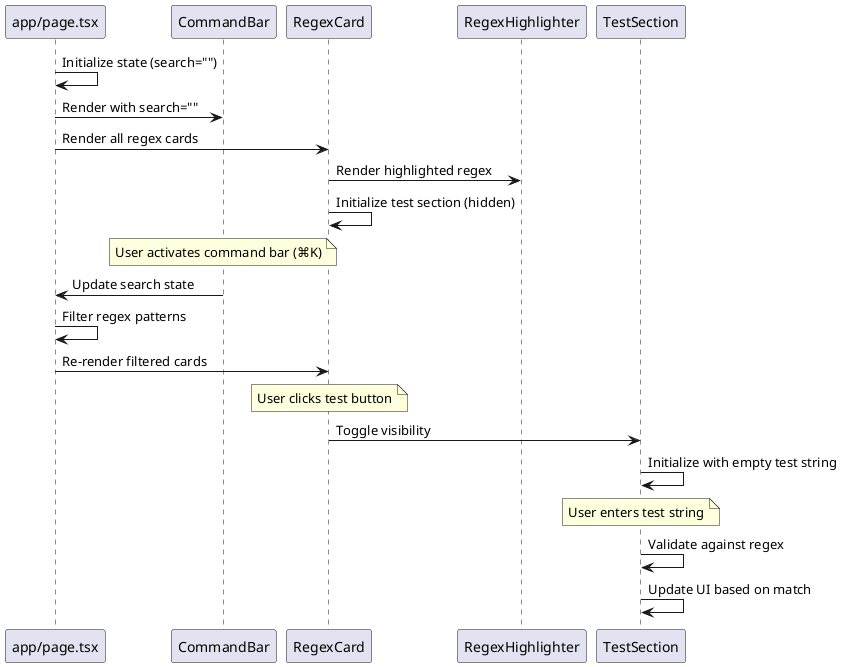

Regular expressions (regex) are powerful tools for pattern matching and text manipulation, but they can be notoriously difficult to write and understand. Even experienced developers often find themselves searching for common regex patterns or struggling to remember the exact syntax for validating emails, URLs, or phone numbers.

This is where **coolregex** comes in - a sleek, modern web application that provides a carefully curated collection of commonly used regex patterns, ready to be copied and used in your projects.

## Why I Created coolregex

As a developer, I frequently found myself in situations where I needed to quickly validate user input or parse text using regular expressions. Each time, I would end up searching through old projects or browsing Stack Overflow to find the right pattern. This repetitive process was time-consuming and inefficient.

I created coolregex for two main reasons:

1. **Quick Access to Common Patterns**: I wanted a centralized, easily accessible library of well-tested regex patterns that I could quickly copy and use in my projects.

2. **Learning Tool**: I wanted to deepen my understanding of regular expressions by creating a tool that not only provides patterns but also explains how they work and allows for interactive testing.

By building coolregex, I've not only created a useful tool for myself and other developers but also gained a much deeper understanding of regex patterns and their applications.

## Key Features

coolregex is designed to be a comprehensive tool for developers and data analysts looking to streamline their validation processes. Here are some of its key features:

### 1. Curated Collection of Regex Patterns

coolregex offers a variety of commonly used regex patterns for:

- Email validation
- URL validation
- Phone numbers
- Dates
- IP addresses
- Password strength
- Currency formats
- And many more

### 2. Interactive Testing

Each regex pattern comes with an interactive testing feature that allows you to:
- Enter test strings
- See real-time validation results
- Understand how the pattern matches or fails to match your input

### 3. Syntax Highlighting

The application includes custom syntax highlighting for regex patterns, making them easier to read and understand:
- Different colors for character classes, quantifiers, groups, and anchors
- Visual distinction between different parts of complex patterns

### 4. Command Bar

A powerful command bar (activated with ⌘K) allows you to:
- Quickly search for specific patterns
- Filter the collection based on keywords
- Navigate the application efficiently

### 5. Modern, Responsive UI

Built with Next.js and Tailwind CSS, coolregex offers:
- A clean, minimalist interface
- Full responsiveness across devices
- Accessibility features for all users

## Architecture

### Component Structure



### Data Flow



### Component Interaction



## Core Components

### RegexHighlighter

The `RegexHighlighter` component is responsible for parsing regex patterns and applying syntax highlighting to make them more readable. It breaks down the regex , character classes, quantifiers, etc.) and applies specific styles to each part.

```typescript
// Simplified version of the highlighting logic
const patterns = {
  literal: { regex: /[a-zA-Z0-9]/, style: "" },
  character_class: { regex: /\[[^\]]*\]/, style: "text-green-600 bg-green-200" },
  quantifier: { regex: /\*|\+|\?|\{[0-9,]*\}/, style: "text-red-600 bg-red-200" },
  group: { regex: /\(.*?\)/, style: "text-yellow-600 bg-yellow-200" },
  anchor: { regex: /\^|\$/, style: "text-purple-600 bg-purple-200" },
  escaped: { regex: /\\[dDsSwW]/, style: "text-pink-600 bg-pink-200" },
};
```

### CommandBar

The `CommandBar` component provides a searchable interface for finding specific regex patterns. It can be activated with keyboard shortcuts (⌘K) and filters the available regex patterns based on user input.

It leverages the [CMDK](https://cmdk.paco.me) library to create an accessible command palette that enhances navigation and search functionality.

### RegexCard

The `RegexCard` component displays individual regex patterns with their title, description, and icon. It provides functionality to:

1. Copy the regex pattern to the clipboard
2. Test the regex against user-provided strings
3. Toggle the visibility of the test section

Each card is designed to be self-contained, providing all the information and functionality needed for a specific regex pattern.

## Technical Implementation

### State Management

coolregex uses React's built-in state management with the `useState` hook to handle:

- The current search term
- The visibility of test sections
- Test string inputs
- Copy-to-clipboard functionality

This approach keeps the application simple and performant without introducing additional dependencies.

### Syntax Highlighting

The syntax highlighting feature works by:

1. Parsing the regex string character by character
2. Identifying different components (character classes, quantifiers, etc.)
3. Applying specific styles to each component
4. Rendering the highlighted regex with appropriate colors and backgrounds

This makes complex regex patterns much more readable and helps users understand the structure of each pattern.

### Search and Filtering

The search functionality filters regex patterns based on:

- The regex pattern itself
- The title of the pattern
- The description of the pattern

This allows users to find patterns not only by their actual regex syntax but also by their purpose or use case.

## Development and Deployment

coolregex is built with modern web technologies:

- **Next.js**: For server-side rendering and optimized performance
- **TypeScript**: For type safety and improved developer experience
- **Tailwind CSS**: For responsive, utility-first styling
- **Shadcn/ui**: For accessible, reusable UI components
- **Vercel**: For seamless deployment and hosting

The development workflow is streamlined with:

```bash
# Clone the repository
git clone https://github.com/nicholasadamou/coolregex.git

# Install dependencies
pnpm install

# Start the development server
pnpm dev
```

## Future Enhancements

I have several ideas for future improvements to coolregex:

1. **User Contributions**: Allow users to submit their own regex patterns
2. **Pattern Categories**: Organize patterns into categories for easier browsing
3. **Regex Builder**: Add a visual regex builder for creating custom patterns
4. **Explanation Feature**: Provide detailed explanations of how each regex works
5. **Localization**: Support for multiple languages

## Conclusion

coolregex started as a personal project to solve a common developer problem - quick access to reliable regex patterns. It has evolved into a useful tool that not only provides these patterns but also helps users understand and test them.

Whether you're validating form inputs, parsing text, or just learning about regular expressions, coolregex aims to make your work easier and more efficient.

Visit [coolregex.vercel.app](https://coolregex.vercel.app) to try it out, and check out the [GitHub repository](https://github.com/nicholasadamou/coolregex) to contribute or learn more about the implementation.
