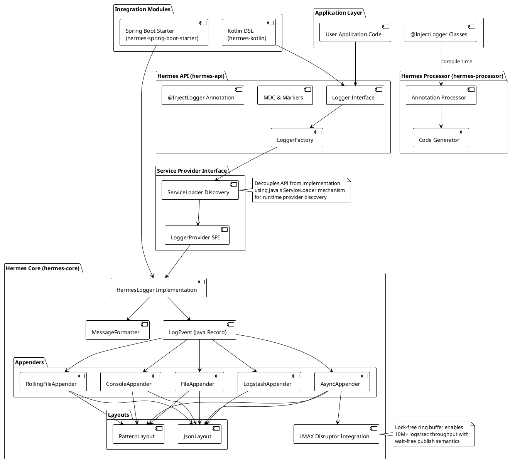
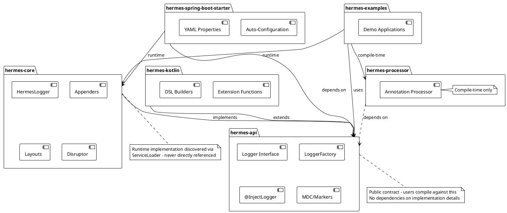

Managing logging infrastructure in high-throughput Java applications presents unique challenges: runtime reflection overhead, lock contention in async logging, garbage collection pressure from string allocation, and the eternal boilerplate of logger field declarations. Traditional logging frameworks often require explicit logger instantiation, XML configuration files, and complex dependency chains that slow development velocity.

**Hermes** eliminates these pain points by providing a modern, high-performance logging library built for Java 17+ that combines compile-time code generation, zero-allocation message formatting, and lock-free async processing. Named after the Greek messenger god, Hermes delivers log messages swiftly and reliably while maintaining excellent developer experience through zero-boilerplate annotations and sensible defaults.

## Why Hermes?

Modern Java applications demand logging solutions that scale to millions of events per second without becoming performance bottlenecks. Traditional logging frameworks were designed in the Java 6 era and carry architectural decisions that don't leverage modern JVM capabilities or contemporary concurrency primitives.

### The Logging Performance Challenge

High-throughput applications—microservices handling thousands of requests per second, data processing pipelines, real-time analytics systems—generate massive volumes of log data. Every microsecond spent formatting messages, acquiring locks, or allocating strings directly impacts application latency and throughput. Traditional logging approaches suffer from:

- **Reflection overhead** for logger field injection
- **Lock contention** in multi-threaded async appenders
- **GC pressure** from excessive string allocation during message formatting
- **Thread blocking** when writing to I/O streams synchronously
- **Configuration complexity** with XML or properties files

### Zero-Boilerplate Development Experience

Beyond performance, developer experience matters. Writing `private static final Logger log = LoggerFactory.getLogger(MyClass.class);` in every class is tedious, error-prone (easy to copy-paste the wrong class), and adds visual noise to source code.

Hermes solves this with compile-time annotation processing:

```java path=null start=null
@InjectLogger
public class UserService extends UserServiceHermesLogger {
    public void createUser(String username) {
        log.info("Creating user: {}", username);
    }
}
```

The `@InjectLogger` annotation triggers compile-time code generation that creates a base class with a `protected Logger log` field. This approach:

- **Eliminates boilerplate** without runtime reflection
- **Provides type safety** through compile-time checks
- **Works with GraalVM Native Image** (no reflection configuration needed)
- **Enables IDE autocomplete** for the generated logger field

### Enterprise-Grade Features for Production

Hermes isn't just fast—it's production-ready with features that enterprise applications demand:

- **Structured JSON logging** for log aggregation systems (ELK, Splunk, Datadog)
- **Mapped Diagnostic Context (MDC)** for request tracing and correlation
- **Multiple appenders** (Console, File, RollingFile, Async, Logstash)
- **Pattern layouts** with customizable formatting
- **Spring Boot auto-configuration** with YAML-based configuration
- **Kotlin DSL** for idiomatic Kotlin integration
- **GraalVM Native Image support** with included metadata

## Core Architecture

Hermes follows a modular architecture that separates concerns into six focused modules, enabling users to include only what they need while maintaining clear dependency boundaries.

### System Architecture Overview



### Module Dependency Structure

Hermes is organized into six distinct modules, each with specific responsibilities:



#### Module Breakdown

**1. hermes-api** - The Public Contract

Contains all public interfaces, annotations, and API surface that applications compile against. This separation enables implementation swapping without recompilation.

**Key components:**

- `Logger` interface with level-specific methods (trace, debug, info, warn, error)
- `LoggerFactory` for logger instantiation
- `@InjectLogger` annotation for compile-time injection
- `LogLevel` enum (TRACE, DEBUG, INFO, WARN, ERROR)
- `MDC` (Mapped Diagnostic Context) for thread-local contextual data
- `Marker` interface for log categorization

**2. hermes-core** - The Implementation Engine

Provides the concrete implementation of all logging functionality, optimized for performance and zero-allocation where possible.

**Key components:**

- `HermesLogger` - Main logger implementation with level checks
- `LogEvent` - Immutable Java 17 record capturing log data
- `MessageFormatter` - Zero-allocation message formatting using ThreadLocal StringBuilder
- **Appenders**: Console, File, RollingFile, Async (with Disruptor), Logstash
- **Layouts**: Pattern (customizable format strings), JSON (structured logging)
- Performance optimizations: early exit, ThreadLocal reuse, lock-free data structures

**3. hermes-processor** - Compile-Time Code Generation

Annotation processor that generates logger base classes during compilation, eliminating runtime reflection overhead.

**How it works:**

1. Detects `@InjectLogger` annotation during compilation
2. Generates a base class (e.g., `UserServiceHermesLogger`) with `protected Logger log` field
3. User class extends the generated base class to access the logger
4. No runtime overhead—all code generation happens at compile time

**4. hermes-spring-boot-starter** - Spring Boot Integration

Auto-configuration module providing seamless Spring Boot integration with property binding and lifecycle management.

**Features:**

- `@EnableAutoConfiguration` support
- `HermesProperties` for YAML/properties binding
- Actuator health indicator for monitoring
- Automatic logger configuration from `application.yml`

**5. hermes-kotlin** - Idiomatic Kotlin Extensions

Kotlin DSL providing idiomatic syntax for Kotlin projects using extension functions and builders.

**Features:**

- `MyClass::class.logger` - Extension property for logger creation
- Lazy evaluation: `log.info { "Expensive $computation" }`
- MDC DSL: `withMDC("key" to "value") { ... }`
- Structured logging builders with type-safe key-value pairs

**6. hermes-examples** - Reference Implementations

Working examples demonstrating various Hermes features and integration patterns.

## High-Performance Async Logging with LMAX Disruptor

Traditional async logging implementations use lock-based queues (`ArrayBlockingQueue`, `LinkedBlockingQueue`) which suffer from thread contention and context switching overhead. Hermes integrates the LMAX Disruptor—a high-performance inter-thread messaging library used in financial trading systems—to achieve lock-free, wait-free async logging.

### Async Logging Flow

The asynchronous logging process is designed to minimize application thread latency while maximizing throughput:

### Performance Characteristics

**Application Thread (Publisher)**

- **Latency**: ~100 nanoseconds (wait-free publish)
- **Non-blocking**: Returns immediately after publishing to ring buffer
- **No locks**: Uses CAS (Compare-And-Swap) operations

**Background Thread (Consumer)**

- **Batching**: Processes multiple events together, amortizing overhead
- **Sequential I/O**: Writes are coalesced for better disk throughput
- **Single consumer**: Eliminates coordination overhead

**Throughput Comparison**

- **`ArrayBlockingQueue` (lock-based)**
  - Throughput: ~1M logs/sec
  - Latency: ~5-10 µs

- **LMAX Disruptor (lock-free)**
  - Throughput: **10M+ logs/sec**
  - Latency: **~0.1 µs**

### Ring Buffer Mechanics

The ring buffer is pre-allocated with a fixed size (power of 2, typically 1024-8192 slots). This design provides several advantages:

1. **Memory locality**: Contiguous memory improves CPU cache utilization
2. **No allocation**: Slots are reused, eliminating GC pressure
3. **Fast modulo**: Ring wrapping uses bitwise AND instead of expensive modulo operation
4. **Wait-free**: Publishers never wait for consumers (unless buffer full)

## Zero-Allocation Message Formatting

Traditional logging frameworks create new String objects for every log message, contributing to garbage collection pressure. Hermes eliminates this allocation using ThreadLocal StringBuilder reuse.

### Performance Impact

**Before (Traditional Approach)**

```java path=null start=null
// Creates 3 new String objects per call
log.info("User " + username + " logged in at " + timestamp);
```

- **Allocations**: 3+ String objects, intermediate char arrays
- **GC pressure**: Continuous young generation collections
- **Throughput impact**: GC pauses affect latency

**After (Hermes Zero-Allocation)**

```java path=null start=null
// Zero allocations using ThreadLocal StringBuilder reuse
log.info("User {} logged in at {}", username, timestamp);
```

- **Allocations**: Zero (after first call per thread)
- **GC pressure**: Minimal—only final String and LogEvent allocated
- **Throughput**: No GC pauses from message formatting

### Implementation Details

```java path=null start=null
public class MessageFormatter {
    // ThreadLocal ensures each thread has its own StringBuilder
    private static final ThreadLocal<StringBuilder> BUFFER =
        ThreadLocal.withInitial(() -> new StringBuilder(256));

    public static String format(String pattern, Object... args) {
        StringBuilder sb = BUFFER.get();
        sb.setLength(0); // Clear but don't deallocate

        int argIndex = 0;
        int patternLength = pattern.length();

        for (int i = 0; i < patternLength; i++) {
            char c = pattern.charAt(i);
            if (c == '{' && i + 1 < patternLength && pattern.charAt(i + 1) == '}') {
                // Placeholder found
                if (argIndex < args.length) {
                    sb.append(args[argIndex++]);
                }
                i++; // Skip the '}'
            } else {
                sb.append(c);
            }
        }

        return sb.toString(); // Only allocation
    }
}
```

## Spring Boot Integration and Configuration

Hermes provides first-class Spring Boot integration through the `hermes-spring-boot-starter` module, enabling auto-configuration and YAML-based setup.

### Configuration Example

```yaml path=null start=null
# application.yml
hermes:
  # Root log level and package-specific levels
  level:
    root: INFO
    packages:
      io.github.dotbrains: DEBUG
      com.myapp.service: TRACE
      com.myapp.repository: DEBUG

  # Log output pattern (supports multiple format directives)
  pattern: "%d{yyyy-MM-dd HH:mm:ss.SSS} [%thread] %-5level %logger{36} - %msg%n"

  # Async logging configuration
  async:
    enabled: true
    queue-size: 2048 # Ring buffer size (must be power of 2)
```

### Pattern Format Directives

- **`%d{pattern}`** - Timestamp (e.g., `2026-01-10 11:45:30.123`)
- **`%thread`** - Thread name (e.g., `http-nio-8080-exec-1`)
- **`%level`** - Log level (e.g., `INFO`)
- **`%-5level`** - Left-aligned level, 5 chars (e.g., `INFO `)
- **`%logger{length}`** - Logger name, abbreviated (e.g., `c.e.s.UserService`)
- **`%msg`** - Log message (e.g., `User created successfully`)
- **`%n`** - Line separator (platform-specific)
- **`%mdc{key}`** - MDC value (e.g., `req-12345`)
- **`%exception`** - Exception stack trace (full stack trace)

## Structured JSON Logging for Observability

Modern observability platforms (ELK Stack, Splunk, Datadog, New Relic) expect structured JSON logs for efficient parsing and querying. Hermes provides built-in JSON layout with customizable formatting.

### JSON Output Example

```json path=null start=null
{
  "timestamp": "2026-01-10T04:58:51.123Z",
  "level": "INFO",
  "logger": "com.example.UserService",
  "thread": "http-nio-8080-exec-1",
  "threadId": "42",
  "message": "User john.doe created successfully",
  "mdc": {
    "requestId": "req-789",
    "userId": "12345",
    "sessionId": "sess-abc"
  }
}
```

### Logstash Integration

Hermes includes a dedicated LogstashAppender for direct TCP streaming to Logstash:

```java path=null start=null
LogstashAppender logstash = new LogstashAppender(
    "logstash",
    "logstash.example.com",  // Logstash host
    5000                     // TCP input port
);
logstash.start();
```

**Logstash Configuration:**

```ruby path=null start=null
input {
  tcp {
    port => 5000
    codec => json
  }
}

filter {
  # Add additional fields, parse timestamps, etc.
  mutate {
    add_field => { "environment" => "production" }
  }
}

output {
  elasticsearch {
    hosts => ["elasticsearch:9200"]
    index => "hermes-logs-%{+YYYY.MM.dd}"
  }
}
```

## Kotlin DSL for Idiomatic Integration

Hermes provides a Kotlin-specific module (`hermes-kotlin`) with extension functions and DSL builders for idiomatic Kotlin usage.

### Kotlin Extensions Overview

```kotlin path=null start=null
import io.github.dotbrains.kotlin.*

class UserService {
    // Extension property for logger creation
    private val log = UserService::class.logger

    fun createUser(userId: String, username: String) {
        // Lazy evaluation - only computed if DEBUG enabled
        log.debug { "Creating user with expensive data: ${expensiveOperation()}" }

        // MDC with automatic cleanup
        withMDC("userId" to userId, "username" to username) {
            log.info { "Processing user creation" }
            // MDC is automatically cleared after block
        }

        // Structured logging DSL
        log.infoWith {
            "message" to "User created successfully"
            "userId" to userId
            "username" to username
            "timestamp" to System.currentTimeMillis()
            "environment" to System.getenv("ENV")
        }
    }

    // Exception logging with Kotlin syntax
    fun handleError(userId: String, error: Exception) {
        log.error(error) { "Failed to process user: $userId" }
    }
}
```

### Lazy Evaluation Benefits

Kotlin's lambda syntax enables true lazy evaluation—expensive operations are only executed if the log level is enabled:

```kotlin path=null start=null
// ❌ BAD: expensiveOperation() always called, even if DEBUG disabled
log.debug("Result: ${expensiveOperation()}")

// ✅ GOOD: expensiveOperation() only called if DEBUG enabled
log.debug { "Result: ${expensiveOperation()}" }
```

## GraalVM Native Image Support

Hermes includes GraalVM native-image metadata for ahead-of-time compilation to native executables, eliminating the need for manual reflection configuration.

### Native Image Metadata

Hermes includes the following metadata in `hermes-core/src/main/resources/META-INF/native-image/`:

**reflect-config.json** - Reflection hints

```json path=null start=null
[
  {
    "name": "io.github.dotbrains.core.HermesLoggerProvider",
    "allPublicMethods": true
  }
]
```

**resource-config.json** - Resource patterns

```json path=null start=null
{
  "resources": {
    "includes": [
      { "pattern": "META-INF/services/.*" },
      { "pattern": "application.ya?ml" }
    ]
  }
}
```

### Building Native Images

```bash path=null start=null
# Maven with GraalVM native plugin
mvn -Pnative native:compile

# Gradle with GraalVM native plugin
./gradlew nativeCompile

# Direct native-image invocation
native-image --no-fallback -jar myapp.jar
```

## Performance Benchmarks and Metrics

Hermes is designed for high-performance scenarios. Here are the expected performance characteristics:

### Latency Measurements

- **Disabled log statement**: ~1 ns (level check only, early exit)
- **Enabled sync log (console)**: ~1-5 µs (message formatting + I/O)
- **Enabled async log (Disruptor)**: ~100 ns (wait-free publish to ring buffer)
- **JSON formatting**: ~2-10 µs (object construction + serialization)
- **File write (buffered)**: ~5-20 µs (depends on I/O buffer size)

### Throughput Comparison

- **Sync console logging**: ~1M logs/sec (single thread, pattern layout)
- **Async file logging**: ~10M+ logs/sec (multiple threads, Disruptor, buffered I/O)
- **JSON structured logging**: ~500K logs/sec (single thread, JSON layout)

### Memory Efficiency

**Before (Traditional Logging)**

- String allocation per log message
- Intermediate object creation during formatting
- GC pressure from short-lived objects

**After (Hermes Optimization)**

- ThreadLocal StringBuilder reuse (zero allocation after warmup)
- Immutable LogEvent records (compact memory layout)
- Pre-allocated ring buffer (no allocation during logging)

## Use Cases and Deployment Scenarios

Hermes excels in various production scenarios where logging performance and developer experience matter:

### High-Throughput Microservices

**Scenario**: REST API handling 10K+ requests/second with detailed request tracing.

**Solution**:

- Async appender with Disruptor for non-blocking logging
- MDC for request correlation (`requestId`, `userId`, `sessionId`)
- JSON layout for structured logs sent to ELK stack

**Benefits**:

- Application threads return immediately (sub-microsecond logging)
- Request tracing across distributed services via MDC propagation
- Efficient log querying in Elasticsearch using structured fields

### Data Processing Pipelines

**Scenario**: Apache Kafka consumer processing millions of messages per hour with detailed progress tracking.

**Solution**:

- Rolling file appender with size-based rotation
- Zero-allocation message formatting to minimize GC pauses
- Conditional debug logging for problematic message inspection

**Benefits**:

- Minimal overhead on message processing throughput
- Automatic log rotation prevents disk exhaustion
- Debug logging enabled dynamically without restarts

### Spring Boot Enterprise Applications

**Scenario**: Monolithic Spring Boot application with complex business logic requiring comprehensive audit logging.

**Solution**:

- Spring Boot starter for auto-configuration
- YAML-based configuration for environment-specific settings
- Multiple appenders (console for dev, file + Logstash for production)
- MDC populated via Spring interceptors for request tracking

**Benefits**:

- Zero-boilerplate logger injection with `@InjectLogger`
- Environment-specific configuration without code changes
- Seamless integration with Spring Boot Actuator

### Kotlin-Based Applications

**Scenario**: Modern Kotlin microservice requiring idiomatic logging syntax.

**Solution**:

- Kotlin DSL with lazy evaluation and structured logging builders
- Extension functions for logger creation
- MDC DSL for contextual data

**Benefits**:

- Lazy evaluation prevents unnecessary computation
- Type-safe structured logging with DSL builders
- Cleaner code with Kotlin-idiomatic syntax

## Technical Highlights

### What Sets Hermes Apart

**1. Compile-Time Logger Injection**

- Zero runtime overhead through annotation processing
- Type-safe generated base classes
- GraalVM-friendly (no reflection configuration)

**2. Lock-Free Async Processing**

- LMAX Disruptor for 10-100x better throughput than lock-based queues
- Wait-free publish semantics
- Single consumer pattern eliminates coordination overhead

**3. Zero-Allocation Formatting**

- ThreadLocal StringBuilder reuse
- Early exit for disabled log levels
- Minimal GC pressure

**4. Modern Java Features**

- Java 17 records for immutable, compact LogEvent
- ServiceLoader pattern for decoupled architecture
- Text blocks for readable configuration

**5. Comprehensive Integration**

- Spring Boot auto-configuration
- Kotlin DSL extensions
- GraalVM Native Image metadata
- Logstash direct streaming

## Comparison with Established Frameworks

### Logger Injection

- **SLF4J + Logback**: Manual or Lombok
- **Log4j2**: Manual
- **Hermes**: `@InjectLogger` annotation

### Configuration

- **SLF4J + Logback**: XML/Groovy
- **Log4j2**: XML/JSON/YAML
- **Hermes**: YAML with sensible defaults

### Async Logging

- **SLF4J + Logback**: Via appenders (lock-based)
- **Log4j2**: Lock-free (Disruptor)
- **Hermes**: Built-in LMAX Disruptor

### Message Formatting

- **SLF4J + Logback**: String concatenation
- **Log4j2**: ThreadLocal reuse
- **Hermes**: ThreadLocal zero-allocation

### Spring Boot Integration

- **SLF4J + Logback**: External starters
- **Log4j2**: External starters
- **Hermes**: Native auto-configuration

### Kotlin Support

- **SLF4J + Logback**: Java API only
- **Log4j2**: Java API only
- **Hermes**: Dedicated Kotlin DSL

### GraalVM Native Image

- **SLF4J + Logback**: Manual configuration
- **Log4j2**: Manual configuration
- **Hermes**: Included metadata

### Java Version

- **SLF4J + Logback**: 8+
- **Log4j2**: 8+
- **Hermes**: 17+ (modern features)

### JSON Logging

- **SLF4J + Logback**: Via Jackson/Gson
- **Log4j2**: Built-in
- **Hermes**: Built-in optimized layout

## Getting Started

### Maven Setup

```xml path=null start=null
<dependencies>
    <!-- Core API -->
    <dependency>
        <groupId>io.github.dotbrains</groupId>
        <artifactId>hermes-api</artifactId>
        <version>1.0.0</version>
    </dependency>

    <!-- Annotation processor (for @InjectLogger) -->
    <dependency>
        <groupId>io.github.dotbrains</groupId>
        <artifactId>hermes-processor</artifactId>
        <version>1.0.0</version>
        <scope>provided</scope>
    </dependency>

    <!-- Core implementation -->
    <dependency>
        <groupId>io.github.dotbrains</groupId>
        <artifactId>hermes-core</artifactId>
        <version>1.0.0</version>
        <scope>runtime</scope>
    </dependency>
</dependencies>

<build>
    <plugins>
        <plugin>
            <groupId>org.apache.maven.plugins</groupId>
            <artifactId>maven-compiler-plugin</artifactId>
            <configuration>
                <annotationProcessorPaths>
                    <path>
                        <groupId>io.github.dotbrains</groupId>
                        <artifactId>hermes-processor</artifactId>
                        <version>1.0.0</version>
                    </path>
                </annotationProcessorPaths>
            </configuration>
        </plugin>
    </plugins>
</build>
```

### Spring Boot Quick Start

**1. Add the starter dependency:**

```xml path=null start=null
<dependency>
    <groupId>io.github.dotbrains</groupId>
    <artifactId>hermes-spring-boot-starter</artifactId>
    <version>1.0.0</version>
</dependency>
```

**2. Configure in `application.yml`:**

```yaml path=null start=null
hermes:
  level:
    root: INFO
    packages:
      com.example: DEBUG
  async:
    enabled: true
    queue-size: 2048
```

**3. Use in your code:**

```java path=null start=null
@InjectLogger
@Service
public class UserService extends UserServiceHermesLogger {
    public void createUser(String username) {
        log.info("Creating user: {}", username);
    }
}
```

## Tech Stack

**Core Technologies:**

- Java 17 (Records, Text Blocks, Modern JVM)
- LMAX Disruptor (Lock-free async processing)
- ServiceLoader SPI (Decoupled architecture)
- Annotation Processing (Compile-time code generation)

**Integration & Frameworks:**

- Spring Boot (Auto-configuration)
- Kotlin (DSL extensions)
- Maven/Gradle (Build system)
- GraalVM (Native image compilation)

**Testing & Quality:**

- JUnit 5 (Unit testing)
- Mockito (Mocking framework)
- GitHub Actions (CI/CD)
- Maven Central (Artifact distribution)

## Conclusion

Hermes represents a modern approach to Java logging that leverages contemporary JVM features, advanced concurrency primitives, and developer-friendly abstractions. By combining compile-time code generation, zero-allocation message formatting, and lock-free async processing, Hermes delivers exceptional performance without sacrificing usability.

Whether you're building high-throughput microservices, data processing pipelines, or enterprise Spring Boot applications, Hermes provides the performance, flexibility, and developer experience needed for production-grade logging infrastructure. Named after the swift messenger god, Hermes truly delivers log messages with speed and reliability.

For detailed architecture documentation, API reference, and integration guides, visit the [official documentation](https://dotbrains.github.io/hermes) or explore the [GitHub repository](https://github.com/dotbrains/hermes).
