Creating a favicon for your website or application often requires opening design software, exporting files in multiple formats and sizes, and dealing with complex toolchains. While favicons seem simple—just a small icon—getting them right involves understanding image formats, transparency, color theory, and browser compatibility.

**IconForge** eliminates this complexity by providing a browser-based, real-time favicon creator powered by Font Awesome's extensive icon library. With over 1,800 professionally designed icons at your fingertips, you can create production-ready favicons in seconds, not hours.

## Why IconForge?

The motivation behind IconForge stems from a common pain point in web development: the tedious process of creating and iterating on favicons. Traditional workflows involve:

- Opening design software (Photoshop, Figma, Sketch)
- Creating artboards at multiple sizes (16×16, 32×32, 180×180, 512×512)
- Designing or importing icons
- Exporting to PNG, ICO, and SVG formats
- Testing across different browsers and devices
- Iterating when changes are needed

IconForge reduces this entire process to a single browser session with instant visual feedback.

### Key Benefits

- **Zero Setup Required**: No design software, no CLI tools, no build process
- **Real-Time Preview**: See changes instantly, including in the browser tab
- **Production-Ready Output**: Export high-quality 512×512 PNG or ICO files
- **Accessibility**: Fully keyboard-navigable with responsive design
- **Extensibility**: Stacked icon mode for creating unique, layered designs

## Core Features

IconForge provides a comprehensive set of features designed to make favicon creation both powerful and intuitive:

### Live Canvas Preview

The centerpiece of IconForge is its real-time canvas rendering system. Every change—color, size, icon selection—immediately updates both the main preview canvas and the browser's favicon. This live feedback loop enables rapid experimentation and iteration.

### Advanced Color Controls

- **Hex Color Pickers**: Precise color selection using react-colorful's modern color picker interface
- **Foreground/Background Control**: Independent color control for icon and background
- **Transparency Support**: Optional transparent backgrounds for modern, flat design aesthetics
- **Visual Feedback**: Checkerboard pattern behind canvas shows transparency clearly

### Dynamic Size Control

IconForge provides intuitive sliders for controlling icon sizes:

- **Main Icon Size**: 10–100% scaling of the primary icon
- **Stacked Icon Size**: Independent size control for layered icons
- **Real-Time Updates**: Smooth rendering as you drag sliders

### Icon Stacking System

One of IconForge's most powerful features is the ability to stack two Font Awesome icons with XOR blending, creating unique composite designs:

- Layer two icons at different sizes
- XOR composition mode creates "cutout" effects
- Independent size control for each layer
- Enables complex designs impossible with single icons

### Intelligent Search

With 1,800+ icons, finding the right one is crucial. IconForge implements fuzzy search powered by Fuse.js:

- Search by icon ID (e.g., "user", "home")
- Search by label (e.g., "User", "House")
- Search by semantic terms (e.g., "person" finds "user", "building" finds "house")
- Fault-tolerant matching handles typos and partial matches

### Multiple Export Formats

- **PNG Export**: High-quality 512×512 PNG for modern browsers
- **ICO Export**: Legacy ICO format for broader compatibility
- **Advanced ICO**: Integration with RealFaviconGenerator for multi-size ICO bundles

## Architecture Overview

IconForge is architected as a modern, client-side React application leveraging Next.js 16's App Router. The architecture prioritizes real-time interactivity, clean separation of concerns, and optimal performance through efficient state management and canvas rendering.

### High-Level System Architecture


### Component Architecture

IconForge follows a unidirectional data flow pattern where the main page component maintains all application state, and child components receive data via props and communicate changes through callback functions.


## State Management & Data Flow

IconForge uses React's built-in `useState` hook for state management, maintaining a single `CanvasState` object that represents the entire application state. This approach provides predictable state updates and makes it easy to understand how data flows through the application.

### CanvasState Structure

The `CanvasState` interface defines all the properties needed to render a favicon:

```typescript path=null start=null
interface CanvasState {
  foregroundColor: string; // Hex color for the icon
  backgroundColor: string; // Hex color or 'transparent'
  size: number; // Icon size percentage (10-100)
  stackedSize: number; // Stacked icon size (10-100)
  icon: Icon | null; // Primary icon
  stackedIcon: Icon | null; // Secondary icon for stacking
  stackedSelected: boolean; // Whether stacking is enabled
}
```

### Data Flow Sequence


### State Update Pattern

IconForge follows React best practices for state updates, using functional updates to ensure state changes are based on the most recent state:

```typescript path=null start=null
// Color change example
setState((prev) => ({ ...prev, foregroundColor: newColor }));

// Icon selection with conditional logic
setState((prev) => ({
  ...prev,
  [prev.stackedSelected ? "stackedIcon" : "icon"]: selectedIcon,
}));
```

## Canvas Rendering Engine

The heart of IconForge is its canvas rendering system, which converts Font Awesome icons into high-quality raster images. This system handles font rendering, color application, transparency, and advanced composition modes.

### Font Awesome Integration

IconForge uses Font Awesome 6's webfont files, loading them through Next.js's layout component:

```typescript path=null start=null
// app/layout.tsx
import "@fortawesome/fontawesome-free/css/all.css";
```

Font Awesome provides three font families:

- **Font Awesome 6 Free** (weight 900): Solid icons
- **Font Awesome 6 Free** (weight 400): Regular icons
- **Font Awesome 6 Brands**: Brand logos

### Canvas Drawing Algorithm

The `drawIcon` function in `canvas-utils.ts` implements a multi-step rendering process:


### Composite Operations for Icon Stacking

IconForge uses Canvas API's `globalCompositeOperation` to achieve the XOR blend effect:

```typescript path=null start=null
// Main icon rendering
ctx.globalCompositeOperation = "destination-out"; // Create mask
ctx.fillText(icon.unicode, centerX, centerY);
ctx.globalCompositeOperation = "source-over"; // Draw with color
ctx.fillText(icon.unicode, centerX, centerY);

// Stacked icon with XOR effect
ctx.globalCompositeOperation = "xor"; // Exclusive OR
ctx.fillText(stackedIcon.unicode, centerX, centerY);
```

The XOR composite operation creates a "cutout" effect where overlapping areas become transparent, enabling unique layered designs.

### Font Rendering Details

IconForge dynamically determines the correct font family and weight based on the icon's style metadata:

```typescript path=null start=null
const getFontFamily = (icon: Icon) => {
  if (icon.styles.includes("brands")) {
    return '"Font Awesome 6 Brands"';
  }
  return '"Font Awesome 6 Free"';
};

const getFontWeight = (icon: Icon) => {
  if (icon.styles.includes("brands")) return 400;
  if (icon.styles.includes("regular")) return 400;
  return 900; // solid
};
```

### Performance Optimization

The canvas rendering system is optimized for performance:

1. **Memoized Utilities**: Font family/weight functions are defined once
2. **Efficient Redraws**: Only re-render when state actually changes via `useEffect`
3. **Canvas Size**: Fixed 512×512 output size provides optimal quality/performance balance
4. **Hardware Acceleration**: Canvas rendering leverages GPU acceleration when available

## Fuzzy Search Implementation

With over 1,800 Font Awesome icons available, finding the right icon quickly is essential. IconForge implements intelligent fuzzy search using Fuse.js, providing fault-tolerant, semantic search capabilities.

### Search Architecture


### Icon Metadata Structure

Each icon in the dataset includes rich metadata for search:

```typescript path=null start=null
interface Icon {
  id: string; // e.g., "user", "home", "arrow-right"
  unicode: string; // Unicode character (e.g., "\uf007")
  label: string; // Display name (e.g., "User")
  styles: string[]; // Available styles: ["solid", "regular"]
  search: string[]; // Semantic terms: ["person", "profile", "account"]
}
```

### Fuse.js Configuration

The search system is configured to balance precision with fault tolerance:

```typescript path=null start=null
const fuse = useMemo(
  () =>
    new Fuse(icons, {
      keys: ["id", "label", "search"], // Search across multiple fields
      threshold: 0.3, // 0.0 = perfect match, 1.0 = match anything
      distance: 100, // Max character distance for matches
    }),
  [icons]
);
```

### Search Examples

Before diving into search examples, it's helpful to understand how IconForge's intelligent search system works in practice. The following queries illustrate the flexibility of semantic, typo-tolerant, and partial matching powered by Fuse.js—making it easy to find the right icon even if you don't remember the exact name.

**Query: `user`**

- **Matches**: user, users, user-group
- **Reason**: Exact ID match

**Query: `person`**

- **Matches**: user, user-tie, user-circle
- **Reason**: Semantic search term

**Query: `usr`**

- **Matches**: user, user-plus
- **Reason**: Fuzzy matching (typo tolerance)

**Query: `house`**

- **Matches**: home, house, building
- **Reason**: Label and semantic matches

**Query: `arw`**

- **Matches**: arrow-right, arrow-left, arrow-up
- **Reason**: Partial match with typo

### Performance Considerations

The search system uses React's `useMemo` to optimize performance:

```typescript path=null start=null
const filteredIcons = useMemo(() => {
  if (!searchQuery) return icons; // No search = show all
  return fuse.search(searchQuery).map((result) => result.item);
}, [searchQuery, fuse, icons]);
```

This ensures:

- Fuse.js instance is created only once
- Filtered results are recalculated only when query changes
- Full icon list is returned immediately when search is cleared

## Dynamic Favicon Updates

One of IconForge's standout features is its ability to update the browser's favicon in real-time as you design. This provides immediate visual feedback and demonstrates exactly how the favicon will look in production.

### Favicon Update Flow


### Implementation Details

The `useDynamicFavicon` hook implements the favicon update logic:

```typescript path=null start=null
export const useDynamicFavicon = (canvasSelector = "canvas") => {
  const updateFavicon = () => {
    const canvas = document.querySelector(canvasSelector) as HTMLCanvasElement;
    if (!canvas) return;

    try {
      // Convert canvas to data URL
      const faviconUrl = canvas.toDataURL("image/png");

      // Find or create favicon link element
      let link = document.querySelector("link[rel*='icon']") as HTMLLinkElement;
      if (!link) {
        link = document.createElement("link");
        link.rel = "icon";
        document.head.appendChild(link);
      }

      // Update the favicon
      link.href = faviconUrl;
    } catch (error) {
      console.error("Failed to update favicon:", error);
    }
  };

  return { updateFavicon };
};
```

### Timing Considerations

The page component uses a small delay to ensure the canvas has finished rendering:

```typescript path=null start=null
useEffect(() => {
  const timeoutId = setTimeout(() => {
    updateFavicon();
  }, 100); // 100ms delay

  return () => clearTimeout(timeoutId);
}, [state, updateFavicon]);
```

This delay is necessary because:

- State updates trigger canvas re-renders
- Canvas drawing is asynchronous
- The favicon needs the fully rendered canvas data

## Testing & Quality Assurance

IconForge maintains high code quality through comprehensive unit testing using Jest and React Testing Library. The test suite covers components, custom hooks, and utility functions.

### Test Coverage Overview

```plantuml
@startuml Test Coverage
!theme plain

package "Components" {
  [DownloadControls\nTested ✓]
  [ColorPicker\nTested ✓]
  [Tooltip\nTested ✓]
  [IconCanvas\nIntegration ✓]
}

package "Hooks" {
  [useDownload\nTested ✓]
  [useIconSearch\nTested ✓]
  [useDynamicFavicon\nManual ✓]
}

package "Utilities" {
  [canvas-utils\nTested ✓]
  [icons.ts\nData only]
}

note right of Components
  • Render testing
  • User interaction
  • Props validation
  • Event handlers
end note

note right of Hooks
  • State management
  • Side effects
  • Return values
  • Error handling
end note

note right of Utilities
  • Pure functions
  • Color conversion
  • Canvas operations
  • Edge cases
end note

@enduml
```



### Test Examples

Before diving into the individual test cases, here's an overview of IconForge's testing approach. The following examples illustrate how key components, React hooks, and utility functions are tested to ensure reliability, correct behavior, and maintainable code. Each test demonstrates real-world usage and validates important user interactions or logic across the application.

#### Component Testing

```typescript path=null start=null
// DownloadControls.test.tsx
describe('DownloadControls', () => {
  it('cycles through download formats', async () => {
    const onFormatChange = jest.fn();
    const user = userEvent.setup();

    render(
      <DownloadControls
        format="ico"
        onFormatChange={onFormatChange}
        onDownload={jest.fn()}
        downloading={false}
      />
    );

    await user.click(screen.getByText('ICO'));
    expect(onFormatChange).toHaveBeenCalled();
  });
});
```

#### Hook Testing

```typescript path=null start=null
// useIconSearch.test.ts
describe("useIconSearch", () => {
  it("filters icons by search query", () => {
    const { result } = renderHook(() => useIconSearch(mockIcons));

    act(() => {
      result.current.setSearchQuery("user");
    });

    expect(result.current.filteredIcons).toHaveLength(3);
    expect(result.current.filteredIcons[0].id).toBe("user");
  });
});
```

#### Utility Testing

```typescript path=null start=null
// canvas-utils.test.ts
describe("hexToRgba", () => {
  it("converts hex colors to RGBA", () => {
    expect(hexToRgba("#ff3860")).toEqual({
      r: 255,
      g: 56,
      b: 96,
      a: 1,
    });
  });
});
```

### Continuous Integration

IconForge uses GitHub Actions for automated testing:

```yaml path=null start=null
name: Tests
on: [push, pull_request]
jobs:
  test:
    runs-on: ubuntu-latest
    steps:
      - uses: actions/checkout@v3
      - uses: actions/setup-node@v3
      - run: npm install
      - run: npm run lint
      - run: npm test
      - run: npm run build
```

Every push and pull request triggers:

- Linting (ESLint)
- Unit tests (Jest)
- Build verification (Next.js)
- Coverage reporting

## Deployment & Infrastructure

IconForge is deployed on Vercel, leveraging Next.js's built-in optimization features and Vercel's global CDN for fast, reliable delivery.

### Deployment Architecture

```plantuml
@startuml Deployment Architecture
!theme plain

package "Vercel Edge Network" {
  [Global CDN]
  [Edge Functions]
}

package "Build Process" {
  [Next.js Build]
  [Static Generation]
  [Asset Optimization]
}

package "Assets" {
  [HTML/CSS/JS]
  [Font Awesome Fonts]
  [Icon Data JSON]
}

package "Client Browser" {
  [React App]
  [Canvas Renderer]
}

[Next.js Build] --> [Static Generation]
[Static Generation] --> [Asset Optimization]
[Asset Optimization] --> [HTML/CSS/JS]
[Asset Optimization] --> [Font Awesome Fonts]
[Asset Optimization] --> [Icon Data JSON]

[HTML/CSS/JS] --> [Global CDN]
[Font Awesome Fonts] --> [Global CDN]
[Icon Data JSON] --> [Global CDN]

[Global CDN] --> [React App]
[React App] --> [Canvas Renderer]

note right of [Global CDN]
  • Automatic HTTPS
  • Gzip/Brotli compression
  • HTTP/2 & HTTP/3
  • Global edge locations
  • Less than 100ms TTFB worldwide
end note

note right of [Static Generation]
  • Static HTML generation
  • Optimized JS bundles
  • Tree-shaking
  • Code splitting
end note

@enduml
```



### Build Optimization

IconForge benefits from Next.js's production optimizations:

- **Static HTML Export**: All pages pre-rendered at build time
- **Automatic Code Splitting**: Only load JavaScript needed for each page
- **Image Optimization**: Automatic WebP conversion and responsive sizing
- **Font Optimization**: Font Awesome fonts loaded with optimal caching headers
- **Bundle Analysis**: Tree-shaking removes unused code

### Performance Metrics

- **First Contentful Paint (FCP)**: Less than 1.5s
- **Time to Interactive (TTI)**: Less than 2.5s
- **Largest Contentful Paint (LCP)**: Less than 2.0s
- **Cumulative Layout Shift (CLS)**: Less than 0.1
- **Total Bundle Size**: Approximately 800KB (including Font Awesome fonts)

### Continuous Deployment

Vercel automatically deploys:

- **Production**: Every push to `main` branch
- **Preview**: Every pull request gets a unique preview URL
- **Rollback**: One-click rollback to any previous deployment

## Usage Guide

IconForge is designed for ease of use, even if you've never created a favicon before. This section will guide you through the main features, showing you how to select icons, customize colors and sizes, enable stacking, preview your creation, and export your favicon for production use—all from a modern, responsive web interface.

### Step-by-Step Workflow

Before diving into the step-by-step workflow, let's explore how to use IconForge to create your own custom favicon. The following guide walks you through each key feature and control, making it easy to get started, customize your design, and export a production-ready favicon in just a few clicks.

**Step 1: Browse or Search Icons**

- Scroll through the icon grid on the right panel
- Or use the search bar to find specific icons by name or function
- Click any icon to select it as your primary favicon

**Step 2: Customize Colors**

- Click the foreground color picker to choose your icon color
- Click the background color picker to set a background
- Enable "Transparent background" checkbox for no background

**Step 3: Adjust Icon Size**

- Use the "Icon Size" slider to scale the primary icon (10-100%)
- Larger sizes fill more of the canvas
- Smaller sizes create padding around the icon

**Step 4: Enable Stacking (Optional)**

- Check "Enable Stacked Icon" to layer two icons
- Select a second icon from the grid
- Use the "Stacked Size" slider for independent sizing
- Experiment with the XOR blend effect

**Step 5: Preview Your Design**

- Main canvas shows real-time preview
- Browser tab updates to show actual favicon appearance
- Checkerboard pattern reveals transparency

**Step 6: Download Your Favicon**

- Click the format button to cycle: ICO → ICO Advanced → PNG
- Click "Download" to save your favicon
- Use the 512×512 PNG for modern browsers
- Use ICO format for legacy browser support

### Keyboard Shortcuts

IconForge supports keyboard navigation:

- **Tab**: Navigate between controls
- **Enter/Space**: Activate buttons
- **Arrow Keys**: Adjust sliders incrementally
- **Type in Search**: Instant focus on icon search

## Use Cases

Whether you're building a website for yourself, delivering projects for clients, or maintaining open source repositories, IconForge adapts to a wide variety of needs. Below, we highlight some of the most common scenarios where IconForge accelerates icon creation, simplifies workflows, and ensures consistent, high-quality results.

### For Web Developers

**Quick Prototyping**: Generate placeholder favicons during initial development without leaving the browser. Perfect for MVPs and rapid prototyping.

**Client Projects**: Create custom favicons matching client brand colors instantly. Make real-time adjustments during client calls.

**Personal Projects**: Design unique favicons for side projects, portfolios, and open-source repositories.

### For Designers

**Iteration Testing**: Quickly test color combinations and icon choices before committing to final designs in professional tools.

**Favicon Mockups**: Generate favicon options to present to clients or stakeholders for feedback.

**Icon Stacking Exploration**: Experiment with layered icon designs using XOR blending that would be time-consuming in traditional design software.

### For Product Teams

**A/B Testing**: Generate multiple favicon variations for user testing and analytics.

**Brand Refresh**: Quickly update favicons across multiple properties during rebranding initiatives.

**Multi-Brand Management**: Create consistent favicon styles across different product lines or sub-brands.

### For Open Source Projects

**Repository Identity**: Give GitHub/GitLab projects unique, recognizable favicons.

**Documentation Sites**: Create favicons for project documentation that match the project's icon or branding.

**Demo Applications**: Generate favicons for demo applications and example projects.

## Technical Highlights

This section showcases some of the most interesting technical aspects of IconForge under the hood. From real-time canvas rendering and custom hooks, to advanced color manipulation and seamless file export—all logic runs client-side for a fast, privacy-friendly user experience. Here are a few highlights that set IconForge apart from typical favicon generators:

### What Makes IconForge Unique

- **Fully Client-Side**: All processing happens in the browser—no server required, no data leaves your machine
- **Real-Time Feedback**: Instant visual updates including live browser tab preview
- **Icon Stacking**: XOR blending creates unique composite designs impossible with simple overlays
- **Semantic Search**: Fuzzy search with semantic term matching finds icons by function, not just name
- **Production Quality**: 512×512 output size provides optimal quality for modern high-DPI displays

### Performance Considerations

IconForge is optimized for performance despite handling 1,800+ icons:

- **Lazy Loading**: Icon grid uses virtual scrolling for large datasets
- **Memoization**: Search results and Fuse.js instances are cached
- **Debounced Rendering**: Canvas updates are throttled to 100ms intervals
- **Efficient State**: Single state object minimizes re-renders

## Future Enhancements

Before exploring what’s on the roadmap, it’s worth reviewing some upcoming ideas for improving IconForge’s core functionality, design flexibility, and user experience. These enhancements are aimed at making the tool even more versatile for developers and designers alike.

### Planned Features

- **SVG Export**: Native SVG favicon generation for scalable output
- **Multi-Size ICO**: Generate true multi-resolution ICO files (16×16, 32×32, 48×48)
- **Custom Icon Upload**: Import your own SVG icons alongside Font Awesome
- **Gradient Support**: Apply linear/radial gradients to icons
- **Shadow Effects**: Add drop shadows and glow effects
- **Preset Library**: Save and load favorite color/icon combinations
- **Batch Export**: Generate multiple sizes simultaneously
- **URL Sharing**: Share designs via URL parameters

### Technical Improvements

- **Service Worker**: Offline functionality for PWA support
- **WebGL Rendering**: Hardware-accelerated rendering for complex effects
- **History/Undo**: Track design changes with undo/redo capability
- **Accessibility**: Enhanced screen reader support and ARIA labels

## Tech Stack

IconForge is built using a thoughtfully curated set of modern web technologies that power its real-time rendering, advanced search, and seamless export features. The tech stack below highlights the frameworks, libraries, and tools that enable IconForge to deliver a fast, flexible, and developer-friendly favicon creation experience—entirely within the browser.

### Core Framework

- **Next.js 16**: React framework with App Router for optimal performance
- **React 19**: Latest React with improved concurrent rendering
- **TypeScript 5**: Type safety and enhanced developer experience

### Styling & UI

- **Tailwind CSS v4**: Utility-first CSS with new Oxide engine
- **Custom Components**: Purpose-built UI components for favicon editing

### External Libraries

- **Font Awesome 6**: 1,800+ professional icons
- **Fuse.js**: Fuzzy search library for intelligent icon filtering
- **react-colorful**: Performant color picker component
- **file-saver**: Client-side file download utility

### Development Tools

- **ESLint**: Code quality and consistency
- **Jest**: Unit testing framework
- **React Testing Library**: Component testing utilities
- **GitHub Actions**: Automated CI/CD pipeline

### Deployment

- **Vercel**: Edge hosting with automatic deployments
- **Global CDN**: Sub-100ms response times worldwide

## Conclusion

IconForge demonstrates that powerful design tools don't need complex software or steep learning curves. By combining Font Awesome's extensive icon library with modern web technologies like Canvas API, React 19, and Next.js 16, IconForge provides a streamlined favicon creation experience that's both powerful and accessible.

Whether you're a developer needing a quick favicon for a side project, a designer exploring icon combinations, or a product team managing multiple brands, IconForge offers the speed and flexibility to create professional favicons in seconds.

The project showcases several interesting technical implementations:

- Real-time canvas rendering with XOR composition
- Fuzzy search across large datasets
- Dynamic browser favicon updates
- Comprehensive testing coverage
- Modern React patterns and hooks
