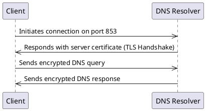
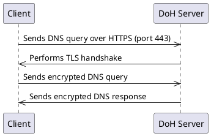
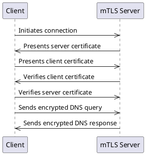
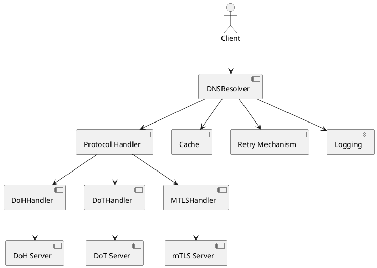
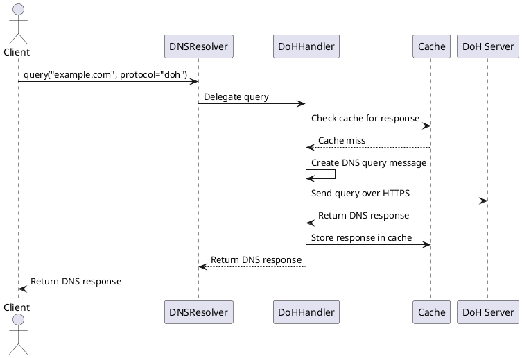

In an era where privacy and security are paramount, DNS traffic often remains a vulnerable point in the network stack. Traditional DNS queries are transmitted in plaintext, making them susceptible to eavesdropping, tampering, and man-in-the-middle attacks. To address these concerns, I created **PrivyDNS**, a Python library designed to securely query DNS records using encrypted protocols such as DNS over HTTPS (DoH), DNS over TLS (DoT), and DNS over Mutual TLS (mTLS).

## Why PrivyDNS?

The motivation behind PrivyDNS stems from the need to enhance DNS security and reliability. Here are the key reasons for its development:

-  **Privacy**: Encrypting DNS queries prevents third parties from monitoring user activity, thus safeguarding user privacy.
-  **Security**: By using encrypted protocols, PrivyDNS helps protect against DNS spoofing and man-in-the-middle attacks.
-  **Performance**: With built-in caching and retry mechanisms, PrivyDNS improves the reliability and speed of DNS queries.
-  **Flexibility**: Supports both synchronous and asynchronous operations, making it suitable for a variety of use cases.

Let's take a deeper dive into DNS over TLS (DoT), DNS over HTTPS (DoH), and DNS over Mutual TLS (mTLS) to understand how PrivyDNS leverages these protocols to enhance DNS security.

### Deep Dive: Understanding DNS Over TLS (DoT), DNS Over HTTPS (DoH), and DNS Over Mutual TLS (mTLS)

The Domain Name System (DNS) is a critical part of the internet infrastructure, translating human-readable domain names into machine-readable IP addresses. Traditionally, DNS queries are transmitted over unencrypted UDP or TCP protocols, making them vulnerable to eavesdropping, tampering, and man-in-the-middle attacks. To address these security concerns, newer protocols such as **DNS Over TLS (DoT)**, **DNS Over HTTPS (DoH)**, and **DNS Over Mutual TLS (mTLS)** have been introduced. These protocols aim to encrypt DNS traffic, ensuring privacy, integrity, and security.

#### What is DNS Over TLS (DoT)?

**DNS Over TLS (DoT)** is a protocol for encrypting DNS queries using **Transport Layer Security (TLS)**. DoT protects the privacy and integrity of DNS requests by establishing a secure TLS connection between the client and the DNS resolver. It uses port 853 (rather than the standard DNS port 53), and the traffic is encrypted, making it harder for third parties to spy on or alter the queries.

#### How DoT Works

1. **Client Initiates Connection**: The client makes a request to the DNS server over TCP, using port 853, which is reserved for DoT.
2. **TLS Handshake**: The client and server perform a TLS handshake, establishing an encrypted communication channel.
3. **Encrypted DNS Query**: The client sends the DNS query through the encrypted TLS connection.
4. **DNS Resolution**: The resolver processes the query, encrypts the response, and sends it back to the client over the same TLS connection.

#### Diagram: DNS Over TLS Workflow

#### Benefits of DoT

- **Encryption**: Protects the DNS query and response from being intercepted or altered.
- **Privacy**: Prevents third parties (e.g., ISPs) from tracking user browsing activity.
- **Integrity**: Ensures the DNS data has not been tampered with during transmission.

### What is DNS Over HTTPS (DoH)?

**DNS Over HTTPS (DoH)** is similar to DoT but encrypts DNS queries over **HTTPS** (HyperText Transfer Protocol Secure). DoH operates over the standard HTTPS port (443) and uses the same encryption as web traffic. This makes it harder to detect DNS traffic as it looks like regular HTTPS traffic, providing additional privacy benefits.

#### How DoH Works

1. **Client Sends HTTPS Request**: The client sends a DNS query in an HTTPS request to the DoH server, using port 443.
2. **TLS Handshake**: Similar to DoT, the client and server establish an encrypted TLS connection.
3. **DNS Query**: The DNS query is encapsulated within the HTTPS request.
4. **DNS Response**: The server responds with the DNS resolution, encapsulated in an HTTPS response.

#### Diagram: DNS Over HTTPS Workflow

#### Benefits of DoH

- **Enhanced Privacy**: As DNS queries are sent over HTTPS, they are harder to differentiate from other web traffic, providing better privacy protection.
- **Bypass Censorship**: DoH can bypass network-level filtering and censorship because it uses port 443, which is generally open in most networks.
- **Encryption and Integrity**: Just like DoT, DoH ensures that DNS traffic is encrypted and protected from tampering.

### What is DNS Over Mutual TLS (mTLS)?

**DNS Over Mutual TLS (mTLS)** extends the security of DoT by adding client authentication. In standard TLS, only the server is authenticated, but in mTLS, both the client and server authenticate each other. This provides an additional layer of security by ensuring that only authorized clients can access the DNS service.

#### How mTLS Works

1. **Client Initiates Connection**: The client initiates a connection to the DNS server.
2. **Server Authentication**: The server presents its certificate to the client.
3. **Client Authentication**: The client presents its certificate to the server.
4. **Mutual Verification**: Both parties verify each other's certificates.
5. **Encrypted Communication**: After successful mutual authentication, DNS queries and responses are exchanged over the encrypted connection.

#### Diagram: DNS Over Mutual TLS Workflow

#### Benefits of mTLS

- **Enhanced Security**: By requiring client authentication, mTLS ensures that only authorized clients can access the DNS service.
- **Prevents Unauthorized Access**: Protects against unauthorized access to DNS services.
- **Encryption and Integrity**: Like DoT and DoH, mTLS ensures that DNS traffic is encrypted and protected from tampering.

### Why Use DoT, DoH, or mTLS?

The adoption of encrypted DNS protocols like DoT, DoH, and mTLS offers several benefits:

1. **Privacy Protection**
These protocols encrypt DNS traffic, preventing ISPs, network administrators, or malicious actors from monitoring your browsing habits through DNS queries.

2. **Security Enhancement**
Encryption protects against various attacks such as DNS spoofing, where attackers redirect users to malicious websites by tampering with DNS responses.

3. **Bypass Censorship**
DoH, in particular, is useful for bypassing DNS-level censorship and restrictions. Since it runs over HTTPS (port 443), it is challenging for network filters or firewalls to distinguish it from normal web traffic, making it harder to block.

4. **Improved Security**
mTLS goes further by providing mutual authentication between client and server, ensuring that only authorized clients can access the DNS service. These mechanisms prevent attackers from providing malicious DNS responses or unauthorized access to DNS services.

To learn more about these protocols, refer to the following resources:

- [DNS Over TLS (DoT) RFC 7858](https://datatracker.ietf.org/doc/rfc7858/)
- [DNS Over HTTPS (DoH) RFC 8484](https://datatracker.ietf.org/doc/rfc8484/)

Now, let's explore how PrivyDNS leverages these protocols to provide a secure and reliable DNS querying solution.

## Architecture Overview

PrivyDNS is architected to provide a robust and secure DNS querying solution. It supports multiple protocols and incorporates features like caching, retry mechanisms, and logging to improve performance and reliability.

### High-Level Architecture

### Key Components

1. **Client**: Initiates DNS queries, specifying the domain name and desired protocol.
2. **DNSResolver**: The main class handling DNS queries. It maintains a registry of protocol handlers and delegates queries to the appropriate handler.
3. **Protocol Handlers**: Specialized classes implementing the `DNSProtocolHandler` abstract base class:
	- **DoHHandler**: Sends DNS queries over HTTPS (DoH) using `httpx` to communicate with the DoH server.
	- **DoTHandler**: Sends DNS queries over TLS (DoT) using `dns.query.tls` for secure communication with the DoT server.
	- **MTLSHandler**: Sends DNS queries over mutual TLS (mTLS) with client certificate authentication.
4. **Cache**: Temporarily stores DNS responses to avoid repeated queries, enhancing performance.
5. **Retry Mechanism**: Automatically retries failed queries a specified number of times before raising an error.
6. **Logging**: Provides detailed logs about query operations, errors, cache hits/misses, and retry attempts.

### DNS Query Flow (DoH Example)

## Conclusion

PrivyDNS is designed with security, performance, and reliability at its core. By supporting encrypted DNS protocols (DoH, DoT, and mTLS), efficient caching, and automatic retries, it ensures that DNS queries are resolved securely and quickly. Whether used in a synchronous or asynchronous context, PrivyDNS provides developers with an easy-to-use interface to enhance DNS security and reliability.
