## Introduction

Setting up a development environment on macOS? Tedious. Time-consuming. If you've ever dreaded configuring a fresh machine or switching between systems, you know exactly what I'm talking about.

`set-me-up` automates the tedious process of configuring development environments by providing:

- 🔧 **Modular architecture** - Pick only the modules you need
- 📦 **Package management** - Automated installation via Homebrew and other package managers
- 🔗 **Dotfile management** - Intelligent symlinking powered by `rcm`
- 🎨 **Highly customizable** - Fork the blueprint and make it your own
- 🔄 **Version control friendly** - Keep your customizations separate from the core tool

## Why I Built This

I was tired of the repetitive, mundane tasks involved in setting up development environments. I wanted something that saves time and ensures consistency across different setups. By automating tool installation, package management, and configuration, `set-me-up` cuts down on errors and speeds up onboarding for new environments.


### Cutting Setup Time by 99%

One of the most compelling benefits of using `set-me-up` is the dramatic reduction in time required to go from a brand-new machine to a fully functional development environment. Traditionally, setting up a new machine involves manually installing tools, configuring settings, and ensuring everything works correctly—a process that can take several hours or even days.

With `set-me-up`, this process is automated, allowing you to cut the time required for setup by up to 99%. What used to take hours can now be completed in minutes. This means that instead of spending valuable time on setup, you can start being productive almost immediately after getting a new machine.

## How set-me-up Works


At its core, `set-me-up` is a toolkit that automates the setup of a macOS development environment. It starts by symlinking dotfiles from the `dotfiles` folder to your home directory and then runs a series of shell scripts to install and configure the necessary tools.

### Customization and Flexibility

```plantuml
@startuml
!theme plain
skinparam backgroundColor #FEFEFE

title Loose Coupling Through Blueprint

package "Your Blueprint Fork" {
  component [Custom Dotfiles] as CD
  component [Custom Modules] as CM
  component [install.sh] as IS
  component [.rcrc config] as RC
}

package "set-me-up Core" {
  component [Core System] as Core
  component [Universal Modules] as UM
}

cloud "GitHub" {
  [Your Repo]
  [set-me-up Repo]
}

IS ..> Core : "references"
IS --> CD : "includes"
IS --> CM : "includes"
IS --> RC : "includes"

note right of IS
  Loose coupling means:
  • Easy to stop using set-me-up
  • Keep your dotfiles portable
  • No direct dependencies
  • Version pinning control
end note

@enduml
```



One of the key strengths of `set-me-up` is its flexibility. It doesn't enforce a specific setup but instead acts as a highly customizable template. You can easily modify it to suit your preferences by forking the blueprint setup, which allows you to maintain your own dotfiles and scripts separately from the main project. This loose coupling makes it easy to walk away from `set-me-up` if needed while keeping your customized environment intact.

**Why fork instead of using the main repo directly?**

- **Loose coupling** - Your repo connects to `set-me-up` only through the installer
- **Portable dotfiles** - Keep your configurations even if you stop using `set-me-up`
- **Privacy friendly** - Easy to make your setup private with no direct ties to the main repo
- **Clean history** - Your commit history stays focused on your customizations
- **Version pinning** - The installer locks to a specific `set-me-up` version; upgrade by bumping the version

#### Using Hooks and rcm Tags

To further customize your setup, `set-me-up` provides hook points before and after sourcing the module scripts. These hooks allow you to perform special preparations or apply custom definitions. Additionally, `set-me-up` uses [rcm](https://github.com/thoughtbot/rcm) tags to manage dotfiles, giving you control over which files take precedence in your setup.

**How RCM tags work:**

1. Create your own tag (e.g., `tag-my` in the `dotfiles` directory)
2. Duplicate the directory structure and files you want to modify
3. Your files take precedence over the defaults
4. Add your tag to `.rcrc` before existing tags for higher precedence

### Simplicity Through Automation

With a single command, you can provision your machine using the `smu` script included in the toolkit. This script handles everything from installing Homebrew to configuring shell environments, ensuring that your setup is both consistent and efficient.

## Why set-me-up is Useful

`set-me-up` is particularly useful for developers who:

- **Value Consistency**: Ensure that your development environment is set up the same way every time, reducing the risk of configuration errors.
- **Save Time**: Automate the tedious process of setting up a new machine, allowing you to get to work faster.
- **Customization**: Tailor the setup to your needs without being locked into a specific configuration.
- **Scalability**: Easily apply the same setup across multiple machines or share it with your team.

Whether you're setting up a new machine, moving to a different environment, or just looking to streamline your workflow, `set-me-up` provides a robust and flexible solution.

### Quantifying the Impact

For organizations, the benefits of `set-me-up` translate directly to significant cost savings:

**Time Savings Per Developer:**

- **Manual setup:** 8-16 hours (spread across 1-2 days)
- **With set-me-up:** 30 minutes to 1 hour
- **Time saved:** 7-15 hours per developer onboarding

**Cost Analysis:**

Assuming an average developer cost of $100/hour (including salary, benefits, and overhead):

- **Traditional onboarding cost:** $800-1,600 per developer
- **set-me-up onboarding cost:** $50-100 per developer
- **Savings per developer:** $750-1,500

**Real-World Scenarios:**

1. **Small team (10 developers/year):**
   - Annual savings: $7,500-15,000
   - Setup time reclaimed: 70-150 hours

2. **Mid-size company (50 developers/year):**
   - Annual savings: $37,500-75,000
   - Setup time reclaimed: 350-750 hours

3. **Enterprise (200 developers/year):**
   - Annual savings: $150,000-300,000
   - Setup time reclaimed: 1,400-3,000 hours

**Additional Hidden Savings:**

- **Reduced support burden:** IT/DevOps teams spend 75-90% less time helping new developers with setup issues
- **Consistency:** Eliminates configuration drift and "works on my machine" problems, reducing debugging time
- **Faster machine replacement:** When hardware fails or needs upgrading, developers can be productive again in under an hour instead of days
- **Improved developer experience:** New hires can focus on learning the codebase and business logic from day one, not fighting with tooling
- **Knowledge retention:** Setup process is documented as code, reducing dependency on tribal knowledge

**Break-even Analysis:**

The initial investment in setting up `set-me-up` for your organization typically takes 8-40 hours (depending on complexity). This means:

- **Break-even point:** After onboarding just 1-3 developers
- **ROI after 10 developers:** 1,750-3,750%
- **Time to ROI:** Often within the first quarter

### Machine Refresh and Hardware Failures

Beyond onboarding, `set-me-up` provides ongoing value:

- **Hardware upgrades:** Developers can migrate to new machines in under an hour
- **Machine failures:** Catastrophic hardware failures no longer mean days of lost productivity
- **Testing environments:** Quickly spin up consistent environments for testing or experimentation
- **Contractor onboarding:** Temporary team members can be productive immediately

For a team of 50 developers with an average hardware refresh cycle of 3 years, assuming 10% need emergency machine replacements annually, `set-me-up` saves an additional:

- **Annual savings:** $12,500-25,000 (from refresh/replacement scenarios)
- **Productivity hours reclaimed:** 115-250 hours/year

## The set-me-up Blueprint

The `set-me-up` blueprint is a lean template with an example tag and module structure designed to help you manage your `set-me-up` setup in a way that is both flexible and loosely coupled. By using this blueprint, you gain the ability to maintain a highly customizable development environment that suits your unique workflow, while also benefiting from the robust automation that `set-me-up` provides.

### What's Inside

The blueprint includes everything you need to get started:

- An `rcm` tag called `tag-example` that demonstrates the structure
- An adapted `.rcrc` file that ensures your customizations are seamlessly integrated
- A pre-configured `example` module where you can add your customizations
- The installer script (`install.sh`) designed to download and set up `set-me-up` on top of your blueprint

### How to Use

Using the `set-me-up` blueprint is straightforward:

1. **Fork** the [blueprint repository](https://github.com/dotbrains/set-me-up-blueprint)
2. **Customize** by adding dotfiles, modules, and configurations in `tag-example` (or create your own tag)
3. **Update** the `SMU_BLUEPRINT` variable in `dotfiles/modules/install.sh` to point to your fork
4. **Run** the installer from your fork:

```bash path=null start=null
bash <(curl -s -L https://raw.githubusercontent.com/YOUR-USERNAME/set-me-up-blueprint/main/dotfiles/modules/install.sh)
```

5. **Provision** your system:

```bash path=null start=null
smu --provision --module base
smu --provision --module casks --module php --no-base
```

This approach ensures that your development environment is both consistent and uniquely yours, with the flexibility to adapt to future changes or different machines.

**Real-world example:** [nicholasadamou/dotfiles](https://github.com/nicholasadamou/dotfiles)

## The set-me-up Installer

The `set-me-up` installer is a universal installer script included in your blueprint fork. It's designed to download both `set-me-up` core and your custom blueprint configuration.

### How the Installer Works


### Using the Installer

⚠️ **Important:** Always review the installer script before running it. Replace `YOUR-USERNAME` with your GitHub username and `BRANCH-NAME-HERE` with your branch (typically `main`).

**For bash/zsh:**

```bash path=null start=null
bash <(curl -s -L https://raw.githubusercontent.com/YOUR-USERNAME/set-me-up-blueprint/BRANCH-NAME-HERE/dotfiles/modules/install.sh)
```

**For fish shell:**

```bash path=null start=null
curl -s -L https://raw.githubusercontent.com/YOUR-USERNAME/set-me-up-blueprint/BRANCH-NAME-HERE/dotfiles/modules/install.sh | bash
```

**Custom installation directory:**

```bash path=null start=null
export SMU_HOME_DIR="/path/to/directory"
bash <(curl -s -L https://raw.githubusercontent.com/YOUR-USERNAME/set-me-up-blueprint/BRANCH-NAME-HERE/dotfiles/modules/install.sh)
```

💡 **Tip:** Keep `SMU_HOME_DIR` in your shell profile so the `smu` scripts can find the sources.

## The smu Script


The `smu` script is the heart of `set-me-up`, designed to automate the setup of a development environment on macOS. Here's what it does:

**Core Functions:**

1. **Symlinks dotfiles** - Uses [rcm](https://github.com/thoughtbot/rcm) to symlink files from `dotfiles/` to your home directory
2. **Installs base tools** - Ensures Homebrew, Git, and RCM are installed
3. **Runs modules** - Each module automates installation of specific tools
4. **Respects hooks** - Runs `before.sh` and `after.sh` hooks for customization

**Useful Commands:**

```bash path=null start=null
smu --help              # Show all available options
smu --lsrc              # Preview how rcm will manage your dotfiles
smu --rcup              # Manually re-run dotfile symlinking
smu --rcdn              # Remove symlinked dotfiles
smu --provision --module base  # Install base tools and symlink dotfiles
```

## Universal Modules

The universal modules provide a comprehensive framework for setting up development environments. Available modules include:

**Foundational:**

- `base` - Homebrew, Git, RCM (required first)
- `packages` - Common CLI tools and utilities
- `casks` - GUI applications via Homebrew Cask
- `app_store` - Mac App Store applications

**Language-Specific:**

- `go` - Go with `goenv`
- `java` - JVM languages with `sdkman`
- `node` - Node.js with `n` or `nvm`
- `php` - PHP development tools
- `python` - Python with `pyenv`
- `ruby` - Ruby with `rbenv`
- `rust` - Rust toolchain

**Editors:**

- `neovim` - Neovim with LazyVim or NvChad configurations

Each module is designed to be plug-and-play. Simply provision what you need:

```bash path=null start=null
smu --provision --module base
smu --provision --module node --module python --no-base
```

## Conclusion

`set-me-up` is more than just a collection of scripts—it's a comprehensive approach to managing and automating your development environment. By reducing the manual effort involved in setup and maintenance, it allows you to focus on what really matters: writing code and building great software.

**For individuals:**

- Cut setup time from hours to minutes
- Ensure consistency across all your machines
- Keep your dotfiles portable and version-controlled

**For organizations:**

- Save $750-1,500 per developer onboarded
- Reduce IT/DevOps support burden by 75-90%
- Improve developer experience from day one
- Build institutional knowledge as code

If you're tired of repetitive setup tasks or looking to standardize your environment across machines, give `set-me-up` a try. Start by forking the [blueprint repository](https://github.com/dotbrains/set-me-up-blueprint) and customizing it to your needs.
