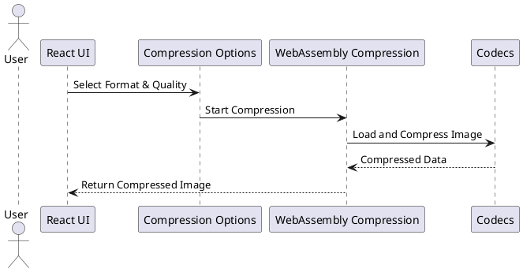
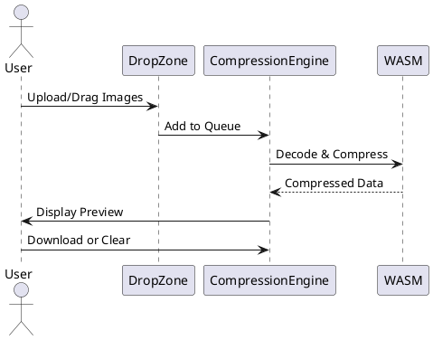
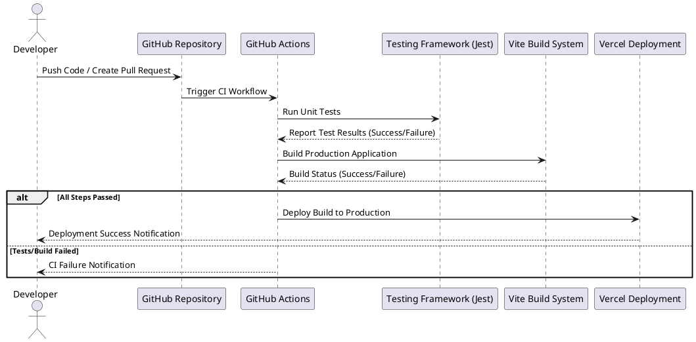

In the rapidly evolving landscape of web-based tools, **Squash** stands out as a modern, high-performance image compression tool that runs entirely in the browser. Built on a foundation of **WebAssembly** and a modular architecture, Squash offers fast, efficient compression for multiple image formats without compromising on quality. This article delves into the **low-level system design**, **architecture**, and **key design decisions** that make Squash a powerful and scalable solution.

## Table of Contents

## Why Squash Was Created

The inspiration for **Squash** arose from the need for **an intuitive, privacy-first image compression solution** that could be used anywhere—without the overhead of server-side processing or third-party dependencies. I often found myself switching between multiple tools to optimize images for various purposes: web development, presentations, and personal projects. While some tools provided excellent compression results, they required **uploading images to external servers**, raising concerns about **privacy** and **data control**. Others were powerful but felt unnecessarily complex for everyday tasks.

The question became clear:
**What if we could compress images directly in the browser, with near-native performance and complete user control?**

With advances in **WebAssembly (WASM)** and modern frontend frameworks like **React**, building such a tool was not only possible but could also deliver **blazing-fast performance** without compromising the user experience. Squash was born out of the desire to create a tool that meets the following core goals:

- **Speed and Performance**: Utilize WebAssembly to achieve native-like image processing speed.
- **Privacy and Security**: Ensure that all image processing happens on the client side, with no server involvement.
- **Simplicity and Usability**: Provide a minimal, intuitive interface that doesn’t overwhelm users with technical jargon.
- **Extendability**: Build a modular architecture that makes it easy to add new formats and compression techniques.

Squash bridges the gap between **powerful image compression algorithms** and a **user-friendly experience**, making it a go-to tool for developers, designers, and casual users alike. Whether you need to shrink large image assets for web deployment or just want to reduce the size of vacation photos before sharing them, Squash handles it all—quickly and securely.

## 📚 High-Level Architecture

Squash follows a **modular, component-based architecture** that makes it easy to extend and maintain. The core system is divided into three primary layers:

1. **React Frontend**
   The user interface (UI) built with **React** and **TypeScript** provides a clean, responsive experience. **Framer Motion** is used to add animations, enhancing the UX.

2. **Compression Engine**
   The core compression logic is powered by **WebAssembly** for near-native performance. The engine handles decoding, compressing, and encoding images using a set of WebAssembly-based codecs.

3. **State Management and Queueing**
   Custom hooks (`useImageManager` and `useImageQueue`) manage image states and processing queues, ensuring smooth, parallelized processing without blocking the UI.



## 🛠️ Low-Level System Design

The **low-level system design** revolves around WebAssembly modules for handling image processing. This allows Squash to achieve:

- **Native-like Performance**: WebAssembly provides near-native speed, significantly faster than JavaScript-based image processing.
- **Modular Codec Support**: Each codec (AVIF, JPEG, JPEG XL, PNG, WebP) is a separate WebAssembly module, making it easy to add or update codecs.
- **Client-Side Processing**: No images are sent to the server, ensuring **privacy** and **security** while reducing network latency.

### Key System Components:

1. **Compression Options Component**
Manages format selection and quality settings. Uses **default quality settings** optimized for each format.

```ts
const DEFAULT_QUALITY_SETTINGS = {
  avif: 50,
  jpeg: 75,
  jxl: 75,
  webp: 75,
};
   ```

2. **WebAssembly Compression Engine**
- Dynamically loads the required WebAssembly codec.
- Decodes and encodes images using optimized buffer handling to minimize memory overhead.
- Supports parallel image processing with a smart queuing system.

3. **State Management with React Hooks**
- `useImageManager`: Manages image states (pending, queued, processing, complete).
- `useImageQueue`: Handles the compression queue, ensuring that only a limited number of images are processed simultaneously.

## 🔄 Workflow and Image Processing

The image compression workflow in Squash is designed to be asynchronous and highly efficient. The process begins when a user uploads or drags images into the **DropZone** component. Each image undergoes validation and is added to the processing queue.



The **Compression Engine** processes each image through a multi-step pipeline:

1. **Validation**: Ensures the image is in a supported format.
2. **Decoding**: The image is decoded into raw pixel data using the appropriate WebAssembly codec.
3. **Compression**: The pixel data is compressed into the desired format with the specified quality settings.
4. **Preview Generation**: A preview of the compressed image is displayed.
5. **Download Management**: The compressed image is available for download individually or in a batch as a ZIP file.

## ⚙️ Design Decisions

Several important design decisions were made to balance performance, scalability, and user experience:

### 1. **WebAssembly for Performance**
Using WebAssembly for image processing ensures fast and efficient operations, especially for computationally expensive tasks like compression and format conversion.

### 2. **Client-Side Processing for Privacy**
By keeping all image processing on the client side, Squash eliminates concerns about uploading sensitive images to external servers. This also reduces network latency and enhances performance.

### 3. **Component-Based Design**
Squash leverages React’s component model to maintain a clean separation of concerns. Each component (e.g., `DropZone`, `CompressionOptions`, `ImageList`) is self-contained and reusable.

### 4. **Parallel Processing with Smart Queuing**
The compression engine limits the number of concurrent tasks to avoid blocking the main thread. This ensures a smooth user experience, even when processing large batches of images.

### 5. **Tailwind CSS for Styling**
Tailwind CSS provides utility-based styling, ensuring a consistent and maintainable design without writing custom CSS from scratch.

## 📦 CI/CD with GitHub Actions and Vercel

**Squash** uses a **CI/CD pipeline** powered by **GitHub Actions** for continuous integration and **Vercel** for seamless deployment. This combination ensures that every change is automatically tested and deployed to production without manual intervention, promoting an efficient and reliable development workflow.

### CI/CD Pipeline Workflow



### 🛠️ How the Workflow Operates

1. **Developer Pushes Code / Creates Pull Request**
The workflow is automatically triggered on every code push or pull request to the `main` branch.

2. **GitHub Actions CI Process**
GitHub Actions orchestrates a multi-step process to validate the changes:
- **Dependency Installation**: Dependencies are installed using **pnpm**, ensuring faster and more efficient builds.
- **Run Unit Tests**: **Jest** tests all components and modules to validate functionality.
- **Build Production Application**: **Vite** compiles the application to ensure it can be successfully built for production.

3. **Conditional Check**
If all steps pass, the application is deployed to **Vercel**.

4. **Automatic Deployment with Vercel**
Vercel takes the production build and deploys it to its global content delivery network (CDN), providing instant access to the new version.
- **Preview Deployments**: A unique preview URL is generated for each pull request, enabling easy testing and collaboration.
- **Production Deployment**: Once changes are merged, the application is deployed to production.

5. **Notifications**
- If all steps pass, the developer receives a **deployment success** notification.
- If any step fails (tests, build, or deployment), GitHub Actions sends a **failure notification** with detailed logs for debugging.

The GitHub Actions workflow (`.github/workflows/tests.yml`):

```yaml
name: Run Tests

on:
    push:
        branches: [ main, master ]
    pull_request:
        branches: [ main, master ]

jobs:
    test:
        runs-on: ubuntu-latest

        steps:
            - uses: actions/checkout@v4

            - name: Set up Node.js
              uses: actions/setup-node@v4
              with:
                  node-version: '20'

            - name: Install pnpm
              uses: pnpm/action-setup@v2
              with:
                  version: 10

            - name: Get pnpm store directory
              shell: bash
              run: |
                  echo "STORE_PATH=$(pnpm store path --silent)" >> $GITHUB_ENV

            - name: Setup pnpm cache
              uses: actions/cache@v4
              with:
                  path: ${{ env.STORE_PATH }}
                  key: ${{ runner.os }}-pnpm-store-${{ hashFiles('**/package.json') }}
                  restore-keys: |
                      ${{ runner.os }}-pnpm-store-

            - name: Install dependencies
              run: pnpm install --no-frozen-lockfile

            - name: Run tests
              run: pnpm test
   ```

3. **Vercel for Continuous Deployment**
Once the tests pass successfully, **Vercel** handles the deployment of the application. Vercel provides:
- **Automatic Preview Deployments**: Every pull request is deployed to a unique preview URL, allowing for easy review and testing.
- **Instant Rollbacks**: In case of an error in the production build, it’s easy to roll back to a previous deployment.
- **Optimized Build and Delivery**: Vercel optimizes the production build for speed and scalability, ensuring that Squash is always served efficiently.

### 💡 Benefits of This Setup

1. **Fully Automated Workflow**
Every change is tested, built, and deployed automatically, ensuring quick feedback and reducing the chance of introducing bugs into production.

2. **Collaborative Review**
Preview deployments allow stakeholders and collaborators to test and review features before they are merged into the main branch.

3. **Scalability and Performance**
With Vercel’s edge network, the Squash application is served globally with low latency, providing a fast and seamless user experience.

## Conclusion

Squash is a testament to the power of modern web technologies like **React**, **WebAssembly**, and **Vite**. Its architecture and design choices prioritize performance, scalability, and user experience, making it a valuable tool for anyone looking to compress and optimize images directly in their browser.

By combining **low-level WebAssembly modules** with a **high-level React UI**, Squash delivers a seamless image compression experience that is both powerful and easy to use.
