Remember the golden age of 2D games? When every pixel mattered, and performance wasn't an afterthought? Yeah, that's the vibe I'm going for here. **TransmuteCore** is a high-performance 2D pixel game engine for Java that brings back the joy of building retro-style games without the pain of dealing with modern game engine bloat.

Named after the alchemical concept of transformation (and because "turning code into games" sounded way cooler than "yet another game engine"), TransmuteCore is built for developers who want direct control over pixels, predictable performance, and a framework that stays out of your way.

## Why Another Game Engine?

Look, I get it. The world doesn't need another game engine—unless it's built to solve real problems. Modern game engines are powerful, sure, but they're also heavy, complex, and often overkill for simple 2D games. If you're building a retro platformer, a roguelike, or a pixel art RPG, do you really need gigabytes of tooling and a 30-minute tutorial just to render a sprite?

TransmuteCore was born from a simple frustration: building simple games shouldn't be complicated. Here's what sets it apart:

### Direct Pixel Manipulation

Most 2D engines abstract rendering through layers of APIs. TransmuteCore says "nah" to that and gives you direct access to the pixel buffer via `BufferedImage` and `DataBufferInt`. Want to manipulate individual pixels at blazing speed? You got it. No reflection, no overhead, no surprises.

### Fixed Timestep Game Loop

Physics simulations that depend on framerate? That's a nightmare. TransmuteCore uses a fixed 60 FPS game loop with delta time support, so your game logic stays consistent across different hardware. What runs smoothly on your beefy desktop will run just as smoothly (logically) on a potato laptop.

### Zero Boilerplate, Maximum Speed

The engine is designed to get you from idea to playable game as fast as possible. The CLI tool scaffolds complete game projects in seconds, complete with build configs, sprite handling, and state management. You don't waste time setting up—you spend it building.

### Performance That Actually Matters

TransmuteCore renders every frame in under a millisecond on modern hardware. It uses hardware-accelerated rendering with `VolatileImage`, viewport culling for large tile-based levels, and efficient asset caching. I'm talking stable 60 FPS with ~1000 sprites at 1080p. And startup time? Less than 50ms.

## What's Inside

Here's what you get out of the box:

### The Game Loop That Just Works

Your `update()` method runs at exactly 60 FPS with delta time support, while `render()` runs as fast as your hardware allows. The fixed timestep means buttery-smooth physics regardless of framerate drops.

### Rendering That Feels Right

The `Context` class is your canvas. Every operation—sprites, shapes, text—writes directly to a 32-bit ARGB pixel array. Then `VolatileImage` kicks in for GPU acceleration. You get low-level control with high-level performance.


### Sprites & Animation

Load a sprite sheet, define your animations, done. The `Animation` class handles frame-based animations with delta time, so they run consistently regardless of framerate.

### Stack-Based State Management

Menus, gameplay, pause screens—they're all states. Push a pause state on top of gameplay, pop it when done. The gameplay state picks up exactly where it left off.

### Deferred Asset Loading

Register all your assets (images, audio, fonts) during init, then batch-load with one `AssetManager.load()` call. Everything's cached and ready when you need it.

### Input That Makes Sense

Three states: **Pressed** (single frame), **Held** (continuous), **Released** (single frame). Mouse coordinates are auto-scaled. That's it.

### Levels From Images

Design levels in any image editor. Each pixel color maps to a tile type. The `TiledLevel` class handles viewport culling automatically—even massive levels stay fast.

### Built-In Persistence

"TinyDatabase" handles save games, level data, and config. Serialize to disk, deserialize back. No external dependencies.

### Developer-Friendly Debugging

Configurable logging, FPS monitoring with `fpsVerbose(true)`, and error messages that actually explain what went wrong.

## Architecture Overview

TransmuteCore is designed around a central `Manager` system that coordinates all engine subsystems. This architecture keeps things organized while giving you direct access to every component when you need it.

### High-Level System Architecture


### Game Loop Lifecycle

Every TransmuteCore game implements three core methods:

```plantuml
@startuml Game Loop Lifecycle
!theme plain

start

:**init()**\n\nOne-time initialization;
note right
  • Load assets
  • Set up managers
  • Initialize game state
end note

partition "Game Loop (60 FPS)" {
  repeat
:**update(Manager, delta)**\n\nGame logic with delta time;
    note right
      • Process input
      • Update physics
      • Handle collisions
      • Run AI logic
    end note

:**render(Manager, IRenderer)**\n\nDraw to pixel buffer;
    note right
      • Clear screen
      • Draw sprites
      • Render UI
      • Apply effects
    end note

    :Sleep to maintain 60 FPS;
  repeat while (Game running?)
}

stop

@enduml
```



The fixed timestep loop ensures `update()` is called exactly 60 times per second, regardless of rendering performance. If rendering takes longer than expected, the engine will catch up by running multiple update ticks without rendering. This guarantees consistent gameplay across all hardware.

### Manager System

The `Manager` class is the central hub that provides access to all subsystems:

```java path=null start=null
// Access the global manager
Manager manager = TransmuteCore.getManager();

// Get subsystems
StateManager stateManager = manager.getStateManager();
AssetManager assetManager = manager.getAssetManager();
Input input = manager.getInput();
ObjectManager objectManager = manager.getObjectManager();
SpriteManager spriteManager = manager.getSpriteManager();
```

This design keeps dependencies explicit while avoiding messy singleton patterns. Every subsystem is accessible when you need it, and the manager handles lifecycle coordination automatically.

## The CLI: From Zero to Game in Seconds

No more copy-pasting boilerplate or wrestling with Gradle configs. The CLI scaffolds everything:

**Install:**

```bash path=null start=null
# Unix/macOS
curl -fsSL https://raw.githubusercontent.com/transmute-games/transmute-core/master/scripts/install-cli.sh | sh

# Windows (PowerShell)
irm https://raw.githubusercontent.com/transmute-games/transmute-core/master/scripts/install-cli.ps1 | iex
```

**Create and run:**

```bash path=null start=null
transmute new my-game && cd my-game && ./gradlew run
```

You get: JitPack dependency, build scripts, example code, asset directories, and a README. Choose from **Basic**, **Platformer**, or **RPG** templates.

## Building Your First Game

Let's walk through what a simple TransmuteCore game looks like:

```java path=null start=null
import TransmuteCore.core.TransmuteCore;
import TransmuteCore.core.GameConfig;
import TransmuteCore.core.Manager;
import TransmuteCore.core.interfaces.services.IRenderer;
import TransmuteCore.graphics.Context;
import TransmuteCore.graphics.Color;

public class MyGame extends TransmuteCore {
    public MyGame(GameConfig config) {
        super(config);
    }

    @Override
    public void init() {
        // Initialize your game
        // Load assets, set up states, etc.
    }

    @Override
    public void update(Manager manager, double delta) {
        // Update game logic
        // Process input, move objects, check collisions
    }

    @Override
    public void render(Manager manager, IRenderer renderer) {
        // Render to pixel buffer
        Context ctx = (Context) renderer;
        ctx.renderText("Hello, TransmuteCore!", 50, 100,
                      Color.toPixelInt(255, 255, 255, 255));
    }

    public static void main(String[] args) {
        GameConfig config = new GameConfig.Builder()
            .title("My Game")
            .version("1.0")
            .dimensions(320, GameConfig.ASPECT_RATIO_SQUARE)
            .scale(3)
            .build();

        MyGame game = new MyGame(config);
        game.start();
    }
}
```

That's it. Extend `TransmuteCore`, implement three methods, configure your window, and you're rendering pixels.

### GameConfig Builder

The `GameConfig.Builder` provides a fluent API for configuring your game:

```java path=null start=null
GameConfig config = new GameConfig.Builder()
    .title("My Game")                             // Window title
    .version("1.0")                               // Game version
    .dimensions(320, GameConfig.ASPECT_RATIO_SQUARE)  // Resolution & aspect ratio
    .scale(3)                                     // Window scale multiplier
    .targetFPS(60)                                // Target frames per second
    .fpsVerbose(true)                             // Enable FPS logging
    .build();
```

The engine supports predefined aspect ratios:

- `ASPECT_RATIO_WIDESCREEN` - 16:9
- `ASPECT_RATIO_SQUARE` - 4:3

Height is automatically calculated from width and aspect ratio, so you never have to do the math.

## Working with Sprites and Animation

Sprites are the building blocks of 2D games. TransmuteCore makes working with them straightforward:

### Loading a Sprite Sheet

```java path=null start=null
import TransmuteCore.graphics.Spritesheet;
import TransmuteCore.assets.AssetManager;

// Register sprite sheet during init
new Spritesheet("spritesheet", "/path/to/spritesheet.png", 16, 16);

// Load all assets
AssetManager.getGlobalInstance().load();

// Retrieve sprites
SpriteManager spriteManager = manager.getSpriteManager();
Bitmap playerIdleSprite = spriteManager.getSprite("spritesheet", 0, 0);
```

The sprite sheet is automatically split into tiles based on the specified tile size (16×16 in this case). Sprites are accessed by grid coordinates (row, column).

### Creating Animations

```java path=null start=null
import TransmuteCore.graphics.Animation;

// Create animation with frame durations
Animation walkAnimation = new Animation(
    spriteManager.getSprite("spritesheet", 0, 0),  // Frame 1
    spriteManager.getSprite("spritesheet", 0, 1),  // Frame 2
    spriteManager.getSprite("spritesheet", 0, 2),  // Frame 3
    spriteManager.getSprite("spritesheet", 0, 3)   // Frame 4
);

walkAnimation.setDuration(200);  // 200ms per frame

// Update animation in game loop
walkAnimation.update(delta);

// Render current frame
ctx.renderBitmap(walkAnimation.getCurrentFrame(), x, y);
```

Animations automatically cycle through frames based on delta time, so they run at consistent speeds regardless of framerate.

## State Management for Menus and Gameplay

Managing game states (menu, gameplay, pause, game over) is critical for any game. TransmuteCore's `StateManager` uses a stack-based approach that makes this intuitive:

```java path=null start=null
import TransmuteCore.state.State;
import TransmuteCore.state.StateManager;

// Create a state
public class MenuState extends State {
    public MenuState(String name) {
        super(name);
    }

    @Override
    public void update(Manager manager, double delta) {
        // Handle menu input
        if (manager.getInput().isKeyPressed(KeyEvent.VK_ENTER)) {
            // Transition to gameplay
            manager.getStateManager().push(new GameplayState("gameplay"));
        }
    }

    @Override
    public void render(Manager manager, Context ctx) {
        // Render menu
        ctx.renderText("Press ENTER to Start", 50, 100, Color.WHITE);
    }
}

// Initialize state manager in init()
StateManager stateManager = new StateManager(this);
getManager().setStateManager(stateManager);
stateManager.push(new MenuState("menu"));
```

States are stack-based, so you can layer them naturally. Push a pause state on top of gameplay, and when the user unpauses, simply pop the pause state. The gameplay state resumes exactly where it left off.

## Tile-Based Levels

Building large levels pixel-by-pixel is tedious. TransmuteCore's `TiledLevel` class loads levels from images where each pixel color represents a tile type. This lets you design levels in any image editor:

```java path=null start=null
import TransmuteCore.level.TiledLevel;
import TransmuteCore.level.Tile;

// Load level from image
TiledLevel level = new TiledLevel("/path/to/level.png", 16);  // 16×16 tiles

// Map pixel colors to tiles
level.addTile(0xFF00FF00, new GrassTile());  // Green pixels = grass
level.addTile(0xFF808080, new StoneTile());  // Gray pixels = stone
level.addTile(0xFF0000FF, new WaterTile());  // Blue pixels = water

// Render with viewport culling
level.render(ctx, cameraX, cameraY);
```

The engine automatically culls tiles outside the viewport, so even massive levels render efficiently. Only visible tiles are drawn, keeping performance high.

## Performance

On modern hardware (2020+):

- **60 FPS stable** at 1080p with ~1000 sprites
- **< 50ms startup** (excluding JVM warm-up)
- **Sub-millisecond rendering** per frame
- **Pre-allocated buffers** = minimal GC pressure
- **Viewport culling** = massive levels stay fast

## Who It's For

**Retro platformers** inspired by Mario, Celeste, or Shovel Knight. Direct pixel control, fixed timestep physics, built-in collision detection.

**Roguelikes** with procedural generation. Tile-based levels and A\* pathfinding included.

**Learning game dev?** Simple enough to understand core concepts without the framework bloat.

**Game jams.** 48 hours? The CLI scaffolds projects in seconds. Focus on gameplay, not setup.

**Indie teams.** No licensing fees, no runtime costs, just Java code you control.

## What Makes It Different

1. **Direct pixel buffer access** with GPU acceleration via `VolatileImage`—low-level control, high-level performance
2. **Fixed 60 FPS timestep**—consistent physics across all hardware
3. **Zero reflection**—everything's explicit, no mysterious overhead
4. **CLI that actually helps**—scaffolds projects, not just boilerplate
5. **Sub-50ms startup**—build games, not waiting screens

## Future Enhancements

TransmuteCore is actively developed with several features on the roadmap:

### Planned Features

- **Particle System** - Built-in particle effects for explosions, smoke, and magic spells
- **Physics Engine** - Dedicated 2D physics with rigid bodies and constraints
- **Lighting System** - Dynamic 2D lighting with shadows and color blending
- **Network Multiplayer** - Built-in client-server networking for online multiplayer
- **Mobile Export** - Android and iOS build targets via libGDX backend
- **Visual Editor** - Standalone level editor with tile placement and entity spawning

### Technical Improvements

- **Multi-threaded Rendering** - Parallel rendering for large sprite counts
- **Asset Streaming** - Load assets on-demand during gameplay
- **Shader Support** - Custom pixel shaders for post-processing effects
- **Profiling Tools** - Built-in performance profiler for bottleneck identification

## Getting Started

**Quick start:**

```bash path=null start=null
# Install CLI
curl -fsSL https://raw.githubusercontent.com/transmute-games/transmute-core/master/scripts/install-cli.sh | sh

# Create and run
transmute new my-game && cd my-game && ./gradlew run
```

**Add to existing project:**

```groovy path=null start=null
repositories {
    mavenCentral()
    maven { url 'https://jitpack.io' }
}

dependencies {
    implementation 'com.github.transmute-games.transmute-core:transmute-core:v1.0.0'
}
```

## Documentation

TransmuteCore includes comprehensive documentation to help you build games:

### Getting Started

- **[Getting Started Guide](https://github.com/transmute-games/transmute-core/blob/master/docs/GETTING_STARTED.md)** - Complete setup and first steps
- **[Hello World Tutorial](https://github.com/transmute-games/transmute-core/blob/master/docs/tutorials/01-hello-world.md)** - Your first TransmuteCore game

### Progressive Tutorials

1. **[Hello World](https://github.com/transmute-games/transmute-core/blob/master/docs/tutorials/01-hello-world.md)** - Basic game structure
2. **[Sprites & Animation](https://github.com/transmute-games/transmute-core/blob/master/docs/tutorials/02-sprites-and-animation.md)** - Visual assets and animation
3. **[Input & Movement](https://github.com/transmute-games/transmute-core/blob/master/docs/tutorials/03-input-and-movement.md)** - Player controls
4. **[Collision Detection](https://github.com/transmute-games/transmute-core/blob/master/docs/tutorials/04-collision-detection.md)** - AABB, circle, and spatial partitioning
5. **[State Management](https://github.com/transmute-games/transmute-core/blob/master/docs/tutorials/05-state-management.md)** - Menus and game states
6. **[Audio System](https://github.com/transmute-games/transmute-core/blob/master/docs/tutorials/06-audio-system.md)** - Sound effects and music
7. **[Level Design](https://github.com/transmute-games/transmute-core/blob/master/docs/tutorials/07-level-design.md)** - Tile-based levels

### Reference Guides

- **[WARP.md](https://github.com/transmute-games/transmute-core/blob/master/WARP.md)** - Architecture overview and core concepts
- **[CLI Documentation](https://github.com/transmute-games/transmute-core/tree/master/packages/cli)** - CLI tool reference

## Tech Stack

**Core Technologies:**

- Java 17 (Modern Java with records and text blocks)
- BufferedImage & DataBufferInt (Direct pixel manipulation)
- VolatileImage (Hardware-accelerated rendering)
- Java AWT (Window and event handling)

**Build System:**

- Gradle (Multi-project setup with wrapper)
- JitPack (Maven distribution)

**CLI Tool:**

- Shell scripts (Unix/macOS installation)
- PowerShell scripts (Windows installation)
- GitHub Releases (Binary distribution)

**Development:**

- GitHub Actions (CI/CD)
- Javadoc (API documentation)
- Comprehensive unit tests

## The Bottom Line

TransmuteCore isn't trying to compete with Unity or Unreal. It's not a 3D powerhouse or a visual scripting playground. It's a focused, high-performance 2D pixel engine for developers who want control, performance, and simplicity.

If you're building retro-style games, pixel art projects, or educational demos, TransmuteCore gets out of your way and lets you focus on what matters: making fun games. Fast startup, direct pixel access, and a CLI that handles the boring stuff—that's the promise.

Want to dive deeper? Check out the [official documentation](https://github.com/transmute-games/transmute-core/blob/master/docs/GETTING_STARTED.md) or explore the [GitHub repository](https://github.com/transmute-games/transmute-core). And yes, contributions are always welcome!
