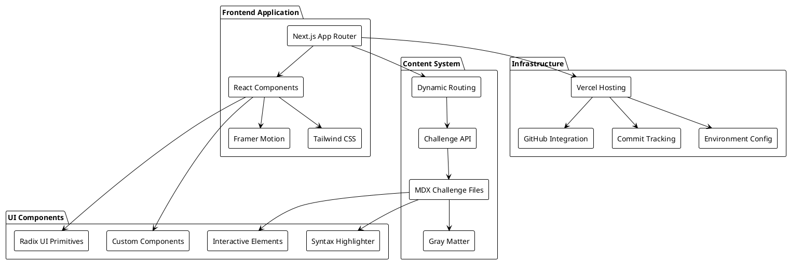

In the rapidly evolving world of software development, traditional coding challenge platforms often focus on algorithmic puzzles that don't translate directly to real-world programming skills. **You Build It** addresses this gap by providing an interactive platform where developers learn by building actual applications and tools they'll use in their careers. This Next.js-powered platform represents a comprehensive approach to developer education, combining modern web technologies with carefully crafted learning experiences.

## Why I Built You Build It

The inspiration for You Build It came from recognizing a fundamental disconnect in developer education. While platforms like LeetCode and HackerRank excel at algorithmic thinking, they often leave developers unprepared for the practical aspects of software engineering. I wanted to create a platform that would:

- **Bridge Theory and Practice**: Connect algorithmic concepts to real-world application development
- **Build Actual Skills**: Help developers create tools and systems they'll encounter in professional environments
- **Provide Rich Learning Experiences**: Offer interactive, well-documented challenges with comprehensive explanations
- **Support Progressive Learning**: Structure challenges from beginner-friendly to advanced levels
- **Create Lasting Value**: Enable developers to build a portfolio of practical projects

The platform serves as both an educational tool and a showcase of modern web development practices, demonstrating how thoughtful UX design can make complex technical concepts accessible and engaging.

## Platform Architecture

You Build It follows a content-driven architecture designed for performance, maintainability, and exceptional user experience:



### Architecture Components

**Frontend Application:**

- **Next.js App Router**: Modern routing with server-side rendering and static generation
- **React Components**: Reusable, accessible component architecture
- **Framer Motion**: Smooth animations and micro-interactions
- **Tailwind CSS**: Utility-first styling with responsive design

**Content System:**

- **MDX Challenge Files**: Rich content with embedded React components
- **Gray Matter**: Front matter parsing for challenge metadata
- **Challenge API**: Dynamic challenge loading and filtering
- **Dynamic Routing**: SEO-friendly URLs with automatic sitemap generation

**UI Components:**

- **Radix UI Primitives**: Headless, accessible UI foundations
- **Custom Components**: Platform-specific interface elements
- **Syntax Highlighter**: Code syntax highlighting with multiple themes
- **Interactive Elements**: Engaging challenge previews and progress tracking

## Core Features & Implementation

### Dynamic Challenge System

The heart of You Build It is its sophisticated challenge management system that transforms static MDX files into interactive learning experiences:

```javascript path=null start=null
// Challenge loading and processing
export async function getChallenges(): Promise<Challenge[]> {
  const challengeFiles = await fs.readdir(challengesDirectory);

  const challenges = await Promise.all(
    challengeFiles
      .filter(file => file.endsWith('.mdx'))
      .map(async (file) => {
        const filePath = path.join(challengesDirectory, file);
        const fileContent = await fs.readFile(filePath, 'utf8');

        const { data: frontmatter, content } = matter(fileContent);
        const slug = file.replace('.mdx', '');

        return {
          slug,
          title: frontmatter.title,
          summary: frontmatter.summary,
          difficulty: frontmatter.difficulty,
          category: frontmatter.category,
          skills: frontmatter.skills || [],
          estimatedTime: frontmatter.estimatedTime,
          content
        };
      })
  );

  return challenges.sort((a, b) =>
    difficultyOrder[a.difficulty] - difficultyOrder[b.difficulty]
  );
}
```

### Advanced Filtering & Search

The platform includes sophisticated filtering capabilities that help developers find challenges matching their skill level and interests:

```typescript path=null start=null
interface ChallengeFilters {
  difficulty: string[];
  category: string[];
  skills: string[];
  searchTerm: string;
}

const useFilteredChallenges = (
  challenges: Challenge[],
  filters: ChallengeFilters
) => {
  return useMemo(() => {
    return challenges.filter((challenge) => {
      // Difficulty filtering
      if (
        filters.difficulty.length > 0 &&
        !filters.difficulty.includes(challenge.difficulty)
      ) {
        return false;
      }

      // Category filtering
      if (
        filters.category.length > 0 &&
        !filters.category.includes(challenge.category)
      ) {
        return false;
      }

      // Skills filtering
      if (
        filters.skills.length > 0 &&
        !filters.skills.some((skill) => challenge.skills.includes(skill))
      ) {
        return false;
      }

      // Search term filtering
      if (filters.searchTerm) {
        const term = filters.searchTerm.toLowerCase();
        return (
          challenge.title.toLowerCase().includes(term) ||
          challenge.summary.toLowerCase().includes(term) ||
          challenge.skills.some((skill) => skill.toLowerCase().includes(term))
        );
      }

      return true;
    });
  }, [challenges, filters]);
};
```

### Rich MDX Content Experience

Each challenge leverages MDX to provide rich, interactive content that goes beyond traditional markdown:

````mdx path=null start=null
---
title: Build Your Own Docker
summary: Implement a basic container runtime from scratch
difficulty: Advanced
category: Systems Programming
skills:
  - Containerization
  - Linux Internals
  - System Calls
estimatedTime: 8-10 hours
---

# Building Container Isolation

Learn how Docker creates isolated environments using Linux namespaces:

<CodeExample language="c" title="Creating a new namespace">
```c
#include <sched.h>
#include <sys/wait.h>

int create_container() {
// Create new namespaces for isolation
if (unshare(CLONE_NEWPID | CLONE_NEWNS | CLONE_NEWUTS) != 0) {
perror("unshare failed");
return -1;
}

    // Execute command in isolated environment
    execvp(args[0], args);
    return 0;

}
````

</CodeExample>

<TechStack
  technologies={["Linux Namespaces", "Cgroups", "System Calls"]}
  difficulty="Advanced"
/>
```

### Responsive Design System

The platform employs a mobile-first design approach with Tailwind CSS, ensuring excellent experiences across all devices:

```javascript path=null start=null
const ChallengeCard = ({ challenge, index }) => {
  return (
    <motion.div
      className="group relative rounded-lg border border-gray-200 bg-white transition-all duration-200 hover:border-[--brand] hover:shadow-lg"
      initial={{ opacity: 0, y: 20 }}
      animate={{ opacity: 1, y: 0 }}
      transition={{ duration: 0.5, delay: index * 0.1 }}
      whileHover={{ y: -5 }}
    >
      <div className="p-6">
        <div className="mb-3 flex items-start justify-between">
          <h3 className="line-clamp-2 text-lg font-semibold text-gray-900 transition-colors group-hover:text-[--brand]">
            {challenge.title}
          </h3>
          <DifficultyBadge difficulty={challenge.difficulty} />
        </div>

        <p className="mb-4 line-clamp-2 text-gray-600">{challenge.summary}</p>

        <div className="flex items-center justify-between">
          <ChallengeMetadata
            category={challenge.category}
            estimatedTime={challenge.estimatedTime}
          />
          <ArrowRight className="h-4 w-4 text-[--brand] transition-transform group-hover:translate-x-1" />
        </div>

        <SkillTags skills={challenge.skills.slice(0, 3)} />
      </div>
    </motion.div>
  );
};
```

## Challenge Categories & Learning Paths

You Build It organizes challenges into carefully structured categories that mirror real-world software development domains:

### Systems Programming

Build low-level tools and understand system internals:

- **Docker Container Runtime**: Learn containerization and Linux namespaces
- **Database System**: Implement B-trees, transactions, and SQL parsing
- **Version Control System**: Build Git-like functionality with content addressing

### Command Line Tools

Master text processing and system utilities:

- **diff Tool**: Implement Myers' algorithm for file comparison
- **grep Clone**: Build pattern matching with regular expressions
- **cut Utility**: Create field and character extraction tools

### Web Development

Build modern web applications and servers:

- **HTTP Server**: Understand the request-response cycle and concurrency
- **Web Framework**: Create routing, middleware, and templating systems
- **API Gateway**: Build request routing and authentication systems

### Language Implementation

Dive deep into programming language theory:

- **Regular Expression Engine**: Implement NFA/DFA conversion and matching
- **JSON Parser**: Build recursive descent parsers and AST generation
- **Compiler Frontend**: Create lexical analysis and syntax parsing

## Technical Implementation Deep Dive

### Performance Optimization

The platform implements several optimization strategies to ensure fast loading and smooth interactions:

```javascript path=null start=null
// Static generation for challenge pages
export async function generateStaticParams() {
  const challenges = await getChallenges();

  return challenges.map((challenge) => ({
    challenge: challenge.slug,
  }));
}

// Incremental Static Regeneration for dynamic content
export const revalidate = 3600; // Revalidate every hour

// Component-level optimizations
const ChallengePreview = memo(({ challenge }) => {
  const [imageLoaded, setImageLoaded] = useState(false);

  return (
    <div className="relative overflow-hidden">
      <Image
        src={challenge.image}
        alt={challenge.title}
        width={400}
        height={200}
        className={`transition-opacity duration-300 ${
          imageLoaded ? "opacity-100" : "opacity-0"
        }`}
        onLoad={() => setImageLoaded(true)}
        priority={challenge.featured}
      />
      {!imageLoaded && <ImageSkeleton />}
    </div>
  );
});
```

### Accessibility Features

The platform prioritizes accessibility with semantic HTML, ARIA attributes, and keyboard navigation:

```javascript path=null start=null
const FilterButton = ({ filter, isActive, onToggle }) => {
  return (
    <button
      className={`rounded-lg px-4 py-2 font-medium transition-colors focus:outline-none focus:ring-2 focus:ring-[--brand] focus:ring-offset-2 ${
        isActive
          ? "bg-[--brand] text-white"
          : "bg-gray-100 text-gray-700 hover:bg-gray-200"
      }`}
      onClick={onToggle}
      aria-pressed={isActive}
      aria-label={`Filter by ${filter.name}`}
    >
      {filter.name}
      {filter.count > 0 && (
        <span className="ml-2 text-xs opacity-75">{filter.count}</span>
      )}
    </button>
  );
};
```

### Progressive Enhancement

The platform works excellently with JavaScript disabled while enhancing the experience when available:

```javascript path=null start=null
// Server-side rendering for core content
export default function ChallengePage({ challenge }) {
  return (
    <div className="min-h-screen bg-white">
      {/* Core content always renders server-side */}
      <ChallengeHeader challenge={challenge} />
      <ChallengeContent content={challenge.content} />

      {/* Enhanced features load progressively */}
      <ClientOnly>
        <InteractiveDemos challenge={challenge} />
        <ProgressTracking challengeId={challenge.id} />
        <SocialSharing challenge={challenge} />
      </ClientOnly>
    </div>
  );
}

const ClientOnly = ({ children }) => {
  const [hasMounted, setHasMounted] = useState(false);

  useEffect(() => {
    setHasMounted(true);
  }, []);

  if (!hasMounted) return null;
  return children;
};
```

## Developer Experience & Tooling

### Development Environment

You Build It includes comprehensive developer tooling for maintainability and code quality:

```json path=null start=null
{
  "scripts": {
    "dev": "next dev",
    "build": "next build",
    "start": "next start",
    "lint": "next lint",
    "type-check": "tsc --noEmit",
    "test": "jest",
    "test:watch": "jest --watch",
    "analyze": "ANALYZE=true next build"
  },
  "lint-staged": {
    "*.{js,jsx,ts,tsx}": ["eslint --fix", "prettier --write"],
    "*.{md,mdx}": ["prettier --write"]
  }
}
```

### Type Safety

The entire codebase leverages TypeScript for type safety and developer productivity:

```typescript path=null start=null
interface Challenge {
  slug: string;
  title: string;
  summary: string;
  longSummary?: string;
  difficulty: "Beginner" | "Intermediate" | "Advanced";
  category: string;
  skills: string[];
  estimatedTime: string;
  content: string;
  featured?: boolean;
  prerequisites?: string[];
}

interface ChallengeFilters {
  difficulty: Challenge["difficulty"][];
  category: string[];
  skills: string[];
  searchTerm: string;
}

type ChallengeState = {
  challenges: Challenge[];
  filteredChallenges: Challenge[];
  filters: ChallengeFilters;
  loading: boolean;
  error: string | null;
};
```

## Deployment & Infrastructure

### Vercel Integration

The platform leverages Vercel's edge network for optimal performance globally:

```javascript path=null start=null
// next.config.js
/** @type {import('next').NextConfig} */
const nextConfig = {
  experimental: {
    appDir: true,
  },
  images: {
    domains: ["images.unsplash.com", "github.com"],
    formats: ["image/avif", "image/webp"],
  },
  async headers() {
    return [
      {
        source: "/(.*)",
        headers: [
          {
            key: "X-Frame-Options",
            value: "DENY",
          },
          {
            key: "X-Content-Type-Options",
            value: "nosniff",
          },
          {
            key: "Referrer-Policy",
            value: "strict-origin-when-cross-origin",
          },
        ],
      },
    ];
  },
};

module.exports = nextConfig;
```

### Monitoring & Analytics

The platform includes comprehensive monitoring for performance optimization:

```javascript path=null start=null
// Web Vitals tracking
export function reportWebVitals(metric) {
  switch (metric.name) {
    case "CLS":
    case "FID":
    case "FCP":
    case "LCP":
    case "TTFB":
      // Send to analytics service
      gtag("event", metric.name, {
        value: Math.round(metric.value),
        event_label: metric.id,
        non_interaction: true,
      });
      break;
    default:
      break;
  }
}
```

## Learning Outcomes & Impact

### Skills Development

You Build It challenges are designed to develop practical skills that transfer directly to professional software development:

**Systems Understanding:**

- Low-level system programming concepts
- Operating system internals and APIs
- Memory management and resource optimization
- Concurrency and parallel processing

**Software Engineering:**

- API design and implementation patterns
- Database design and query optimization
- Testing strategies and quality assurance
- Performance monitoring and optimization

**Modern Web Development:**

- Server-side rendering and static generation
- Progressive web application principles
- Accessibility and inclusive design
- Performance optimization techniques

### Career Advancement

The platform bridges the gap between academic computer science and industry requirements:

- **Portfolio Building**: Each completed challenge becomes a portfolio project
- **Interview Preparation**: Practice explaining complex systems and architectures
- **Technology Exploration**: Safely experiment with new technologies and patterns
- **Open Source Contribution**: Learn collaborative development practices

## Future Enhancements

The roadmap for You Build It includes several exciting features:

### Interactive Development Environment

- **In-browser Coding**: Web-based IDE for immediate challenge attempts
- **Real-time Testing**: Automated test suites for challenge validation
- **Collaborative Features**: Pair programming and code reviews

### Enhanced Learning Analytics

- **Progress Tracking**: Detailed analytics on learning progression
- **Skill Assessment**: Automated evaluation of completed challenges
- **Personalized Recommendations**: AI-powered learning path suggestions

### Community Features

- **Solution Sharing**: Community gallery of challenge solutions
- **Peer Reviews**: Code review system for learning improvement
- **Discussion Forums**: Topic-based technical discussions

## Conclusion

You Build It represents a paradigm shift in developer education, moving from abstract algorithmic puzzles to practical, hands-on learning experiences. The platform successfully combines modern web technologies with thoughtful educational design to create an engaging, effective learning environment.

Key accomplishments include:

- **Comprehensive Content System**: 15+ carefully crafted challenges covering diverse programming domains
- **Modern Architecture**: Built with Next.js, TypeScript, and best practices for performance and maintainability
- **Excellent User Experience**: Responsive design with smooth animations and intuitive navigation
- **Developer-Focused**: Practical projects that build real-world skills and portfolio pieces
- **Open Source Community**: Encouraging collaboration and continuous improvement

Whether you're a beginner looking to build your first command-line tool or an experienced developer wanting to understand how databases work internally, You Build It provides structured, engaging pathways to deepen your understanding of software engineering principles.

The project showcases how educational technology can be both technically sophisticated and pedagogically sound, creating learning experiences that developers actually enjoy while building skills they'll use throughout their careers.
